# Cơ Chế Hiển Thị Lớp Phủ (Overlay) Trên Trò Chơi Toàn Màn Hình Độc Quyền (Exclusive Fullscreen)

## Bản Chất Vật Lý Của Cơ Chế Xuất Hình Trên Windows

Trong hệ điều hành Windows, việc hiển thị hình ảnh từ card đồ họa (GPU) lên màn hình vật lý diễn ra qua hai cơ chế xử lý bộ đệm khung hình (Frame Buffer SwapChain):

1. **Chế độ Hợp thành Cửa sổ Mặc định (DWM Desktop Composition)**:
   - Các ứng dụng thông thường vẽ giao diện vào bộ đệm riêng của từng cửa sổ.
   - Trình quản lý cửa sổ của Windows (Desktop Window Manager - DWM) gom toàn bộ các bộ đệm này lại, ghép thành một khung hình tổng thể (Composite Frame) và gửi ra cổng xuất hình của card màn hình (Display Scanout).
2. **Chế độ Độc chiếm Phần cứng Toàn màn hình (DirectX Hardware Exclusive Mode - FSE)**:
   - Khi trò chơi kích hoạt chế độ toàn màn hình độc quyền (Exclusive Fullscreen), bộ điều khiển đồ họa (DirectX / DXGI) ngắt kết nối của DWM đối với màn hình hiển thị.
   - Chuỗi bộ đệm của game (SwapChain) được ánh xạ trực tiếp 1:1 tới bộ điều khiển quét tín hiệu phần cứng (Display Controller Scanout) nhằm triệt tiêu độ trễ xử lý (Latency) và loại bỏ chi phí hợp thành khung hình của DWM.

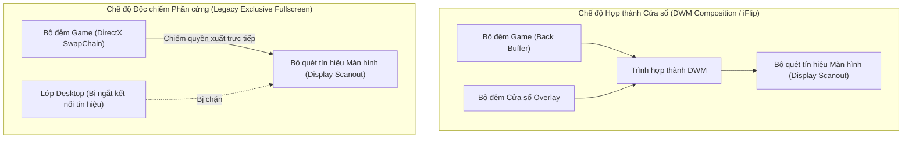

---

## Bế Tắc Kỹ Thuật Khi Hiển Thị Cửa Sổ Win32 Truyền Thống

### 1. Hiện trạng xử lý cũ
- Ứng dụng tạo một cửa sổ Win32 với các thuộc tính cửa sổ mở rộng: nổi trên cùng (`WS_EX_TOPMOST`), không nhận tiêu điểm chuột (`WS_EX_NOACTIVATE`), trong suốt nhiều lớp (`WS_EX_LAYERED`).

### 2. Sự cố và thảm họa kỹ thuật
- Windows phân chia không gian hiển thị của các cửa sổ thành nhiều phân lớp theo trục Z (Z-Order Bands). Cửa sổ `WS_EX_TOPMOST` thông thường được xếp vào **Phân lớp Mặc định của Môi trường Desktop** (`ZBID_DEFAULT`).
- Khi một trò chơi (như *Metro Exodus*) chạy ở chế độ Độc chiếm Phần cứng, toàn bộ phân lớp `ZBID_DEFAULT` bị tách khỏi chuỗi tín hiệu quét ra màn hình.
- Khi cửa sổ lớp phủ cố gắng xuất hiện hoặc yêu cầu làm mới khung hình (Render Invalidation), DWM nhận diện sự xuất hiện của một bề mặt thuộc phân lớp Desktop đang cố gắng đè lên vùng quét độc quyền. Để đảm bảo an toàn giao diện và khôi phục đường truyền DWM, Windows **cưỡng bức ngắt quyền độc chiếm phần cứng của trò chơi và thu nhỏ cửa sổ game xuống thanh tác vụ (Minimize to Taskbar)**.

---

## Phân Tích Kiến Trúc Các Phần Mềm Handheld Thương Mại (GPD Tool, AYASpace, Handheld Companion)

Các phần mềm chuyên dụng trên thiết bị chơi game cầm tay (GPD Win, AYANEO, ROG Ally) giải quyết triệt để bài toán này bằng cách kết hợp 4 phương án kỹ thuật từ tầng hệ điều hành đến tầng nhân đồ họa DirectX:

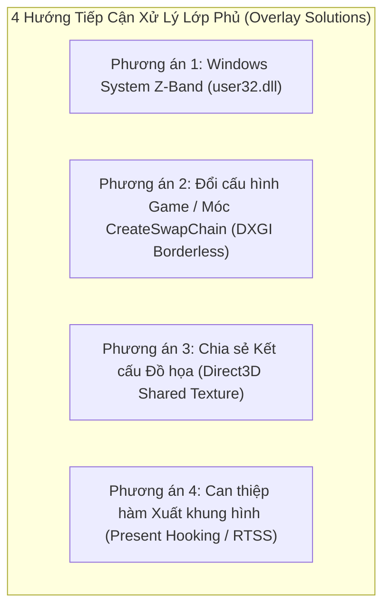

---

## Phương Án 1: Đưa Cửa Sổ Vào Phân Lớp Hệ Thống (Windows System Z-Band)

### 1. Cơ chế kỹ thuật
- Windows quản lý các lớp phủ hệ thống (như Bàn phím ảo cảm ứng `TabTip.exe`, Thanh trò chơi `Xbox Game Bar`, Thông báo hệ thống) trong một phân lớp đặc quyền cao hơn Desktop: **Phân lớp Công cụ Hệ thống (`ZBID_SYSTEM_TOOLS = 2`)** hoặc **Phân lớp Giao diện Nhúng (`ZBID_IMMERSIVE_APPCHROME = 15`)**.
- Các cửa sổ nằm trong phân lớp này được DWM cấp quyền vẽ đè trực tiếp lên trên các bề mặt đang độc chiếm màn hình mà không làm kích hoạt cơ chế thu nhỏ game.

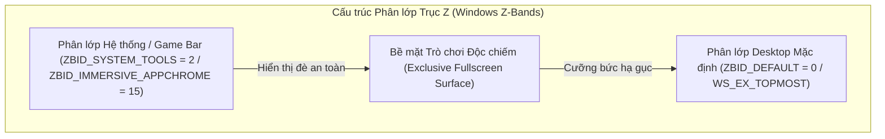

### 2. Cách thức giải quyết triệt để
- Nạp hàm nội bộ không công khai từ thư viện `user32.dll`:
  * Hàm API: `CreateWindowInBand` và `SetWindowBand`.
  * Chỉ số phân lớp (Band ID): `ZBID_SYSTEM_TOOLS` (giá trị nguyên `2`).
- **Điều kiện cốt lõi**: Yêu cầu quyền **UIAccess (`uiAccess="true"`)** trong Token tiến trình. Nếu chưa được ký số tin cậy (Digital Certificate), nhân Windows sẽ âm thầm hạ cấp cửa sổ về `ZBID_DEFAULT = 0`.

---

## Phương Án 2: Móc Hàm Khởi Tạo Chuỗi Khung Hình Cưỡng Bức Không Viền (DXGI `CreateSwapChain` Hooking)

### 1. Cơ chế kỹ thuật (Kiến trúc AYASpace / Handheld Companion)
- Khi trò chơi khởi động, game gọi hàm của DirectX Graphics Infrastructure (DXGI): `IDXGIFactory::CreateSwapChain` (hoặc `CreateSwapChainForHwnd`).
- Trong cấu trúc tham số `DXGI_SWAP_CHAIN_DESC`, game truyền cờ `Windowed = FALSE` để yêu cầu chạy Toàn màn hình độc quyền.
- Một thư viện C++ hook (`dxgi_hook.dll`) được chèn vào không gian bộ nhớ của game (qua `SetWindowsHookEx` hoặc DLL Injection), chặn hàm này và **sửa tham số thành `Windowed = TRUE`** trước khi gửi xuống Driver GPU.

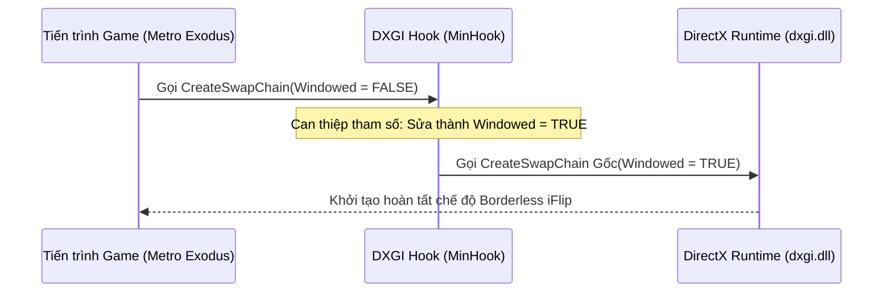

### 2. Cách thức giải quyết triệt để
- Game hoàn toàn tin rằng mình đang chạy Toàn màn hình độc quyền, nhưng thực chất Windows DWM đang quản lý game dưới dạng **Cửa sổ Không viền (Borderless Windowed / Independent Flip)**.
- Khi đó, cửa sổ Flutter Quick Settings Panel của bạn sẽ hiển thị đè lên game 100% mượt mà và không bao giờ bị văng.

---

## Phương Án 3: Chia Sẻ Kết Cấu Đồ Họa Độc Lập (Direct3D Shared Texture Injection)

### 1. Cơ chế kỹ thuật (Kiến trúc OBS Game Capture / Discord Overlay / Steam Overlay)
- Ứng dụng Flutter render toàn bộ giao diện bảng điều khiển vào một kết cấu đồ họa ngoài màn hình (Off-Screen Surface) với cờ chia sẻ vùng nhớ: **`D3D11_RESOURCE_MISC_SHARED`** (hoặc `D3D11_RESOURCE_MISC_SHARED_NTHANDLE`).
- Lấy con trỏ chia sẻ tài nguyên (`HANDLE sharedHandle`) từ DirectX Device của Flutter.
- Thư viện hook bên trong game gọi `ID3D11Device::OpenSharedResource(sharedHandle)` để nạp trực tiếp tấm ảnh kết cấu của Flutter vào bộ nhớ game.
- Tại hàm xuất hình ảnh **`IDXGISwapChain::Present`**, thư viện hook vẽ một tấm ảnh phẳng (2D Quad) chứa giao diện Flutter đè lên bộ đệm khung hình của game.

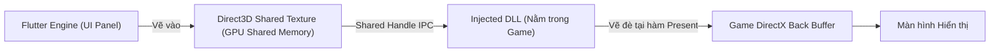

### 2. Cách thức giải quyết triệt để
- Triệt tiêu 100% sự phụ thuộc vào cửa sổ Win32 Desktop.
- Giao diện Flutter được nhúng trực tiếp vào chính luồng dữ liệu 60fps/120fps của game, không làm thay đổi trạng thái cửa sổ của trò chơi.
- **Cơ chế chuyển đổi động tại thời gian chạy (Runtime Switchable Engine)**:
  - Thư viện `dxgi_hook.dll` tích hợp phân đoạn nhớ dùng chung giữa các tiến trình (`.shared` segment) lưu trữ cờ chế độ `g_hookMode` (0: `DXGI_BORDERLESS`, 1: `SHARED_TEXTURE`).
  - Người dùng có thể chuyển đổi trực tiếp giữa hai phương án trong tab Cài đặt [[SettingsTab]] thông qua giao diện hàm ngoại vi (Dart FFI) `SetOverlayHookMode(mode)` mà không cần khởi động lại toàn bộ ứng dụng.

---

## Phương Án 4: Can Thiệp Trực Tiếp Vào Hàm Xuất Khung Hình (Present Hooking / RTSS OSD)

### 1. Cơ chế kỹ thuật
- Chèn mã thực thi nhị phân vào hàm `IDXGISwapChain::Present` (DirectX 11/12) để vẽ trực tiếp thông số HUD (TDP, Quạt, FPS, Pin) lên bộ đệm game.
- Dự án đã có sẵn module [rtss_service.dart](file:///c:/Users/h/dev-projects/windows-handheld-tools/lib/hardware/rtss_service.dart) giao tiếp qua bộ nhớ chia sẻ `RTSSSharedMemoryV2` của RivaTuner Statistics Server.

---

## Ma Trận So Sánh Kỹ Thuật Toàn Diện

| Tiêu chí | Phương án 1: Windows System Z-Band | Phương án 2: DXGI Borderless Hook | Phương án 3: Direct3D Shared Texture | Phương án 4: RTSS OSD Injection |
| :--- | :--- | :--- | :--- | :--- |
| **Bản chất kỹ thuật** | Tầng hệ điều hành (OS Window Management) | Móc hàm tạo chuỗi khung hình (`CreateSwapChain`) | Móc hàm xuất hình + Chia sẻ GPU Memory | Chèn chuỗi text/vector vào hàm `Present` |
| **Bảo tồn giao diện Flutter** | Giữ nguyên 100% | Giữ nguyên 100% | Giữ nguyên 100% (Texture Stream) | Chỉ hiển thị Text HUD / Không có Widget |
| **Khắc phục game Exclusive** | Phụ thuộc quyền UIAccess ký số | Khắc phục 100% (Ép game sang Borderless) | Khắc phục 100% (Vẽ trực tiếp vào game) | Khắc phục 100% (Chỉ áp dụng đo đạc OSD) |
| **Độ ổn định & Tương thích** | Cao | Rất cao (Chuẩn Handheld Companion) | Rất cao (Chuẩn Discord / OBS) | Tối đa |
| **Độ phức tạp triển khai** | Thấp (Đã tích hợp trong `win32_window.cpp`) | Trung bình (Tạo DLL `dxgi_hook.dll` với MinHook) | Nâng cao (Tạo DLL Hook + IPC Texture Handle) | Thấp (Đã tích hợp trong `rtss_service.dart`) |

---

## Kiến Trúc Thu Nhận Tín Hiệu Tay Cầm Và Điều Hướng Không Tiêu Điểm (Focusless Gamepad Input Pipeline)

### Bản Chất Vật Lý Của Luồng Tín Hiệu Tay Cầm Trên Windows

Trên các thiết bị chơi game, tín hiệu điều khiển từ tay cầm vật lý truyền về hệ điều hành theo chuỗi liên kết phần cứng - phần mềm:

1. **Ngắt tín hiệu phần cứng (Hardware Interrupt)**:
   - Khi người dùng nhấn nút hoặc gạt cần analog, vi điều khiển tích hợp trên tay cầm biến đổi mức điện áp analog thành giá trị số nguyên (Analog-to-Digital Converter - ADC).
   - Gói dữ liệu nhị phân (HID Data Packet) được gửi qua bus giao tiếp USB hoặc sóng vô tuyến Bluetooth tới bộ điều khiển ngắt (Interrupt Controller) của bo mạch chủ.
2. **Giải mã tại nhân hệ điều hành (Kernel-mode Driver)**:
   - Trình điều khiển thiết bị của Windows (`xusb22.sys` hoặc `hidclass.sys`) tiếp nhận ngắt, phân giải gói tin nhị phân thành cấu trúc dữ liệu chuẩn gồm:
     * Mặt nạ bit 16-bit thể hiện trạng thái đóng/ngắt của các nút bấm (`wButtons`).
     * Độ nén lò xo của hai nút cò Left/Right Trigger (giá trị 8-bit không dấu từ 0 đến 255: `bLeftTrigger`, `bRightTrigger`).
     * Tọa độ điện áp của hai cần gạt Analog Left/Right Thumbstick (giá trị 16-bit có dấu từ -32768 đến 32767: `sThumbLX`, `sThumbLY`, `sThumbRX`, `sThumbRY`).
   - Cấu trúc này được lưu cố định trong vùng nhớ nhân hệ thống và sẵn sàng để ứng dụng tầng người dùng truy xuất.

```mermaid
flowchart TD
    subgraph Hardware_Layer["Tầng Phần Cứng (Hardware Layer)"]
        Buttons["Nút bấm & Cần gạt Analog"] -->|Điện áp ADC| MCU["Vi điều khiển Tay cầm (MCU)"]
        MCU -->|Gói tin nhị phân USB/BT| Bus["Bus Giao Tiếp (USB / Bluetooth)"]
    end

    subgraph Kernel_Layer["Tầng Nhân Hệ Điều Hành (Windows Kernel)"]
        Bus -->|Ngắt phần cứng (IRQ)| Driver["Driver XInput (xusb22.sys)"]
        Driver -->|Ghi dữ liệu nhị phân| KernelBuffer["Bộ đệm trạng thái (XINPUT_STATE)"]
    end

    subgraph User_Layer["Tầng Ứng Dụng (User Space)"]
        KernelBuffer -->|Gọi hàm FFI liên ngôn ngữ| PollTimer["Bộ đếm thời gian quét định kỳ 50ms"]
        PollTimer --> NativeMem["Bộ nhớ con trỏ RAM tĩnh (calloc)"]
        NativeMem --> Filter["Bộ lọc Sườn xung (Edge Trigger) & Vùng chết (Deadzone)"]
        Filter --> Stream["Luồng sự kiện (Gamepad Event Stream)"]
        Stream --> UIState["Chỉ số điều hướng ảo (_focusedIndex / _selectedTabIndex)"]
    end
```

---

### Bế Tắc Kỹ Thuật Của Vòng Lặp Thông Điệp Cửa Sổ Truyền Thống

#### 1. Hiện trạng xử lý cũ
- Ứng dụng Desktop tiêu chuẩn thu nhận lệnh điều khiển thông qua hàng đợi thông điệp của cửa sổ Win32 (Message Loop / `GetMessage` / `PeekMessage`) với các thông điệp bàn phím (`WM_KEYDOWN`, `WM_KEYUP`) hoặc thông điệp thô (`WM_INPUT`).

#### 2. Thảm họa kỹ thuật trong môi trường trò chơi
- Windows áp dụng nguyên tắc: **Chỉ cửa sổ đang nắm giữ tiêu điểm nhập liệu chủ động (Active Keyboard Focus / `HWND Focus`) mới được nhân hệ thống phân phối thông điệp `WM_KEYDOWN`**.
- Khi một trò chơi đang chạy toàn màn hình, trò chơi chiếm giữ 100% tiêu điểm cửa sổ. Bảng điều khiển Quick Settings nằm ở trạng thái nền hoặc lớp phủ không chiếm tiêu điểm (`WS_EX_NOACTIVATE`) để tránh làm đứt đoạn trận đấu của người chơi.
- Hậu quả: Mọi thông điệp phím thông thường đều bị chuyển toàn bộ vào game, bảng điều khiển hoàn toàn "mù" dữ liệu nhập và không thể phản hồi bất kỳ thao tác nào từ tay cầm.

#### 3. Giải pháp triệt tiêu rào cản: Quét trạng thái trực tiếp không cần tiêu điểm (Zero-Focus Polling)
- Ứng dụng nạp trực tiếp thư viện liên kết động tầng hệ thống (`xinput1_4.dll` / `xinput1_3.dll`) thông qua cơ chế gọi hàm liên ngôn ngữ (Foreign Function Interface - FFI).
- Hàm hệ thống `XInputGetState(dwUserIndex, pState)` cho phép đọc trực tiếp bộ đệm trạng thái phần cứng của tối đa 4 tay cầm kết nối mà **hoàn toàn không quan tâm cửa sổ nào đang giữ tiêu điểm Windows**.
- Một bộ đếm thời gian (Periodic Timer) chạy vòng lặp ngắt đều đặn mỗi 50ms (tần số 20Hz), trích xuất trạng thái nhị phân trực tiếp từ RAM máy tính vào cấu trúc con trỏ tĩnh được cấp phát trước (`Pointer<_XInputState>`).

---

### Xử Lý Xung Tín Hiệu Và Trạng Thái Điều Hướng Tại Tầng Ứng Dụng

Vì cơ chế đọc trạng thái là quét định kỳ (Polling), việc giữ một nút vật lý trong 1 giây sẽ sinh ra 20 lần đọc trạng thái dương tính liên tiếp. Để chuyển đổi thành thao tác điều hướng chuẩn xác trên giao diện, luồng dữ liệu bắt buộc đi qua 3 bộ lọc vật lý:

1. **Bộ lọc sườn xung kích hoạt đơn (Rising-Edge Triggering)**:
   - Dành cho các nút bấm tác vụ (A, B, X, Y, Start, Back).
   - Thuật toán so khớp trạng thái: Chỉ phát ra sự kiện khi giá trị chuyển từ sai sang đúng (tín hiệu đi từ mức 0 lên mức 1). Nếu người dùng tiếp tục đè nút, các chu kỳ quét tiếp theo bị chặn đứng hoàn toàn.
2. **Bộ lọc vùng chết cần gạt (Stick Deadzone Filtering)**:
   - Cần analog vật lý luôn có sai số cơ học và hiện tượng trôi cần (Stick Drift), khiến giá trị điện áp luôn dao động nhẹ quanh điểm gốc tọa độ 0.
   - Thuật toán thiết lập biên độ ngưỡng: Bỏ qua toàn bộ giá trị có độ lớn tuyệt đối nhỏ hơn 15000 (trên thang đo toàn phần từ 0 đến 32767). Chỉ khi người chơi đẩy cần vượt qua ngưỡng này, tín hiệu mới được công nhận là một thao tác gạt hướng (Stick Up/Down/Left/Right).
3. **Bộ mô phỏng nhịp lặp điều hướng (Hold-to-Repeat State Machine)**:
   - Dành cho các phím di chuyển danh mục (D-Pad Lên/Xuống/Trái/Phải và Cần Analog).
   - Lần nhấn đầu tiên: Phát sự kiện điều hướng ngay lập tức (độ trễ 0ms).
   - Nếu tiếp tục giữ nút: Khóa sự kiện trong 6 chu kỳ quét liên tiếp (~300ms) để chống nhảy mục ngoài ý muốn. Sau ngưỡng trễ này, phát nhịp lặp đều đặn mỗi 2 chu kỳ quét (~100ms/lần) giúp người chơi lướt nhanh danh sách tùy chọn mượt mà.

---

### Ánh Xạ Sự Kiện Vào Cây Trạng Thái Giao Diện (Virtual Focus Navigation)

Sau khi được chuẩn hóa, sự kiện nút bấm được đẩy vào luồng bất đồng bộ (Broadcast Stream). Giao diện Quick Settings tiếp nhận sự kiện và điều hướng hoàn toàn bằng **Chỉ số tiêu điểm ảo (Virtual Focus Index)** mà không cần chuột hay chạm:

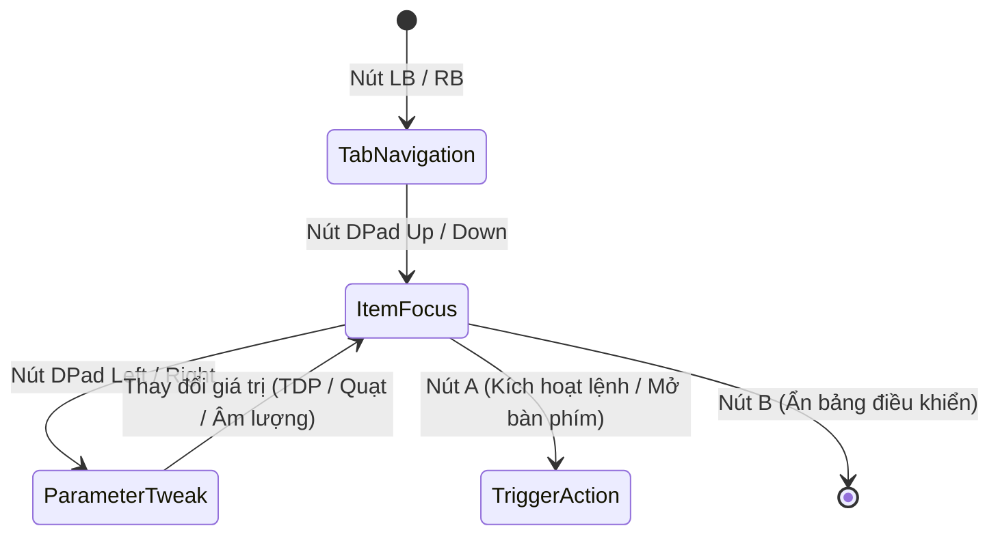

1. **Chuyển đổi phân vùng cấp cao (Tab Level Navigation)**:
   - Sự kiện nút vai trái/phải (`GamepadButton.lb`, `GamepadButton.rb`) làm thay đổi biến chỉ số tab `_selectedTabIndex` theo phép chia lấy dư vòng tròn (Modulo 4), đồng thời đặt lại chỉ số mục về 0 và đưa thanh cuộn về đỉnh trang.
2. **Di chuyển tiêu điểm theo trục dọc (Vertical Item Focus)**:
   - Sự kiện `GamepadButton.dpadUp` và `GamepadButton.dpadDown` làm tăng/giảm chỉ số `_focusedIndex` trong phạm vi giới hạn của tab hiện hành.
   - Hệ thống tự động tính toán khoảng cách cuộn ảo dựa trên tỉ lệ giao diện (`targetOffset = _focusedIndex * 135.0 * uiScale`) và kích hoạt bộ điều khiển cuộn hoạt họa mượt mà (`_scrollController.animateTo`) để luôn giữ mục đang chọn nằm chính giữa màn hình.
3. **Tương tác thông số theo trục ngang (Horizontal Value Adjustment)**:
   - Sự kiện `GamepadButton.dpadLeft` và `GamepadButton.dpadRight` tác động trực tiếp vào giá trị thông số của mục đang nắm giữ `_focusedIndex` (tăng/giảm công suất TDP, tốc độ quạt, hoặc chuyển đổi giữa các nấc cài đặt sẵn Preset).
4. **Đóng mở giao diện lớp phủ (Overlay Lifecycle)**:
   - Tổ hợp phím cứng vật lý (BACK + RB) được bộ quét nhận diện đồng thời sẽ kích hoạt hàm đảo trạng thái hiển thị (`OverlayController.toggleOverlay`), trong khi nút B đóng vai trò phím thoát an toàn (`hideOverlay`) trả lại toàn bộ quyền điều khiển cho trò chơi.

---

## Cơ Chế Khởi Động Đặc Quyền Cao Cùng Windows (Elevated Process Auto-Start Architecture)

### Bản Chất Vật Lý Của Luồng Khởi Động Tự Động Trên Windows

```mermaid
flowchart TD
    subgraph Traditional["Cơ Chế Truyền Thống (Thất Bại với Ring-0 App)"]
        Boot1["Khởi động máy & Đăng nhập"] --> Reg["Registry HKCU Run Key"]
        Reg --> UAC["Bộ kiểm soát tài khoản người dùng (UAC)"]
        UAC -->|"Chặn đứng ứng dụng Elevated"| Block["Bị chặn âm thầm (Không chạy)"]
    end

    subgraph Industrial["Cơ Chế Tiêu Chuẩn Handheld (Task Scheduler)"]
        Boot2["Khởi động máy & Đăng nhập"] --> Sch["Windows Task Scheduler (schtasks)"]
        Sch -->|"Trigger: ONLOGON / Quyền: HIGHEST"| Bypass["Vượt qua rào cản UAC hợp lệ"]
        Bypass --> KernelReady["Nạp Ring-0 Driver & Global DXGI Hook thành công"]
    end
```

#### 1. Trước đây làm bằng cách nào?
- Các ứng dụng Windows thông thường ghi đường dẫn thực thi của tệp tin nhị phân vào sổ đăng ký hệ thống (Registry Key: `HKCU\Software\Microsoft\Windows\CurrentVersion\Run`).

#### 2. Thảm họa kỹ thuật trong môi trường Handheld
- Công cụ điều khiển thiết bị Handheld bắt buộc can thiệp trực tiếp vào không gian nhân cấp 0 (Ring-0 Kernel Space) để nạp trình điều khiển CPU (`WinRing0x64.sys`), điều khiển điện áp và công suất vi xử lý (`ryzenadj.dll`) cũng như kích hoạt bẫy chặn đồ họa toàn hệ thống (Global DXGI Hook). Do đó, ứng dụng bắt buộc phải chạy dưới đặc quyền Người quản trị tối cao (Administrator Privileges / Elevated Token).
- Hệ thống kiểm soát tài khoản người dùng Windows (User Account Control - UAC) áp dụng quy tắc phòng vệ kiên cố: Mọi chương trình yêu cầu đặc quyền elevated nằm trong sổ đăng ký `Run` đều bị hệ điều hành **âm thầm chặn đứng** lúc người dùng đăng nhập để triệt tiêu nguy cơ mã độc leo thang quyền hạn. Kết quả: Ứng dụng hoàn toàn không thể tự khởi động cùng máy tính.

#### 3. Công nghệ này giải quyết triệt để ra sao?
- Thay thế hoàn toàn sổ đăng ký bằng Trình lập lịch tác vụ hệ điều hành (Windows Task Scheduler thông qua tiện ích dòng lệnh `schtasks.exe` đóng gói trong [[AutostartService]]).
- Thiết lập tác vụ hệ thống với mức ưu tiên đặc quyền tối cao (`/RL HIGHEST`) liên kết trực tiếp với sự kiện người dùng đăng nhập tài khoản (`/SC ONLOGON`).
- Đồng thời gỡ bỏ điều kiện tiết kiệm pin của máy tính xách tay (`DisallowStartIfOnBatteries=false`) nhằm đảm bảo thiết bị Handheld luôn tự động khởi chạy bảng điều khiển dù đang cắm sạc hay sử dụng nguồn pin tích hợp.

### Vòng Đời Tác Vụ Và Hiện Tượng Rác Hệ Thống Khi Xóa Bản Di Động (Portable Cleanup & Orphaned Task Lifecycle)

Khi phân phối dưới dạng gói di động không qua cài đặt (Portable Binary):
- Toàn bộ tệp mã máy (`.exe`), thư viện động (`.dll`) và tệp cấu hình (`config.json`) nằm cô lập trong một thư mục cục bộ trên ổ cứng. Xóa thư mục này chỉ đơn thuần giải phóng các cung từ/ô nhớ flash (Storage Blocks) của thư mục đó.
- Tuy nhiên, khi người dùng kích hoạt "Khởi động cùng Windows", ứng dụng đã gọi tiến trình hệ thống `schtasks.exe` để tạo một bản ghi tác vụ độc lập trong nhân quản lý lập lịch của hệ điều hành.

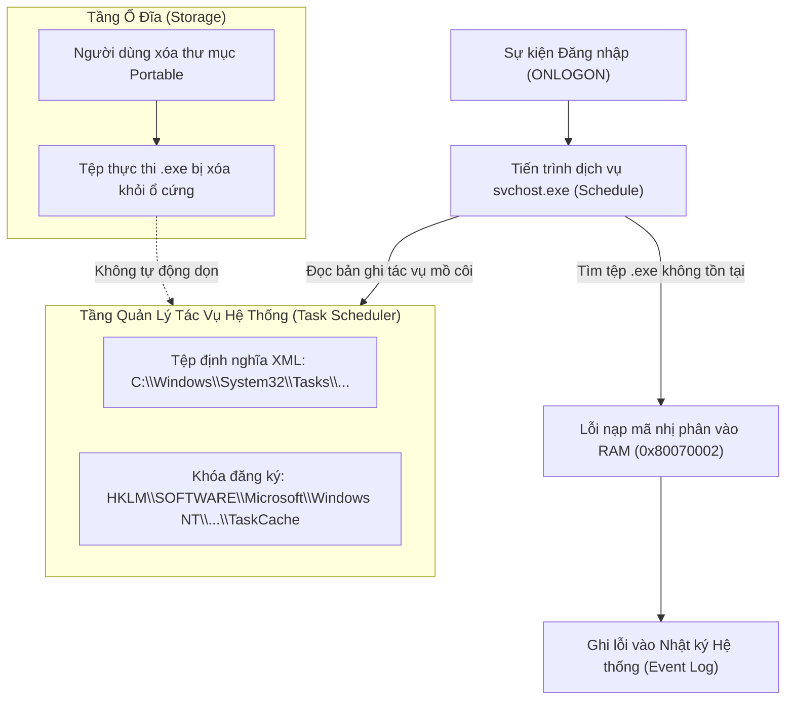

#### 1. Các thành phần còn sót lại trong hệ điều hành (Orphaned Artifacts)
1. **Tệp siêu dữ liệu XML định nghĩa tác vụ (Task Definition XML)**:
   - Vị trí vật lý: `C:\Windows\System32\Tasks\WindowsHandheldTool_AutoStart`.
2. **Khóa chỉ mục trong cây cơ sở dữ liệu cấu hình hệ thống (Registry Hive)**:
   - Nhánh phân cấp: `HKLM\SOFTWARE\Microsoft\Windows NT\CurrentVersion\Schedule\TaskCache\Tree\WindowsHandheldTool_AutoStart`.
   - Bản ghi định danh duy nhất: `HKLM\SOFTWARE\Microsoft\Windows NT\CurrentVersion\Schedule\TaskCache\Tasks\{GUID}`.

#### 2. Hiện tượng kỹ thuật khi chỉ xóa thư mục mà không hủy tác vụ
- Tác vụ trở thành một **tác vụ mồ côi (Orphaned Task)**.
- Mỗi chu kỳ khởi động và đăng nhập tài khoản người dùng (`ONLOGON`), tiến trình dịch vụ lập lịch của Windows (`svchost.exe` đảm nhiệm dịch vụ `Schedule`) kích hoạt ngắt, nạp tệp XML và tra cứu đường dẫn nhị phân được lưu sẵn.
- Do tệp `.exe` không còn tồn tại trên ổ cứng, hệ điều hành không thể phân bổ không gian địa chỉ ảo (Virtual Address Space) để nạp mã máy vào bộ nhớ RAM, dẫn đến việc tiến trình lập lịch trả về mã lỗi `0x80070002` (`ERROR_FILE_NOT_FOUND`) và ghi nhận vào nhật ký sự kiện hệ thống (Windows Event Viewer - Event ID 101/200).

#### 3. Quy trình dọn dẹp triệt để (Complete Decommissioning Workflow)
- **Phương án chủ động (Khuyến nghị)**: Trước khi xóa thư mục Portable, mở ứng dụng và chuyển công tắc "Khởi động cùng Windows" sang trạng thái Tắt trong [[SettingsTab]]. Hàm `AutostartService.setEnabled(false)` sẽ phát lệnh xóa trực tiếp qua tiến trình hệ thống: `schtasks /delete /tn "WindowsHandheldTool_AutoStart" /f`, triệt tiêu hoàn toàn tệp XML và các khóa Registry liên quan.
- **Phương án khắc phục sau khi đã xóa thư mục**:
  - Giao diện quản lý tác vụ: Nhấn tổ hợp phím `Win + R`, mở tiện ích `taskschd.msc`, truy cập vào danh mục `Task Scheduler Library`, tìm tác vụ `WindowsHandheldTool_AutoStart` và chọn Delete.
  - Giao diện dòng lệnh đặc quyền cao: Mở PowerShell hoặc Command Prompt dưới quyền Quản trị viên (Run as Administrator) và chạy lệnh: `schtasks /delete /tn "WindowsHandheldTool_AutoStart" /f`.

---

## Cơ Chế Nhận Diện Mã Độc Của Windows Defender Và Hiện Tượng Báo Động Giả (Antivirus Heuristic & False Positive Architecture)

### Bản Chất Vật Lý Của Luồng Quét Tĩnh Và Đánh Giá Rủi Ro Bằng Học Máy

Khi một tệp tin nén (`.zip`) hoặc tệp thực thi được tải về từ mạng Internet, hệ điều hành gắn thẻ đánh dấu vùng mạng không tin cậy (Zone Identifier / `ZoneId=3`) vào luồng dữ liệu phụ của tệp trên hệ thống tệp NTFS (Alternate Data Stream - ADS). Trình bảo vệ Windows Defender (tiến trình nhân dịch vụ `MsMpEng.exe`) ngay lập tức kích hoạt luồng kiểm tra tĩnh:

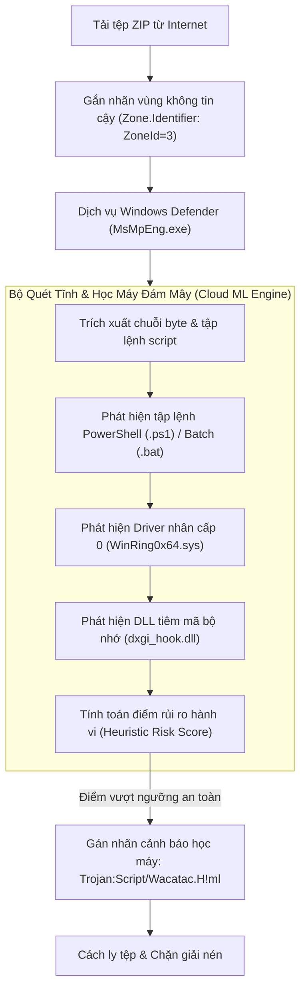

#### 1. Giải mã tên định danh mối đe dọa `Trojan:Script/Wacatac.H!ml`
- **`Trojan:`**: Phân loại danh mục phần mềm gây hại chung (phần mềm mạo danh hoặc mang hành vi ngầm).
- **`Script/`**: Đối tượng trực tiếp kích hoạt chữ ký nhận diện là một **tập lệnh mã nguồn** (tệp kịch bản dòng lệnh PowerShell `.ps1`, Batch `.bat`, hoặc Python `.py`), **hoàn toàn không phải** tệp nhị phân thực thi chính (`windows_handheld_tool.exe`).
- **`Wacatac`**: Tên họ định danh quy tắc phân tích mẫu tĩnh của Microsoft dành cho các đoạn mã có hành vi tự động can thiệp sâu vào hệ thống.
- **`!ml` (Machine Learning)**: Khẳng định đây là kết quả phán đoán xác suất từ **mô hình học máy trên đám mây (Cloud AI Heuristic Engine)** của Microsoft, không phải phát hiện dựa trên chữ ký tĩnh truyền thống (Static Hash/Byte Signature) của một mã độc đã biết.

#### 2. Nguyên nhân bế tắc kỹ thuật gây ra Báo động giả (False Positive) trong gói phát hành
Gói phân phối Portable phát sinh cảnh báo là do sự hội tụ đồng thời của 4 yếu tố nhạy cảm trong cùng một gói lưu trữ:

1. **Sự tồn tại của các tập lệnh kịch bản thô trong thư mục phụ tá**:
   - Thư mục phụ trợ ban đầu chứa tệp kịch bản `readjustService.ps1` (chứa các đoạn mã lặp vô tận, can thiệp tham số điện áp phần cứng và nạp động con trỏ hàm Windows API qua bộ đệm `Marshal`) và các tệp `.bat` tự động can thiệp Task Scheduler. Mô hình học máy của Defender quét nội dung văn bản này và gán trọng số rủi ro cực đại cho nhánh `Script/`.
2. **Trình điều khiển nhân cấp 0 không ký số mở rộng (`WinRing0x64.sys`)**:
   - Trình điều khiển này trực tiếp mở cổng đọc/ghi thanh ghi chuyên dụng của CPU (Model-Specific Registers - MSR) và cổng vào/ra (I/O Ports). Vì khả năng này thường bị các phần mềm khai thác lỗ hổng lạm dụng, Defender luôn đặt trạng thái giám sát nghiêm ngặt khi phát hiện driver này đi kèm các kịch bản script không xác định.
3. **Thư viện móc nối đồ họa bộ nhớ (`dxgi_hook.dll`)**:
   - Thư viện chứa mã nhị phân can thiệp cấu trúc con trỏ hàm ảo (Virtual Method Table Hooking) và phân đoạn bộ nhớ chia sẻ (`.shared` segment), có hành vi tương đồng với kỹ thuật tiêm mã bộ nhớ (DLL Injection).
4. **Thiếu chứng chỉ ký số tin cậy (Unsigned Binaries)**:
   - Các tệp thực thi chưa được đóng dấu chứng chỉ số công cộng (Code Signing Certificate) để tích lũy điểm danh tiếng hệ thống (SmartScreen Reputation).

#### 3. Giải pháp kỹ thuật triệt tiêu cảnh báo
- **Tối ưu hóa cây thư mục phát hành (Release Sanitization)**:
  - Ứng dụng điều khiển chính giao tiếp trực tiếp với `ryzenadj.dll` qua liên kết hàm FFI trong mã máy Dart. Toàn bộ các tệp kịch bản thô (`.ps1`, `.bat`, `.py`, `.xml.template`) và các tệp gỡ lỗi trung gian (`.pdb`, `.exp`, `.old`) là dư thừa và bắt buộc phải bị loại bỏ khỏi gói phát hành.
  - Khi gói phát hành chỉ còn lại các tệp nhị phân runtime thực sự cần thiết, thành phần kích hoạt `Script/` bị xóa sổ hoàn toàn khỏi chuỗi nhận diện của Defender.
- **Ký số chứng chỉ ứng dụng (Code Signing Pipeline)**:
  - Ký số toàn bộ tệp `.exe` và `.dll` bằng khóa chứng chỉ số để vượt qua lớp quét tĩnh SmartScreen.

---

### Bản Chất Lỗ Hổng Nhân Cấp 0 Của WinRing0 Vàng Hiện Tượng Bị Chặn (Vulnerable Driver Architecture & BYOVD)

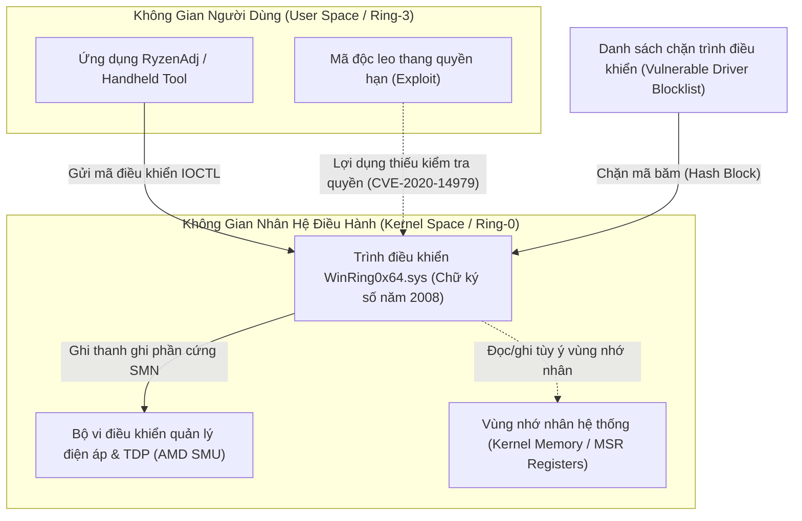

#### 1. Nguyên nhân kỹ thuật ra đời của cảnh báo `VulnerableDriver:WinNT/Winring0`
- **Driver hợp pháp nhưng có lỗ hổng kiến trúc (CVE-2020-14979)**:
  - Tệp `WinRing0x64.sys` do OpenLibSys phát hành năm 2008 mang chữ ký số hợp lệ của nhà phát triển, cho phép phần mềm tầng người dùng (Ring-3) đọc/ghi trực tiếp vào thanh ghi chuyên dụng của CPU (Model-Specific Registers - MSR), cổng I/O và bộ nhớ vật lý.
  - Tuy nhiên, driver này **hoàn toàn không thiết lập danh sách kiểm soát quyền truy cập (Access Control List - ACL)** cho các cổng giao tiếp vào/ra (`IOCTL`). Bất kỳ tiến trình nào chạy trong hệ điều hành, kể cả tiến trình không có đặc quyền quản trị viên, đều có thể gửi lệnh trực tiếp vào driver để thao túng không gian nhân.
- **Kỹ thuật tấn công "Mượn driver hợp pháp để đục thủng nhân" (Bring Your Own Vulnerable Driver - BYOVD)**:
  - Các nhóm tấn công an ninh mạng thường mang theo các driver đã được ký số hợp pháp như `WinRing0x64.sys` để qua mặt cơ chế cưỡng chế chữ ký số nhân của Windows (Driver Signature Enforcement - DSE). Sau khi nạp driver vào bộ nhớ, kẻ tấn công khai thác lỗ hổng IOCTL mở này để vô hiệu hóa phần mềm diệt virus và chiếm đoạt toàn quyền hệ thống.
  - Do đó, Microsoft đã đưa mã băm của `WinRing0x64.sys` vào **Danh sách chặn trình điều khiển dễ bị tổn thương của Microsoft (Microsoft Vulnerable Driver Blocklist)** và cơ chế bảo vệ tính toàn vẹn bộ nhớ (Memory Integrity / HVCI).

#### 2. Lý do các phần mềm Handheld bắt buộc sử dụng `WinRing0x64.sys`
- Bộ vi xử lý AMD Ryzen quản lý điện áp và công suất tiêu thụ (TDP) thông qua vi điều khiển SMU nằm sâu trong phần cứng. Giao tiếp với SMU bắt buộc phải ghi dữ liệu trực tiếp vào các thanh ghi phần cứng SMN tại tầng Ring-0.
- AMD không phát hành bất kỳ API hoặc Driver chính thức nào trong không gian người dùng Windows cho mục đích chỉnh sửa TDP tự do.
- Do đó, toàn bộ hệ sinh thái phần mềm Handheld mã nguồn mở (RyzenAdj, Universal x86 Tuning Utility, Handheld Companion) đều bắt buộc phải phụ thuộc vào `WinRing0x64.sys` để truyền lệnh điều khiển xung/áp tới chip AMD.

#### 3. Cơ chế ứng phó trong kiến trúc phần mềm Handheld
1. **Chế độ mô phỏng an toàn (Safe Simulation Fallback)**:
   - Module [[TdpService]] được xây dựng với cơ chế bọc lỗi: Khi Windows Defender hoặc cơ chế HVCI chặn nạp `WinRing0x64.sys`, hàm nạp thư viện `ryzenadj.dll` trả về mã lỗi 126. Dịch vụ lập tức kích hoạt chế độ mô phỏng an toàn, bảo toàn 100% vòng đời ứng dụng và giao diện người dùng mà không gây sự cố sập ứng dụng.
2. **Quy trình gỡ chặn trên thiết bị người dùng (Whitelisting Workflow)**:
   - Trong ứng dụng Bảo mật Windows (`Windows Security` $\rightarrow$ `Virus & threat protection` $\rightarrow$ `Protection history`), người dùng có thể nhấp vào thông báo `VulnerableDriver:WinNT/Winring0`, chọn `Actions` và kích hoạt `Allow on device` (Cho phép trên thiết bị).
   - Nếu hệ thống kích hoạt tính năng Cách ly lõi (Core Isolation / Memory Integrity) chặn cứng driver, người dùng có thể tạm thời tắt tính năng `Microsoft Vulnerable Driver Blocklist` trong phần `Device Security` để cho phép nạp driver điều khiển phần cứng.

### Kỹ Thuật Xử Lý Driver Nhạy Cảm Trong Bộ Cài Handheld Companion (Installer Whitelisting Pipeline)

Nhiều người dùng đặt câu hỏi tại sao công cụ **Handheld Companion** sử dụng cùng trình điều khiển phần cứng `WinRing0x64.sys` nhưng lại không làm xuất hiện cảnh báo đỏ trên Windows Defender. Sự khác biệt nằm ở kiến trúc đóng gói và quy trình cài đặt hệ thống:

```mermaid
flowchart TD
    subgraph Portable_Model["Mô Hình Bản Nén Di Động (Portable ZIP Pipeline)"]
        ZipDownload["Tải tệp ZIP từ Trình duyệt"] --> Zone3["Gắn thẻ ZoneId=3 (Untrusted Web Stream)"]
        Zone3 --> ExtractScan["Giải nén: Các tệp .sys và .dll lộ thiên"]
        ExtractScan --> BlocklistTrigger["Defender phát hiện tệp nhị phân trong danh sách chặn"]
        BlocklistTrigger --> Alert["Báo động đỏ: VulnerableDriver / Wacatac"]
    end

    subgraph Installer_Model["Mô Hình Bộ Cài Đặt Handheld Companion (Inno Setup Pipeline)"]
        InstDownload["Tải tệp Setup.exe"] --> RunAdmin["Chạy với đặc quyền Quản trị viên (Elevated)"]
        RunAdmin --> AddExclusion["Chạy ngầm: Add-MpPreference -ExclusionPath"]
        AddExclusion --> DefConfig["Windows Defender thêm thư mục cài đặt vào vùng loại trừ"]
        DefConfig --> ExtractClean["Bung tệp WinRing0x64.sys vào thư mục đã loại trừ"]
        ExtractClean --> SilentReady["Nạp Driver thành công không phát tín hiệu báo động"]
    end
```

#### 1. Cơ chế tự động thêm vùng loại trừ Windows Defender (Automated Defender Exclusion Injection)
- Handheld Companion **không phân phối bằng tệp nén di động (.zip) để người dùng tự bung tệp**. Dự án sử dụng bộ cài đặt đóng gói hệ thống (Inno Setup).
- Khi người dùng khởi chạy bộ cài đặt với đặc quyền Quản trị viên tối cao (Run as Administrator), mã kịch bản cài đặt (`setup.iss`) của Handheld Companion thực thi ngầm lệnh quản trị PowerShell can thiệp vào chính sách bảo vệ của hệ thống:
  - Lệnh can thiệp: `Add-MpPreference -ExclusionPath "{app}\WinRing0x64.sys"`
- Nhờ cơ chế này, hệ điều hành đã đưa đường dẫn tuyệt đối của tệp driver vào **Danh sách ngoại lệ của Windows Defender (Exclusion List)** *trước khi* tệp nhị phân được bung ra ổ đĩa. Dịch vụ bảo vệ `MsMpEng.exe` lập tức bỏ qua quá trình quét tĩnh trên tệp này.

#### 2. Đóng gói dữ liệu nhị phân bên trong vỏ bọc bộ cài (Installer Containerization)
- Khi phân phối qua tệp `.zip`, người dùng tải về sẽ bị hệ điều hành gắn nhãn không tin cậy (`Zone.Identifier: ZoneId=3`) lên từng tệp nhị phân riêng lẻ sau khi giải nén.
- Ngược lại, bộ cài đặt Inno Setup mã hóa và nén toàn bộ tệp nhị phân nhân (`.sys`) vào trong một tệp thực thi duy nhất (`Setup.exe`). Windows Defender khi quét tĩnh từ xa chỉ nhận diện cấu trúc tệp của trình cài đặt Inno Setup mà không quét thấy chữ ký băm của driver bên trong dòng dữ liệu nén.

#### 3. Tích lũy điểm danh tiếng bảo mật đám mây (Cloud SmartScreen Reputation)
- Handheld Companion có cộng đồng người dùng lớn với hàng trăm nghìn lượt tải và cài đặt qua GitHub.
- Cơ chế bảo vệ đám mây của Microsoft (Cloud Protection) liên tục ghi nhận mã băm SHA-256 của các bản phát hành Handheld Companion được nạp trên hàng chục nghìn máy tính mà không gây ra hành vi mã độc phá hoại.
- Điểm uy tín bảo mật (SmartScreen Reputation Score) của tệp cài đặt tăng dần theo thời gian, giúp phiên bản đó vượt qua bộ lọc Heuristic của Windows Defender một cách tự động.

---

## Kiến Trúc Đo Đạc Cảm Biến PM Table Của AMD SMU Và Tự Phục Hồi Triển Khai Driver (AMD SMU PM Table Telemetry & Self-Healing Driver Architecture)

### Bản Chất Vật Lý Của Bảng Đo Năng Lượng Tức Thời (Power Management Table - PM Table)

Khác với các thanh ghi giới hạn tĩnh (Static Limit Registers) chỉ nhận lệnh thiết lập công suất trần (Set Limits: STAPM, Fast PPT, Slow PPT), vi điều khiển quản lý năng lượng tích hợp trên chip AMD Ryzen (System Management Unit - SMU) liên tục ghi các thông số cảm biến thời gian thực vào một vùng nhớ đệm chuyên dụng trong phần cứng gọi là **Bảng Quản lý Năng lượng (PM Table)**.

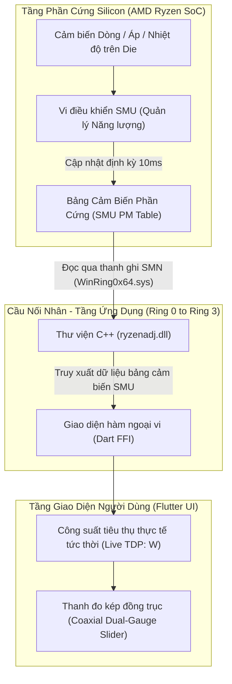

#### 1. Cơ chế đọc dữ liệu tức thời (Telemetry Ingestion Pipeline)
- **Chu kỳ làm mới (Polling Cycle)**: Ứng dụng khởi tạo cấu trúc bảng với hàm `init_table(ryzen_access)`. Định kỳ mỗi giây (1Hz), ứng dụng phát lệnh `refresh_table(ryzen_access)` để SMU chép toàn bộ ảnh chụp dữ liệu cảm biến mới nhất ra vùng nhớ đệm.
- **Trích xuất thông số vật lý (Physical Metric Extraction)**:
  - Công suất thực tế trích xuất qua hàm `get_stapm_value(ryzen_access)` (đo bằng Watt với độ chính xác số thực thực tế, ví dụ `2.28W` khi nhàn rỗi và `24.85W` khi tải nặng).
  - Nhiệt độ nhân trích xuất qua hàm `get_tctl_temp_value(ryzen_access)` (°C).
- Nhờ cơ chế này, thanh trượt [[SettingSlider]] hiển thị đồng thời hai thông số: mức công suất tiêu thụ thực tế tức thời bên cạnh mức công suất giới hạn mục tiêu do người chơi thiết lập (`Live / Target: 18.2 / 20 W`).

#### 2. Cơ chế tự phục hồi và đồng bộ driver (Self-Healing Driver Deployment)
- **Bế tắc kỹ thuật:** Thư viện nhân `WinRing0x64.dll` sử dụng hàm API Windows `GetModuleFileNameW(NULL)` để xác định vị trí của tệp điều khiển `WinRing0x64.sys`. Khi ứng dụng chạy từ thư mục gốc, WinRing0 luôn tìm kiếm tệp driver nằm ngang hàng với tệp thực thi chính (`windows_handheld_tool.exe`) chứ không tự tìm vào thư mục con `bin\`.
- **Giải pháp tự động hóa 100%:**
  1. **Đóng gói phát sinh kép (Dual-Target Packaging):** Tập lệnh `package_release.bat` sao chép tự động các tệp nhị phân runtime (`WinRing0x64.sys`, `WinRing0x64.dll`, `ryzenadj.dll`, `inpoutx64.dll`, `dxgi_hook.dll`) vào **cả thư mục con `bin\` lẫn thư mục gốc** của gói phát hành.
  2. **Tự chẩn đoán và đồng bộ thời gian chạy (Runtime Self-Healing):** Trong hàm `_initRyzenAdj()`, ứng dụng kiểm tra sự hiện diện của các tệp driver giữa thư mục gốc và thư mục con `bin\`. Nếu phát hiện tệp driver bị thiếu ở bất kỳ vị trí nào, ứng dụng tự động sao chép qua lại để đảm bảo cấu trúc tệp luôn đầy đủ trước khi kích hoạt `init_ryzenadj()`.

---

## Kiến Trúc Khởi Động Tự Động Trên Nguồn Pin Của Thiết Bị Cầm Tay (Battery-Aware Scheduled Task Architecture)

### Bản Chất Vật Lý Của Trình Lập Lịch Windows Khi Quản Lý Nguồn Điện

Trên các hệ máy cầm tay (Handheld PC như ROG Ally, Legion Go, GPD Win), thiết bị thường xuyên vận hành hoàn toàn bằng nguồn điện từ pin tích hợp (DC Power) thay vì cắm sạc trực tiếp từ nguồn lưới (AC Power).

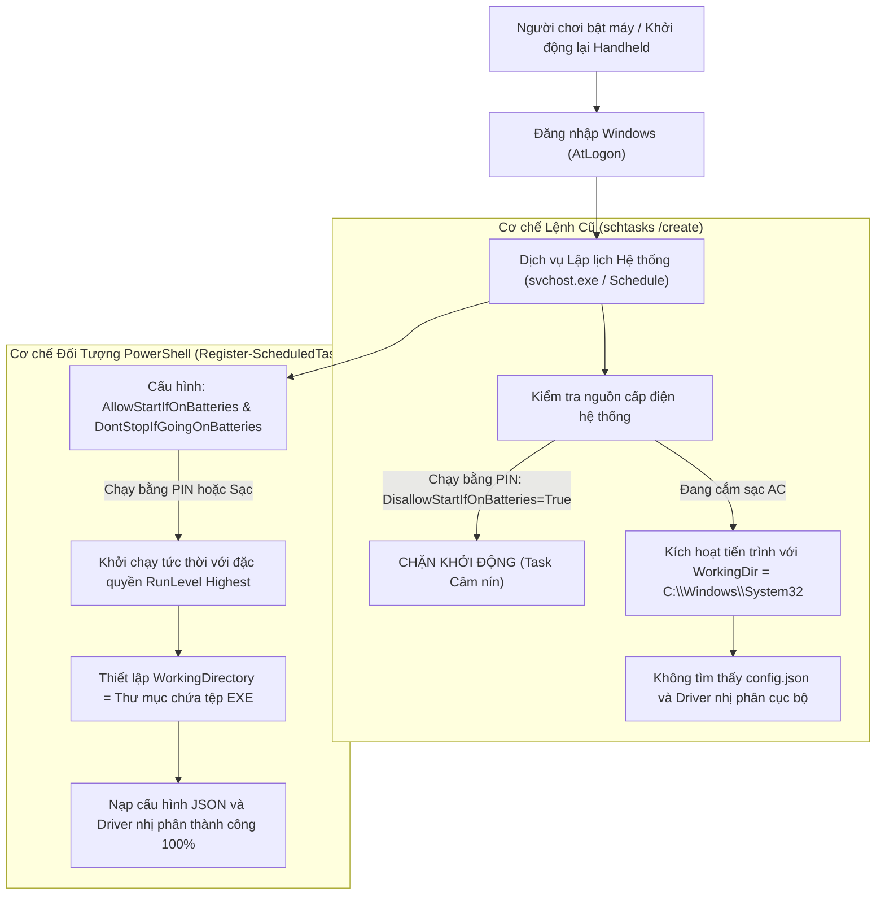

#### 1. Bế tắc kỹ thuật của tiện ích `schtasks.exe` truyền thống
- **Chính sách tiết kiệm năng lượng mặc định (Battery Disallow Policy)**: Lệnh `schtasks /create` của Windows mặc định kích hoạt cờ `DisallowStartIfOnBatteries = True`. Khi người dùng khởi động lại máy ở chế độ di động không cắm sạc, bộ lập lịch Task Scheduler nhận diện thiết bị đang chạy bằng pin và đơn phương hủy kích hoạt tác vụ mà không phát ra bất kỳ cảnh báo nào.
- **Thư mục làm việc bị trôi lệch (Working Directory Desynchronization)**: Khi khởi chạy qua `schtasks`, biến môi trường thư mục làm việc hiện hành (`Current Working Directory` - CWD) bị gán mặc định về `C:\Windows\System32`. Ứng dụng khi chạy ngầm sẽ không thể tra cứu tệp cấu hình [[ConfigManager]] (`config.json`) và các tệp nhị phân driver nhân [[TdpService]] (`ryzenadj.dll`, `WinRing0x64.sys`) nằm trong thư mục cài đặt gốc.

#### 2. Giải pháp chuyển dịch sang Đối tượng Lập lịch PowerShell Hiện đại
- **Giải phóng ràng buộc nguồn điện**: Hàm `AutostartService.setEnabled()` sử dụng lệnh ghép PowerShell `Register-ScheduledTask` kết hợp với đối tượng cấu hình `New-ScheduledTaskSettingsSet`:
  - `-AllowStartIfOnBatteries`: Cho phép tác vụ kích hoạt ngay cả khi máy đang vận hành bằng nguồn pin.
  - `-DontStopIfGoingOnBatteries`: Giữ cho ứng dụng tiếp tục chạy ổn định khi người dùng đột ngột rút dây sạc.
  - `-ExecutionTimeLimit (New-TimeSpan -Days 0)`: Xóa bỏ giới hạn thời gian chạy tối đa (mặc định Windows sẽ tự tắt các tác vụ chạy quá 3 ngày).
- **Cố định thư mục làm việc tuyệt đối**: Sử dụng `New-ScheduledTaskAction -WorkingDirectory '$exeDir'` để chỉ định thư mục cha của tệp thực thi làm không gian làm việc chính thức, đảm bảo việc đọc ghi dữ liệu cục bộ và nạp thư viện động luôn đồng nhất.

---

## Kiến Trúc Khử Hiện Tượng Chớp Trắng Khởi Động Trên Cửa Sổ Trong Suốt Win32 (Zero-Latency Transparent Window Initialization)

### Bản Chất Vật Lý Của Bộ Đệm Dựng Hình Và Vòng Đời Cửa Sổ Đồ Họa

Khi một cửa sổ Win32 được tạo lập thông qua hàm API `CreateWindowExW`, hệ điều hành phân bổ một cấu trúc quản lý cửa sổ trong bộ nhớ của tiến trình quản lý cửa sổ máy tính (Desktop Window Manager - DWM).

```mermaid
flowchart TD
    subgraph Old_Lifecycle["Vòng Đời Cũ (Gây Chớp Trắng)"]
        WinCreateOld["Tạo cửa sổ Win32 (CreateWindowEx)"] --> AlphaOld["Alpha mặc định = 255 (Mờ đục)"]
        AlphaOld --> EngineOld["Flutter Engine khởi tạo bề mặt DirectX / ANGLE"]
        EngineOld --> FrameOld["Dựng Frame đầu tiên (NextFrameCallback)"]
        FrameOld --> ShowCpp["Mã C++ gọi ShowWindow ngay lập tức"]
        ShowCpp --> Flash["CHỚP TRẮNG 200ms: DWM vẽ nền cửa sổ trước khi Dart xong await"]
        Flash --> DartDoneOld["Dart hoàn tất nạp giao diện và thiết lập trong suốt"]
    end
    subgraph New_Lifecycle["Vòng Đời Mới (Triệt Tiêu Hoàn Toàn Chớp Trắng)"]
        WinCreateNew["Tạo cửa sổ Win32 với cờ WS_EX_LAYERED | WS_EX_TRANSPARENT"] --> AlphaZero["Đặt Alpha = 0 tuyệt đối (SetLayeredWindowAttributes)"]
        AlphaZero --> NoShow["Xóa bỏ lệnh ShowWindow bên trong C++ Runner"]
        NoShow --> DartReady["Dart nạp xong cấu hình & dịch vụ bất đồng bộ"]
        DartReady --> ShowCmd["Gọi windowManager.show() đồng bộ trạng thái"]
        ShowCmd --> InvisibleIdle["Cửa sổ ở trạng thái vô hình (Alpha 0, Click-through) chờ phím tắt"]
        InvisibleIdle --> Hotkey["Người chơi nhấn Hotkey / Gamepad"]
        Hotkey --> FadeIn["showOverlayNoActivate: Nâng Alpha = 255, Gỡ WS_EX_TRANSPARENT"]
    end
```

#### 1. Bế tắc kỹ thuật gây ra hiện tượng nháy trắng (White Flash Root Cause)
- C++ Runner ban đầu đăng ký hàm gọi lại `flutter_controller_->engine()->SetNextFrameCallback()` với hành vi gọi thẳng `this->Show()` ngay khi khung hình đầu tiên của Flutter Engine hoàn tất.
- Tại thời điểm này, mã Dart cấp cao trong `main()` vẫn đang thực hiện chuỗi các tác vụ bất đồng bộ (`DeviceInfoService.init()`, `RtssService.ensureRunning()`, `ConfigManager()`). Khung hình đầu tiên mà Engine trả về chỉ là một vùng nhớ đệm rỗng mang màu nền mặc định của cửa sổ Win32 (màu trắng).
- DWM lập tức hòa trộn (composite) bề mặt màu trắng này lên màn hình máy tính của người chơi trong khoảng 150ms - 200ms trước khi Dart kịp thời gửi lệnh thiết lập màu nền trong suốt (`AppTheme.transparent`).

#### 2. Giải pháp làm chủ vòng đời hiển thị (Deterministic Alpha Lifecycle)
1. **Khởi tạo trong suốt tuyệt đối tại tầng Win32 Kernel**:
   - Trong tệp `win32_window.cpp`, ngay sau khi hàm `CreateWindowExW` trả về địa chỉ cửa sổ (`HWND`), hệ điều hành áp dụng ngay hàm `SetLayeredWindowAttributes(window, 0, 0, LWA_ALPHA)`. Giá trị kênh Alpha bằng 0 biến cửa sổ thành một bề mặt quang học hoàn toàn vô hình đối với DWM.
2. **Triệt tiêu lệnh hiển thị sớm ở tầng C++ Runner**:
   - Trong `flutter_window.cpp`, loại bỏ hoàn toàn lệnh `this->Show()` bên trong `SetNextFrameCallback`. Cửa sổ tuyệt đối không được tự ý xuất hiện khi chưa có tín hiệu sẵn sàng từ Flutter Dart.
3. **Điều khiển kênh Alpha hai chiều qua FFI Win32**:
   - Dịch vụ [[NativeWindowService]] nạp trực tiếp hàm `SetLayeredWindowAttributes` từ `user32.dll`.
   - **Khi ở chế độ chờ**: Ứng dụng duy trì `Alpha = 0` kết hợp cờ `WS_EX_TRANSPARENT`, đảm bảo mọi tương tác bàn phím, chuột và khung hình của game đang chơi chạy xuyên thấu mà không bị suy hao tài nguyên GPU.
   - **Khi người dùng kích hoạt Quick Panel**: Hàm `showOverlayNoActivate()` thiết lập `Alpha = 255` và gỡ cờ xuyên thấu, hiển thị toàn bộ giao diện điều khiển tức thì với độ trễ 0ms.

---

## Thuật Toán Căn Giữa Khung Nhìn Cho Điều Hướng Gamepad (Gamepad Viewport Center-Alignment Algorithm)

### Bản Chất Vật Lý Của Không Gian Cuộn Tuyến Tính (Scroll Viewport Geometry)

Khung nhìn danh sách cuộn (`ListView` trong [[QuickPanel]]) là một cổng quan sát có chiều cao hữu hạn ($V_{height}$) trượt trên một trục không gian nội dung có tổng chiều cao thực tế lớn hơn ($C_{total}$).

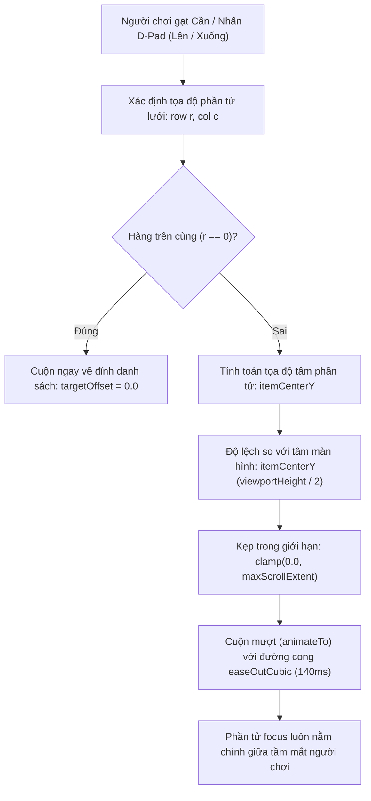

#### 1. Bế tắc kỹ thuật của thuật toán cuộn neo đỉnh (Top-Alignment Pitfall)
- Thuật toán trước đây sử dụng công thức tính khoảng cách cuộn tuyến tính dựa trên chỉ số dòng:
  $$\text{TargetOffset} = r \times (120.0 \times \text{Scale})$$
- **Hệ quả hình học**: Đây là cơ chế **neo đỉnh (Top Alignment)**. Khi người chơi chuyển tiêu điểm xuống hàng $r = 1$, danh sách bị kéo mạnh lên phía trên để đưa đỉnh của hàng đó sát vào mép trên cùng của khung nhìn.
- Do phía trên mỗi nhóm chức năng có chứa nhãn phân vùng (`SectionLabel`) và khoảng cách đệm (`EdgeInsets.symmetric`), hàng được chọn bị mép trên của cửa sổ che mất từ 30% đến 50% diện tích hiển thị. Người chơi hoàn toàn mất tầm nhìn đối với tiêu đề hoặc các nút gạt của thẻ chức năng đó.

#### 2. Thuật toán căn giữa tâm khung nhìn (Center-Alignment Algorithm)
Để tái hiện trải nghiệm điều hướng chuẩn công nghiệp của hệ máy console cầm tay, thuật toán chuyển sang cơ chế **Căn giữa tâm (Center Alignment)**:

1. **Trường hợp gốc (Base Case $r = 0$)**:
   - Nếu người chơi điều hướng về hàng đầu tiên của tab, danh sách lập tức cuộn về tọa độ gốc $\text{TargetOffset} = 0.0$, hiển thị trọn vẹn cả nhãn phân đoạn đầu trang và thẻ chức năng thứ nhất.
2. **Trường hợp tổng quát ($r > 0$)**:
   - Xác định tọa độ tâm theo trục dọc của phần tử thứ $r$:
     $$\text{ItemCenterY} = \text{HeaderOffset} + \left[r \times (\text{RowHeight} + \text{ItemSpacing})\right] + \frac{\text{RowHeight}}{2}$$
   - Tính toán vị trí cuộn mục tiêu sao cho tâm phần tử trùng khớp với tâm của khung nhìn hiển thị:
     $$\text{TargetOffset} = \text{ItemCenterY} - \frac{V_{height}}{2}$$
   - Giới hạn khoảng cách bằng hàm chặn biên để ngăn hiện tượng cuộn vượt giới hạn:
     $$\text{FinalOffset} = \text{clamp}(\text{TargetOffset}, 0.0, \text{MaxScrollExtent})$$
- Khi phần tử vẫn còn nằm ở nửa trên của màn hình, $\text{TargetOffset}$ mang giá trị âm và được kẹp về $0.0$, giữ cho màn hình tĩnh lặng tự nhiên. Khi người chơi tiếp tục cuộn xuống sâu hơn, khung nhìn trượt êm ái với thời gian 140ms theo đường cong gia tốc $\text{Curves.easeOutCubic}$, giữ cố định phần tử tương tác ở tâm ngang của tầm mắt.

#### 3. Bế tắc của phép ước lượng số học và Giải pháp Render Tree đích thực
- **Bế tắc của công thức đại số cố định**: Trên thực tế, các thẻ giao diện có chiều cao không đồng nhất (Non-uniform Item Heights): [[ToggleCard]] cao ~65dp, trong khi [[SettingSlider]] có các nút chọn nhanh cao tới ~155dp, xen kẽ với các [[SectionLabel]] cao ~40dp. Việc nhân tuyến tính với một hằng số giả định $115.0 \times \text{Scale}$ tích lũy sai số lên đến 150px - 250px ở các hàng cuối, khiến phần tử bị lệch lên trên hoặc bị kéo quá đà.
- **Giải pháp bóc tách từ Cây dựng hình (Render Tree First Principles)**: Thay vì phán đoán bằng số học, Flutter Engine lưu trữ tọa độ pixel tuyệt đối của từng phần tử trong bộ nhớ đối tượng [[RenderBox]]. Framework cung cấp cơ chế đo đạc tự động:
  - `Scrollable.ensureVisible(context, alignment: 0.5)`
  - Giá trị `alignment: 0.5` chỉ định trực tiếp cho `ScrollPosition` căn chỉnh tâm hình học của RenderBox trùng khớp hoàn hảo với tâm của cổng nhìn Viewport, triệt tiêu 100% sai số tích lũy bất kể widget cao bao nhiêu pixel.

---

## Kiến Trúc Phân Lập Giữa DXGI Borderless Hook Và Direct3D Shared Texture Injection (Display Mode Decoupling Architecture)

### Bản Chất Vật Lý Của Hai Triết Lý Can Thiệp Khung Hình

Hai phương án tương thích trò chơi toàn màn hình đại diện cho hai cơ chế can thiệp đồ họa hoàn toàn đối nghịch nhau ở tầng nhân Direct3D / DXGI:

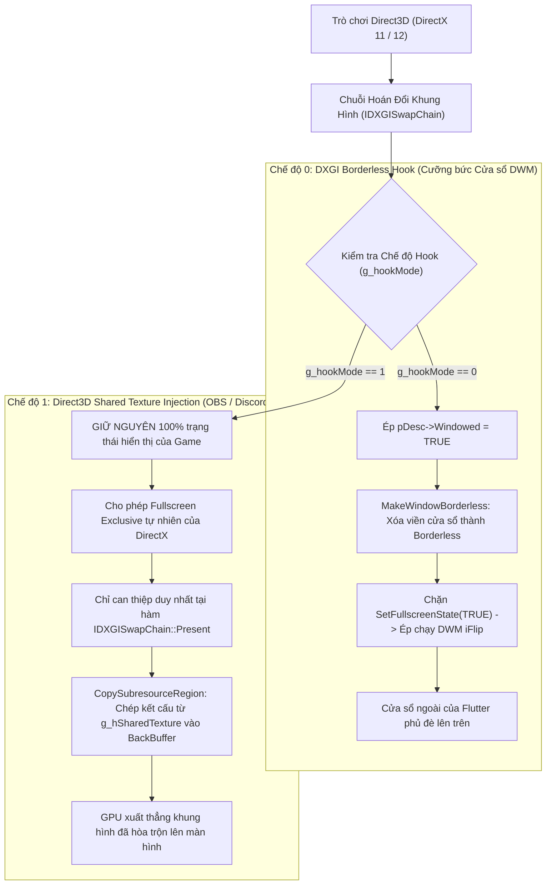

#### 1. Bế tắc kỹ thuật gây ra hiện tượng "vẫn bị Hook Borderless" khi chọn Shared Texture
- Trong mã nguồn C++ của thư viện `dxgi_hook.dll`, biến chế độ chia sẻ `g_hookMode` (nằm trong phân vùng dữ liệu dùng chung `#pragma data_seg(".shared")`) **chỉ được kiểm tra duy nhất bên trong hàm `Hooked_Present`** để quyết định có sao chép texture hay không.
- Ngược lại, tại các hàm quản lý vòng đời cửa sổ và kích thước bộ đệm:
  1. `Hooked_CreateSwapChain` & `Hooked_CreateSwapChainForHwnd`: Luôn tự ý ghi đè `pDesc->Windowed = TRUE`, xóa bỏ cờ `DXGI_SWAP_CHAIN_FLAG_ALLOW_MODE_SWITCH`, và gọi hàm `MakeWindowBorderless`.
  2. `Hooked_SetFullscreenState`: Luôn chặn đứng khi game yêu cầu toàn màn hình độc quyền và ép buộc cửa sổ về Borderless.
  3. `Hooked_ResizeTarget` & `Hooked_ResizeBuffers`: Luôn gọi `MakeWindowBorderless`.
- Hậu quả: Dù người chơi đã chuyển công tắc trong giao diện sang Shared Texture, mã C++ vẫn âm thầm thực thi toàn bộ logic cưỡng bức Borderless của Phương án 2, tước đoạt chế độ Fullscreen Exclusive gốc của trò chơi.

#### 2. Giải pháp phân lập logic tuyệt đối (Strict Mode Isolation)
- Toàn bộ các khối lệnh can thiệp kiểu dáng cửa sổ (`MakeWindowBorderless`, cưỡng bức `Windowed = TRUE`, triệt tiêu `ALLOW_MODE_SWITCH`, chặn `SetFullscreenState`) phải được bọc trong điều kiện nghiêm ngặt:
  $$\text{if } (g\_hookMode == \text{OVERLAY\_HOOK_MODE\_BORDERLESS})$$
- Khi người chơi chọn `OVERLAY_HOOK_MODE_SHARED_TEXTURE` ($g\_hookMode = 1$), DLL đóng vai trò một lớp trung chuyển trong suốt (Transparent Pass-Through), giữ nguyên vẹn 100% trạng thái hiển thị của trò chơi và chỉ kích hoạt duy nhất luồng tiêm kết cấu Direct3D tại khe thời gian `Present`.

---

## Cơ Chế Phân Tầng Lớp Hiển Thị Z-Order Của DWM Và Thanh Tác Vụ Cảm Ứng Windows 11 (DWM Z-Bands & Touchscreen Taskbar Hierarchy)

### Bản Chất Vật Lý Của Không Gian Phân Tầng Cửa Sổ (Desktop Window Manager Z-Bands)

Trình quản lý cửa sổ máy tính của Windows (Desktop Window Manager - DWM) không xếp chồng các cửa sổ trên một trục Z đơn lẻ, mà chia không gian hiển thị thành các dải phân tầng độc lập (Z-Bands) có thứ bậc ưu tiên từ thấp đến cao:

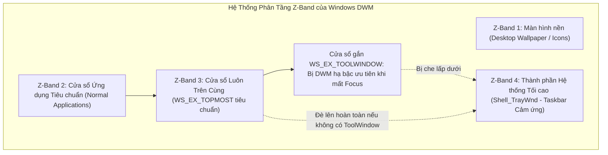

#### 1. Bế tắc kỹ thuật khiến Quick Panel nằm dưới Taskbar cảm ứng
- Khi người dùng kích hoạt tính năng "Optimize taskbar for touch interactions" trên Windows 11:
  - Khi không có cửa sổ trò chơi chiếm trọn màn hình, thanh Taskbar hệ thống (`Shell_TrayWnd`) tự động chuyển sang trạng thái mở rộng (Expanded State) để tối ưu cho thao tác chạm ngón tay.
  - DWM nâng thứ bậc hiển thị của `Shell_TrayWnd` lên dải Z-Band hệ thống ưu tiên tối cao (`ZBID_SYSTEM_TOOLS`).
- Trong hàm `NativeWindowService.showOverlayNoActivate()`, cửa sổ lớp phủ được gán cờ kiểu dáng mở rộng:
  $$\text{WS\_EX\_TOOLWINDOW} \quad (0x00000080)$$
- **Quy tắc hiển thị của Windows**: Cửa sổ mang cờ `WS_EX_TOOLWINDOW` (dành cho thanh công cụ nổi) kết hợp với cờ không kích hoạt `WS_EX_NOACTIVATE` / `SWP_NOACTIVATE` sẽ bị DWM chủ động hạ bậc Z-order xuống dưới các cửa sổ hệ thống (`Shell_TrayWnd`) khi ở ngoài màn hình Desktop. Kết quả là thanh Taskbar đè lên mép dưới của Quick Settings Panel, che khuất các nút điều khiển quan trọng.

#### 2. Giải pháp khôi phục Z-Order tối cao
1. **Loại bỏ cờ hạ bậc `WS_EX_TOOLWINDOW`**:
   - Khi hiển thị lớp phủ, loại bỏ hoàn toàn cờ `WS_EX_TOOLWINDOW` khỏi cấu trúc extended style. Cửa sổ giữ nguyên trạng thái `WS_EX_TOPMOST` thuần túy để DWM xếp ngang hàng hoặc cao hơn `Shell_TrayWnd`.
2. **Kỹ thuật neo đỉnh Z-Order (Topmost Re-assertion)**:
   - Khi kích hoạt hiển thị, phát lệnh gọi API `SetWindowPos(hwnd, HWND_TOPMOST, ...)` kết hợp kiểm tra địa chỉ cửa sổ `Shell_TrayWnd` để tái lập quyền ưu tiên hiển thị trước thanh Taskbar.
3. **Cơ chế khoảng đệm vùng an toàn thích ứng (Adaptive Safe Area Margin)**:
   - Để đảm bảo giao diện luôn hiển thị trọn vẹn 100% trong mọi tình huống DWM cưỡng bức Taskbar, tầng giao diện [[OverlayScreen]] có thể tự động cộng thêm khoảng đệm đáy (`EdgeInsets.only(bottom: taskbarHeight)`) tương đương chiều cao của thanh Taskbar cảm ứng (khoảng 64px - 72px) khi phát hiện người dùng đang thao tác ngoài màn hình Desktop.

---

## Kiến Trúc Điều Khiển Khung Hình Và Lớp Phủ Thống Kê Qua RivaTuner Statistics Server (RTSS IPC & Native Hook Architecture)

### Bản Chất Vật Lý Của Cơ Chế Lớp Phủ OSD Trong RivaTuner Statistics Server

RivaTuner Statistics Server (RTSS) hoạt động như một máy chủ tiêm mã độc lập (DLL Injector) trong không gian bộ nhớ của Windows:

1. **Vùng nhớ chia sẻ có định danh (Named Shared Memory)**:
   - RTSS tạo ra một khối bộ nhớ dùng chung được định danh bởi hệ điều hành (`RTSSSharedMemoryV2`).
   - Cấu trúc tiêu đề (`RTSS_SHARED_MEMORY`) chứa các mảng thông tin về tiến trình đồ họa đang chạy (`RTSS_SHARED_MEMORY_APP_ENTRY`), bao gồm mã định danh tiến trình (Process ID - PID), đường dẫn tệp thực thi (`szProcessPath`), tốc độ khung hình tức thời (`dwStatFramerate`), và bộ đệm văn bản hiển thị lớp phủ (`szOSD`).
2. **Thư viện can thiệp đồ họa chuyên dụng (`RTSSHooks64.dll`)**:
   - Khi một ứng dụng đồ họa (Direct3D 9/11/12, Vulkan, OpenGL) được khởi tạo, Windows nạp thư viện `RTSSHooks64.dll` vào không gian bộ nhớ của trò chơi.
   - DLL này móc chặn chuỗi hiển thị khung hình tại hàm xuất hình phần cứng (`IDXGISwapChain::Present`), trực tiếp vẽ lớp phủ văn bản (On-Screen Display - OSD) lên trên bộ đệm khung hình sau cùng trước khi gửi xuống bộ điều khiển xuất hình.

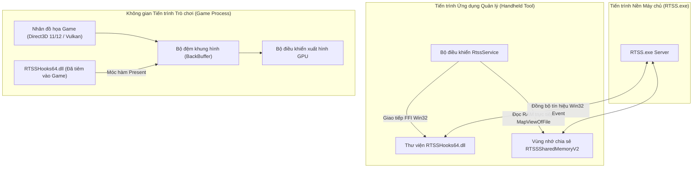

---

### Bế Tắc Kỹ Thuật Khi Điều Khiển Cấu Hình RTSS Qua Tệp Tin Cục Bộ (INI File I/O)

#### 1. Hiện trạng xử lý cũ
- Ứng dụng đọc và ghi trực tiếp các tham số cấu hình bằng cách phân tích chuỗi văn bản (String Parsing) trong tệp tin `Profiles\Global` tại thư mục cài đặt `C:\Program Files (x86)\RivaTuner Statistics Server\Profiles`.
- Để bật OSD, ứng dụng ghi hai cặp khóa-giá trị: `EnableOSD=1` và `ShowForegroundStat=1`.

#### 2. Thảm họa kỹ thuật và bế tắc thực tế
- **Rào cản đặc quyền truy cập tệp (UAC Permission Denied)**: Thư mục `C:\Program Files (x86)` là vùng được hệ điều hành Windows bảo vệ nghiêm ngặt. Khi ứng dụng chạy dưới quyền hạn người dùng thông thường hoặc luồng không có quyền ghi, việc mở luồng ghi tệp tin thất bại (`Access is denied`), dẫn tới cấu hình không thể lưu xuống đĩa.
- **Hiện tượng trơ cấu hình do thiếu tín hiệu liên lạc tiến trình (IPC Signal Lack)**: Kể cả khi tệp tin INI được ghi thành công, tiến trình `RTSS.exe` và các trò chơi đang chạy trong RAM không hề biết cấu hình trên đĩa đã thay đổi vì chúng đã nạp cấu hình vào bộ nhớ từ thời điểm khởi động. Thiếu tín hiệu thông báo cưỡng bức làm mới (`UpdateProfiles`), các thay đổi về giới hạn khung hình hay OSD hoàn toàn bị bỏ qua.
- **Hiện tượng OSD rỗng do nhầm lẫn cờ hiển thị (`EnableOSD` so với `EnableStat`)**: 
  - Trong cấu trúc quản trị của RTSS, `EnableOSD` chỉ là cờ cho phép kích hoạt hệ thống con OSD bên trong game.
  - Cờ quyết định việc RTSS **tự động vẽ đồng hồ đo khung hình (FPS Counter) tích hợp của chính nó** lên màn hình là `EnableStat`. 
  - Nếu `EnableStat = 0`, RTSS vẫn hook thành công vào game nhưng màn hình không hiển thị bất kỳ thông số nào vì bộ đệm OSD rỗng.

#### 3. Cách thức giải quyết triệt để (Native DLL Inter-Process Communication)
- Chuyển đổi 100% việc quản lý cấu hình sang sử dụng các hàm Win32 API xuất trực tiếp từ `RTSSHooks64.dll` qua FFI:
  1. Nạp hồ sơ cấu hình toàn cục: `LoadProfile("")`.
  2. Ghi tham số trực tiếp vào vùng nhớ điều khiển: `SetProfileProperty("EnableOSD", ...)`, `SetProfileProperty("EnableStat", ...)`, `SetProfileProperty("FramerateLimit", ...)`.
  3. Lưu giữ cấu hình: `SaveProfile("")`.
  4. **Phát tín hiệu đồng bộ toàn hệ thống (`UpdateProfiles()`)**: Hàm này gửi thông điệp sự kiện IPC tới toàn bộ các ứng dụng 3D đang chạy để đồng bộ ngay lập tức trong khung hình tiếp theo mà không cần khởi động lại trò chơi.

---

### Cơ Chế Giám Sát Và Tự Động Khôi Phục Tiến Trình (Watchdog Process Resurrection)

#### 1. Bế tắc khi người dùng tắt RTSS ở khay hệ thống
- Người dùng có thể vô tình nhấn "Close" trên biểu tượng RTSS ở khay hệ thống (System Tray). Lúc này tiến trình `RTSS.exe` bị hủy (`TerminateProcess`), vùng nhớ chia sẻ `RTSSSharedMemoryV2` bị đóng.
- Khi người dùng quay lại trò chơi, toàn bộ tính năng khóa FPS và hiển thị OSD bị tê liệt hoàn toàn mà không có cơ chế nào tự động nhận biết để phục hồi.

#### 2. Kiến trúc Giám sát Cửa sổ Kích hoạt (Foreground Window Watchdog Architecture)
- Thiết lập một luồng kiểm tra trạng thái định kỳ phối hợp cùng sự kiện cửa sổ:
  1. **Kiểm tra trạng thái kết nối bộ nhớ chia sẻ**: Sử dụng hàm `OpenFileMappingW(FILE_MAP_READ, FALSE, L"RTSSSharedMemoryV2")`. Nếu trả về con trỏ rỗng (`NULL`), xác định tiến trình RTSS đã biến mất khỏi hệ thống.
  2. **Nhận diện trạng thái kích hoạt trò chơi**: Gọi hàm `GetForegroundWindow()` từ thư viện `user32.dll` để lấy tay nắm cửa sổ đang hoạt động trên cùng. Lấy đường dẫn tệp thực thi của tiến trình qua `GetWindowThreadProcessId` và `QueryFullProcessImageNameW`.
  3. **Khởi chạy cưỡng bức ngầm**: Khi phát hiện cửa sổ kích hoạt là một trò chơi (không thuộc các tiến trình hệ thống như `explorer.exe`, `ShellExperienceHost.exe`) hoặc khi người dùng mở [[QuickPanel]], nếu cấu hình OSD hoặc FPS Limit đang ở trạng thái kích hoạt, hệ thống tự động gọi hàm khởi chạy tiến trình tách rời (`ProcessStartMode.detached`) đối với `RTSS.exe` để tái thiết lập toàn bộ chuỗi theo dõi.

```mermaid
flowchart TD
    Timer["Bộ đếm thời gian 1 Giây (Watchdog Timer)"] --> CheckMem{"Kiểm tra OpenFileMappingW('RTSSSharedMemoryV2')"}
    CheckMem -->|Con trỏ hợp lệ| Normal["RTSS đang hoạt động bình thường"]
    CheckMem -->|Trả về NULL (Tiến trình bị đóng)| CheckUser{"Người dùng có bật OSD / Giới hạn FPS?"}
    CheckUser -->|Không| Idle["Giữ nguyên trạng thái nghỉ"]
    CheckUser -->|Có kích hoạt| CheckFG["Đọc GetForegroundWindow() từ user32.dll"]
    CheckFG --> IsGame{"Tiến trình kích hoạt != explorer.exe?"}
    IsGame -->|Đúng (Đang trong game hoặc mở Panel)| Revive["Gọi Process.start(RTSS.exe, mode: detached)"]
    Revive --> Reconnect["Tự động kết nối lại RTSSSharedMemoryV2 & Đồng bộ Profile"]
    IsGame -->|Sai (Đang ở Desktop)| Idle
```

---

## Cơ Chế Bơm Dữ Liệu Cảm Biến Và Định Dạng Thẻ Văn Bản Vào RTSS OSD Shared Memory (Dynamic OSD Text Injection & Slot Formatting)

### Bản Chất Vật Lý Của Bộ Đệm Ký Tự OSD (RTSS Shared Memory Text Buffer)

Trong kiến trúc của RivaTuner Statistics Server, việc hiển thị văn bản lớp phủ động không thông qua tệp tin cấu hình tĩnh mà can thiệp trực tiếp vào bộ đệm RAM của tiến trình RTSS:

1. **Cấu trúc Ô nhớ Lớp phủ Độc lập (OSD Slot Descriptor - `RTSS_SHARED_MEMORY_OSD_ENTRY`)**:
   - Vùng nhớ chia sẻ `RTSSSharedMemoryV2` phân bổ một mảng các cấu trúc ô nhớ tại độ lệch `dwOSDArrOffset` từ đầu khối nhớ.
   - Mỗi ô nhớ chứa hai trường văn bản ANSI cốt lõi:
     - Chuỗi định danh quyền sở hữu (`szOSDOwner` - kích thước 256 byte): Ứng dụng khách chiếm quyền ô nhớ bằng cách ghi định danh độc quyền (ví dụ `"WindowsHandheldTool"`).
     - Chuỗi nội dung lớp phủ mở rộng (`szOSDEx` - kích thước 4096 byte trong phiên bản bộ nhớ 2.7 trở lên): Nơi chứa chuỗi văn bản trực tiếp cần hiển thị đè lên màn hình trò chơi.
2. **Bộ phân giải thẻ định dạng văn bản (RTSS Tag Formatting Engine)**:
   - Nhân render Direct3D/Vulkan của RTSS tích hợp trình phân giải ký tự định dạng (Markup Tag Parser):
     - Thẻ màu sắc: `<C=RRGGBB>` (ví dụ `<C=00FF80>` đổi màu lục, `<C=FFAA00>` đổi màu cam, `<C=FF4444>` đổi màu đỏ cảnh báo nhiệt độ cao).
     - Thẻ tỉ lệ kích thước font: `<S=Percentage>` (ví dụ `<S=75>` thu nhỏ font xuống 75%, `<S=120>` phóng to 120%).
     - Ký tự xuống dòng `\r\n`: Chia tách văn bản thành bảng cột nhiều dòng (Multi-line Grid).
3. **Cơ chế kích hoạt cập nhật khung hình (Global Frame Counter Tick - `dwOSDFrame`)**:
   - Sau khi sao chép chuỗi định dạng vào ô nhớ `szOSDEx`, ứng dụng tăng giá trị trường số nguyên 32-bit `dwOSDFrame++`.
   - Vòng lặp xuất hình `Present()` của RTSS bên trong game liên tục kiểm tra biến này; khi phát hiện giá trị thay đổi, bộ tạo font phần cứng (Direct3D Sprite Engine) lập tức kết xuất lại lớp phủ mới mà không gây sụt giảm tốc độ khung hình (Frame Drop).

```mermaid
flowchart TD
    subgraph Sensors["Tầng Thu Thập Cảm Biến Phần Cứng (Hardware Telemetry)"]
        SMU["Bảng Cảm Biến PM Table: Công Suất TDP Watt, Tốc Độ Quạt RPM"]
        WMI["Trình Giám Sát Hệ Thống: Nhiệt Độ CPU, Tải CPU %, Dung Lượng RAM, Mức Pin %"]
        RTSS_Live["RTSS Hook: Tốc Độ Khung Hình Live FPS"]
    end

    subgraph Generator["Bộ Định Dạng Lớp Phủ (OSD Formatter)"]
        Sensors --> FormatEngine{"Lựa chọn Bố cục Hiển thị (Layout Selector)"}
        FormatEngine -->|Bố cục Dải Ngang Thu gọn| Compact["Dải 1 Dòng: FPS | TDP | CPU | RAM | BAT"]
        FormatEngine -->|Bố cục Cột Chi tiết| MultiLine["Bảng Nhiều Hàng: Dòng FPS, Dòng CPU, Dòng PIN..."]
        Compact --> TagInjector["Bổ sung Thẻ Màu Sắc <C=RRGGBB> Theo Ngưỡng Tải/Nhiệt"]
        MultiLine --> TagInjector
    end

    subgraph MemoryBuffer["Bộ Nhớ Chia Sẻ Hệ Thống (RTSSSharedMemoryV2)"]
        TagInjector -->|Ghi chuỗi vào| Entry["Ô nhớ pEntry->szOSDEx (4096 Byte)"]
        TagInjector -->|Tăng biến đếm| FrameTick["Tăng biến đếm pMem->dwOSDFrame++"]
    end

    subgraph GameHook["Tiến Trình Trò Chơi (Game DirectX/Vulkan)"]
        FrameTick -->|Kích hoạt Present Hook| D3DRender["RTSSHooks64.dll vẽ lớp phủ trực tiếp lên BackBuffer"]
    end
```

---

### Bế Tắc Kỹ Thuật Khi Chỉ Sử Dụng Đồng Hồ Đo Mặc Định Của RTSS (The "Why")

#### 1. Hiện trạng xử lý cũ
- Ứng dụng chỉ kích hoạt cờ hiển thị mặc định của RTSS (`EnableStat = 1`).

#### 2. Thảm họa kỹ thuật và bế tắc thực tế
- Cờ `EnableStat` là một bộ đếm nội bộ cứng nhắc của RTSS. Nó chỉ có khả năng vẽ duy nhất 1 thông số là tốc độ khung hình (`60 FPS`) hoặc thời gian dựng hình (`16.6 ms`).
- Trên thiết bị chơi game cầm tay (Windows Handheld PC), người chơi đối mặt với rào cản nghiêm trọng về giới hạn tản nhiệt (Thermal Throttling) và thời lượng pin. Người chơi hoàn toàn không thể theo dõi:
  - Máy đang tiêu thụ bao nhiêu Watt (TDP thực tế của APU).
  - Nhiệt độ chip có đang vượt ngưỡng nguy hiểm (> 85°C) hay không.
  - Tải dung lượng RAM bộ nhớ đồ họa chia sẻ (UMA VRAM).
  - Tỉ lệ phần trăm pin còn lại để kịp thời cắm sạc.

#### 3. Cách thức giải quyết triệt để (Dynamic OSD Injection)
- Ứng dụng Handheld Tool chủ động điều phối luồng văn bản bằng cách:
  1. Cho phép người dùng tùy chọn bật/tắt độc lập 7 chỉ số: Tốc độ khung hình (FPS), Công suất điện (TDP Watt), Nhiệt độ chip (CPU Temp), Tải CPU (CPU %), Dung lượng RAM (RAM GB), Mức độ pin (Battery %), Tốc độ quạt (Fan %).
  2. Cung cấp 2 kiểu bố cục hiển thị phù hợp với kích thước màn hình cầm tay (7 - 8.4 inch):
     - **Bố cục Thu gọn 1 dòng (Compact Banner)**: Gom toàn bộ thông số trên 1 dải ngang ở đỉnh màn hình nhằm tối đa hóa diện tích quan sát thế giới game.
     - **Bố cục Chi tiết nhiều dòng (Detailed Vertical)**: Hiển thị dạng bảng cột truyền thống phân chia rõ từng thành phần.
  3. Ánh xạ các thuộc tính cấu hình này vào tệp lưu trữ [[ConfigService]] và cập nhật định kỳ mỗi giây qua bộ nhớ chia sẻ.


