# Cơ Chế Hiển Thị Lớp Phủ (Overlay) Trên Trò Chơi Toàn Màn Hình Độc Quyền (Exclusive Fullscreen)

## Bản Chất Vật Lý Của Cơ Chế Xuất Hình Trên Windows

Trong hệ điều hành Windows, việc hiển thị hình ảnh từ card đồ họa (GPU) lên màn hình vật lý diễn ra qua hai cơ chế xử lý bộ đệm khung hình (Frame Buffer SwapChain):

1. **Chế độ Hợp thành Cửa sổ Mặc định (DWM Desktop Composition)**:
   - Các ứng dụng thông thường vẽ giao diện vào bộ đệm riêng của từng cửa sổ.
   - Trình quản lý cửa sổ của Windows (Desktop Window Manager - DWM) gom toàn bộ các bộ đệm này lại, ghép thành một khung hình tổng thể (Composite Frame) và gửi ra cổng xuất hình của card màn hình (Display Scanout).
2. **Chế độ Độc chiếm Phần cứng Toàn màn hình (DirectX Hardware Exclusive Mode - FSE)**:
   - Khi trò chơi kích hoạt chế độ toàn màn hình độc quyền (Exclusive Fullscreen), bộ điều khiển đồ họa (DirectX / DXGI) ngắt kết nối của DWM đối với màn hình hiển thị.
   - Chuỗi bộ đệm của game (SwapChain) được ánh xạ trực tiếp 1:1 tới bộ điều khiển quét tín hiệu phần cứng (Display Controller Scanout) nhằm triệt tiêu độ trễ xử lý (Latency) và loại bỏ chi phí hợp thành khung hình của DWM.

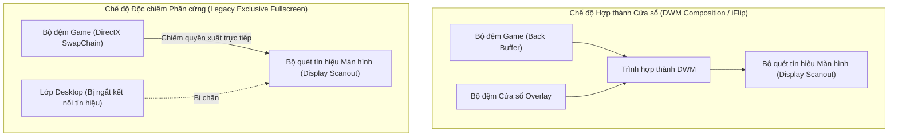

---

## Bế Tắc Kỹ Thuật Khi Hiển Thị Cửa Sổ Win32 Truyền Thống

### 1. Hiện trạng xử lý cũ
- Ứng dụng tạo một cửa sổ Win32 với các thuộc tính cửa sổ mở rộng: nổi trên cùng (`WS_EX_TOPMOST`), không nhận tiêu điểm chuột (`WS_EX_NOACTIVATE`), trong suốt nhiều lớp (`WS_EX_LAYERED`).

### 2. Sự cố và thảm họa kỹ thuật
- Windows phân chia không gian hiển thị của các cửa sổ thành nhiều phân lớp theo trục Z (Z-Order Bands). Cửa sổ `WS_EX_TOPMOST` thông thường được xếp vào **Phân lớp Mặc định của Môi trường Desktop** (`ZBID_DEFAULT`).
- Khi một trò chơi (như *Metro Exodus*) chạy ở chế độ Độc chiếm Phần cứng, toàn bộ phân lớp `ZBID_DEFAULT` bị tách khỏi chuỗi tín hiệu quét ra màn hình.
- Khi cửa sổ lớp phủ cố gắng xuất hiện hoặc yêu cầu làm mới khung hình (Render Invalidation), DWM nhận diện sự xuất hiện của một bề mặt thuộc phân lớp Desktop đang cố gắng đè lên vùng quét độc quyền. Để đảm bảo an toàn giao diện và khôi phục đường truyền DWM, Windows **cưỡng bức ngắt quyền độc chiếm phần cứng của trò chơi và thu nhỏ cửa sổ game xuống thanh tác vụ (Minimize to Taskbar)**.

---

## Phân Tích Kiến Trúc Các Phần Mềm Handheld Thương Mại (GPD Tool, AYASpace, Handheld Companion)

Các phần mềm chuyên dụng trên thiết bị chơi game cầm tay (GPD Win, AYANEO, ROG Ally) giải quyết triệt để bài toán này bằng cách kết hợp 4 phương án kỹ thuật từ tầng hệ điều hành đến tầng nhân đồ họa DirectX:

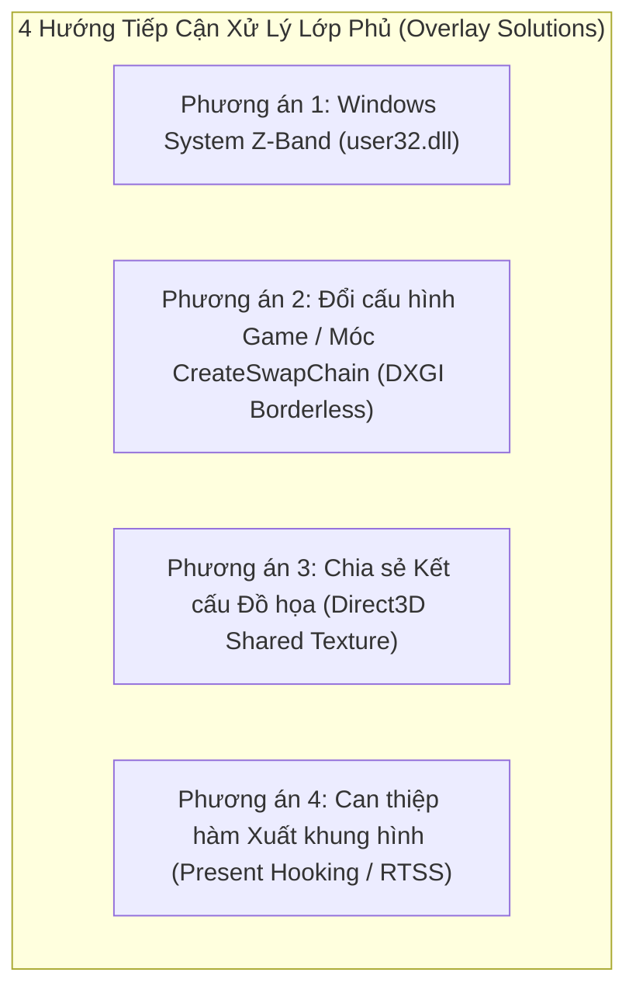

---

## Phương Án 1: Đưa Cửa Sổ Vào Phân Lớp Hệ Thống (Windows System Z-Band)

### 1. Cơ chế kỹ thuật
- Windows quản lý các lớp phủ hệ thống (như Bàn phím ảo cảm ứng `TabTip.exe`, Thanh trò chơi `Xbox Game Bar`, Thông báo hệ thống) trong một phân lớp đặc quyền cao hơn Desktop: **Phân lớp Công cụ Hệ thống (`ZBID_SYSTEM_TOOLS = 2`)** hoặc **Phân lớp Giao diện Nhúng (`ZBID_IMMERSIVE_APPCHROME = 15`)**.
- Các cửa sổ nằm trong phân lớp này được DWM cấp quyền vẽ đè trực tiếp lên trên các bề mặt đang độc chiếm màn hình mà không làm kích hoạt cơ chế thu nhỏ game.

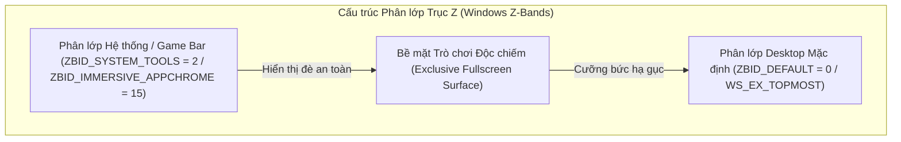

### 2. Cách thức giải quyết triệt để
- Nạp hàm nội bộ không công khai từ thư viện `user32.dll`:
  * Hàm API: `CreateWindowInBand` và `SetWindowBand`.
  * Chỉ số phân lớp (Band ID): `ZBID_SYSTEM_TOOLS` (giá trị nguyên `2`).
- **Điều kiện cốt lõi**: Yêu cầu quyền **UIAccess (`uiAccess="true"`)** trong Token tiến trình. Nếu chưa được ký số tin cậy (Digital Certificate), nhân Windows sẽ âm thầm hạ cấp cửa sổ về `ZBID_DEFAULT = 0`.

---

### Hiện Tượng Cạnh Tranh Thứ Tự Trục Z Với Thanh Tác Vụ Chế Độ Máy Tính Bảng (Tablet-Optimized Taskbar Z-Order Race Condition)

#### 1. Hiện tượng thực tế và bế tắc kỹ thuật
Khi người dùng kích hoạt tính năng "Tối ưu hóa thanh tác vụ cho tương tác chạm khi thiết bị được dùng như máy tính bảng" (Optimize taskbar for touch interactions when this device is used as a tablet) trên Windows 11, thanh tác vụ (Taskbar) đôi khi đè lên bảng điều khiển Quick Settings Panel, nhưng đôi khi lại bị bảng điều khiển đè lên (hiện tượng lúc đè, lúc không).

#### 2. Bóc trần bản chất vật lý dưới tầng nhân Windows (First Principles)
Trong cấu trúc dữ liệu của Trình quản lý Hợp thành Cửa sổ (Desktop Window Manager - DWM), thứ tự hiển thị từ trước ra sau (trục Z) của các cửa sổ được tổ chức dưới dạng **Danh sách liên kết đôi (Doubly-linked List)**:

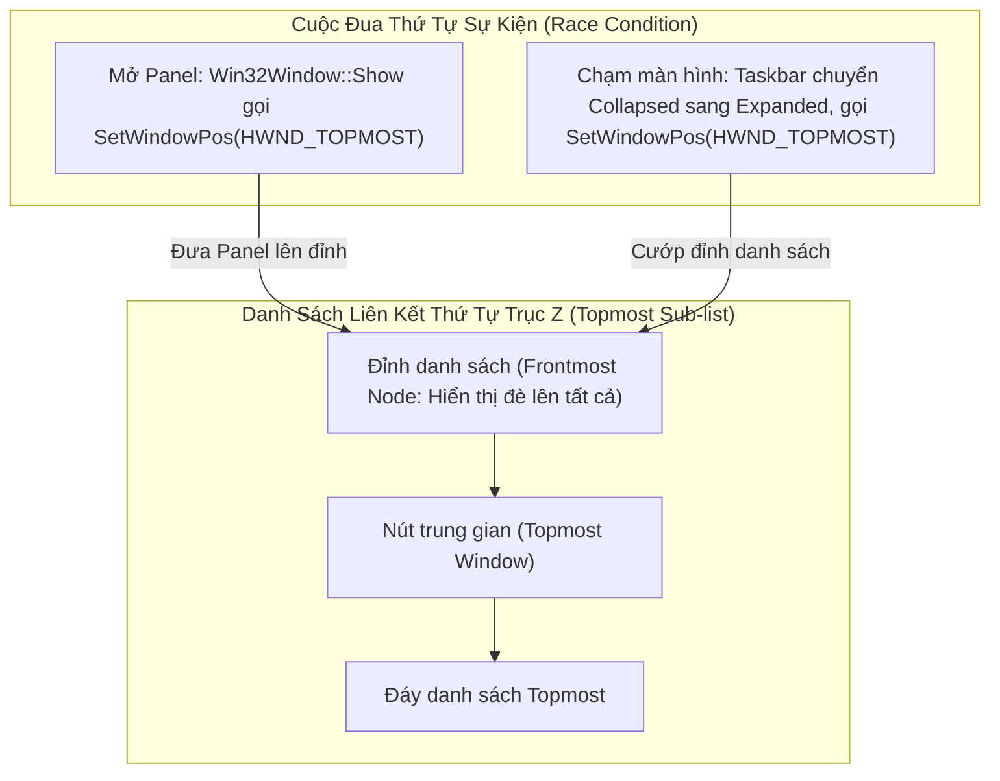

1. **Cơ chế hoạt động của Thanh tác vụ Máy tính bảng (Tablet-Optimized Taskbar)**:
   - Thanh Taskbar Windows 11 (`Shell_TrayWnd`) tích hợp giao diện XAML Islands có hai trạng thái vật lý:
     * **Trạng thái Thu gọn (Collapsed State)**: Chiều cao co lại chỉ còn 12-16px, ẩn hầu hết biểu tượng để nhường diện tích cho màn hình cảm ứng.
     * **Trạng thái Mở rộng (Expanded State)**: Khi người dùng chạm ngón tay vào màn hình hoặc vuốt từ cạnh đáy lên, tiến trình `explorer.exe` kích hoạt hoạt họa trồi lên với chiều cao 48-52px.
   - **Hành vi cạnh tranh**: Để đảm bảo thanh mở rộng không bị các ứng dụng khác che khuất các nút bấm cảm ứng, tiến trình `explorer.exe` lập tức phát đi lời gọi hàm Win32: `SetWindowPos(hTaskbar, HWND_TOPMOST, ..., SWP_SHOWWINDOW)`.
2. **Quy tắc giải quyết xung đột của Windows DWM (The "Last-Caller Wins" Rule)**:
   - Khi hai hay nhiều cửa sổ cùng mang thuộc tính nổi trên cùng (`WS_EX_TOPMOST` hoặc cờ `HWND_TOPMOST`): **Cửa sổ nào gọi hàm `SetWindowPos(HWND_TOPMOST)` sau cùng nhất theo mốc thời gian CPU sẽ được nhân hệ thống đưa lên đầu danh sách liên kết (Head of the TOPMOST list)**.
   - Khi ứng dụng không có chứng chỉ số và thiếu thuộc tính `uiAccess="true"`, lời gọi `CreateWindowInBand(..., ZBID_SYSTEM_TOOLS)` bị nhân hệ điều hành từ chối và hạ cấp về lớp Desktop mặc định (`ZBID_DEFAULT`). Lúc này, Panel và Taskbar cùng chia sẻ chung một phân lớp `HWND_TOPMOST`:
     * **Kịch bản Panel đè lên Taskbar (Không bị đè)**: Người dùng nhấn tổ hợp phím mở Panel **sau khi** thanh Taskbar đã mở rộng từ trước. Lời gọi `Win32Window::Show()` của Panel thực thi sau $\rightarrow$ Panel chiếm đỉnh danh sách liên kết $\rightarrow$ Panel đè lên Taskbar.
     * **Kịch bản Taskbar đè lên Panel (Bị đè)**: Panel đang mở sẵn trên màn hình. Người dùng chạm ngón tay vào khu vực đáy màn hình làm thanh Taskbar thức giấc và chuyển từ Thu gọn sang Mở rộng. Lời gọi `SetWindowPos` của `explorer.exe` thực thi sau lời gọi của Panel $\rightarrow$ Taskbar cướp lấy đỉnh danh sách liên kết $\rightarrow$ Taskbar đè lên đáy của Panel.

#### 3. Các phương án giải quyết triệt để
- **Phương án 1: Tái khẳng định đỉnh liên kết (Re-asserting Topmost / Watchdog Tick)**: Khi Panel đang ở trạng thái mở, phát lời gọi `SetWindowPos(window_handle_, HWND_TOPMOST, 0, 0, 0, 0, SWP_NOMOVE | SWP_NOSIZE | SWP_NOACTIVATE)` mỗi khi nhận sự kiện chạm hoặc theo chu kỳ ngắt để giành lại vị trí đỉnh bảng.
- **Phương án 2: Tự động thu gọn thanh tác vụ qua Shell API (`SHAppBarMessage`)**: Gửi thông điệp hệ thống `ABM_SETSTATE` với cờ `ABS_AUTOHIDE` để yêu cầu Windows tự động thu gọn thanh tác vụ khi Panel kích hoạt, và khôi phục trạng thái ban đầu khi Panel đóng lại.
- **Phương án 3: Chừa khoảng trống đệm an toàn (Bottom Safe Area Inset)**: Đo lường kích thước thực tế của `Shell_TrayWnd` bằng `GetWindowRect` và tự động co lề dưới của giao diện Flutter lên trên chiều cao của Taskbar, triệt tiêu hoàn toàn sự giao thoa diện tích cảm ứng.

---

## Phương Án 2: Móc Hàm Khởi Tạo Chuỗi Khung Hình Cưỡng Bức Không Viền (DXGI `CreateSwapChain` Hooking)

### 1. Cơ chế kỹ thuật (Kiến trúc AYASpace / Handheld Companion)
- Khi trò chơi khởi động, game gọi hàm của DirectX Graphics Infrastructure (DXGI): `IDXGIFactory::CreateSwapChain` (hoặc `CreateSwapChainForHwnd`).
- Trong cấu trúc tham số `DXGI_SWAP_CHAIN_DESC`, game truyền cờ `Windowed = FALSE` để yêu cầu chạy Toàn màn hình độc quyền.
- Một thư viện C++ hook (`dxgi_hook.dll`) được chèn vào không gian bộ nhớ của game (qua `SetWindowsHookEx` hoặc DLL Injection), chặn hàm này và **sửa tham số thành `Windowed = TRUE`** trước khi gửi xuống Driver GPU.

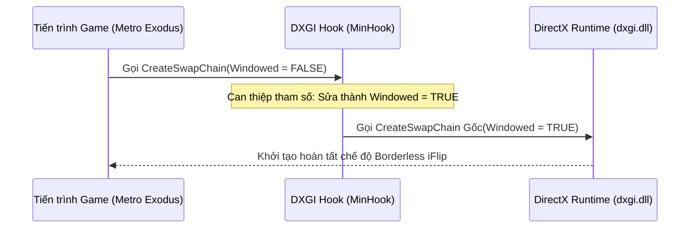

### 2. Cách thức giải quyết triệt để
- Game hoàn toàn tin rằng mình đang chạy Toàn màn hình độc quyền, nhưng thực chất Windows DWM đang quản lý game dưới dạng **Cửa sổ Không viền (Borderless Windowed / Independent Flip)**.
- Khi đó, cửa sổ Flutter Quick Settings Panel của bạn sẽ hiển thị đè lên game 100% mượt mà và không bao giờ bị văng.

---

## Phương Án 3: Chia Sẻ Kết Cấu Đồ Họa Độc Lập (Direct3D Shared Texture Injection)

### 1. Cơ chế kỹ thuật (Kiến trúc OBS Game Capture / Discord Overlay / Steam Overlay)
- Ứng dụng Flutter render toàn bộ giao diện bảng điều khiển vào một kết cấu đồ họa ngoài màn hình (Off-Screen Surface) với cờ chia sẻ vùng nhớ: **`D3D11_RESOURCE_MISC_SHARED`** (hoặc `D3D11_RESOURCE_MISC_SHARED_NTHANDLE`).
- Lấy con trỏ chia sẻ tài nguyên (`HANDLE sharedHandle`) từ DirectX Device của Flutter.
- Thư viện hook bên trong game gọi `ID3D11Device::OpenSharedResource(sharedHandle)` để nạp trực tiếp tấm ảnh kết cấu của Flutter vào bộ nhớ game.
- Tại hàm xuất hình ảnh **`IDXGISwapChain::Present`**, thư viện hook vẽ một tấm ảnh phẳng (2D Quad) chứa giao diện Flutter đè lên bộ đệm khung hình của game.

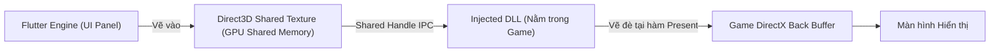

### 2. Cách thức giải quyết triệt để
- Triệt tiêu 100% sự phụ thuộc vào cửa sổ Win32 Desktop.
- Giao diện Flutter được nhúng trực tiếp vào chính luồng dữ liệu 60fps/120fps của game, không làm thay đổi trạng thái cửa sổ của trò chơi.
- **Cơ chế chuyển đổi động tại thời gian chạy (Runtime Switchable Engine)**:
  - Thư viện `dxgi_hook.dll` tích hợp phân đoạn nhớ dùng chung giữa các tiến trình (`.shared` segment) lưu trữ cờ chế độ `g_hookMode` (0: `DXGI_BORDERLESS`, 1: `SHARED_TEXTURE`).
  - Người dùng có thể chuyển đổi trực tiếp giữa hai phương án trong tab Cài đặt [[SettingsTab]] thông qua giao diện hàm ngoại vi (Dart FFI) `SetOverlayHookMode(mode)` mà không cần khởi động lại toàn bộ ứng dụng.

---

## Phương Án 4: Can Thiệp Trực Tiếp Vào Hàm Xuất Khung Hình (Present Hooking / RTSS OSD)

### 1. Cơ chế kỹ thuật
- Chèn mã thực thi nhị phân vào hàm `IDXGISwapChain::Present` (DirectX 11/12) để vẽ trực tiếp thông số HUD (TDP, Quạt, FPS, Pin) lên bộ đệm game.
- Dự án đã có sẵn module [rtss_service.dart](file:///c:/Users/h/dev-projects/windows-handheld-tools/lib/hardware/rtss_service.dart) giao tiếp qua bộ nhớ chia sẻ `RTSSSharedMemoryV2` của RivaTuner Statistics Server.

---

## Ma Trận So Sánh Kỹ Thuật Toàn Diện

| Tiêu chí | Phương án 1: Windows System Z-Band | Phương án 2: DXGI Borderless Hook | Phương án 3: Direct3D Shared Texture | Phương án 4: RTSS OSD Injection |
| :--- | :--- | :--- | :--- | :--- |
| **Bản chất kỹ thuật** | Tầng hệ điều hành (OS Window Management) | Móc hàm tạo chuỗi khung hình (`CreateSwapChain`) | Móc hàm xuất hình + Chia sẻ GPU Memory | Chèn chuỗi text/vector vào hàm `Present` |
| **Bảo tồn giao diện Flutter** | Giữ nguyên 100% | Giữ nguyên 100% | Giữ nguyên 100% (Texture Stream) | Chỉ hiển thị Text HUD / Không có Widget |
| **Khắc phục game Exclusive** | Phụ thuộc quyền UIAccess ký số | Khắc phục 100% (Ép game sang Borderless) | Khắc phục 100% (Vẽ trực tiếp vào game) | Khắc phục 100% (Chỉ áp dụng đo đạc OSD) |
| **Độ ổn định & Tương thích** | Cao | Rất cao (Chuẩn Handheld Companion) | Rất cao (Chuẩn Discord / OBS) | Tối đa |
| **Độ phức tạp triển khai** | Thấp (Đã tích hợp trong `win32_window.cpp`) | Trung bình (Tạo DLL `dxgi_hook.dll` với MinHook) | Nâng cao (Tạo DLL Hook + IPC Texture Handle) | Thấp (Đã tích hợp trong `rtss_service.dart`) |

---

## Kiến Trúc Thu Nhận Tín Hiệu Tay Cầm Và Điều Hướng Không Tiêu Điểm (Focusless Gamepad Input Pipeline)

### Bản Chất Vật Lý Của Luồng Tín Hiệu Tay Cầm Trên Windows

Trên các thiết bị chơi game, tín hiệu điều khiển từ tay cầm vật lý truyền về hệ điều hành theo chuỗi liên kết phần cứng - phần mềm:

1. **Ngắt tín hiệu phần cứng (Hardware Interrupt)**:
   - Khi người dùng nhấn nút hoặc gạt cần analog, vi điều khiển tích hợp trên tay cầm biến đổi mức điện áp analog thành giá trị số nguyên (Analog-to-Digital Converter - ADC).
   - Gói dữ liệu nhị phân (HID Data Packet) được gửi qua bus giao tiếp USB hoặc sóng vô tuyến Bluetooth tới bộ điều khiển ngắt (Interrupt Controller) của bo mạch chủ.
2. **Giải mã tại nhân hệ điều hành (Kernel-mode Driver)**:
   - Trình điều khiển thiết bị của Windows (`xusb22.sys` hoặc `hidclass.sys`) tiếp nhận ngắt, phân giải gói tin nhị phân thành cấu trúc dữ liệu chuẩn gồm:
     * Mặt nạ bit 16-bit thể hiện trạng thái đóng/ngắt của các nút bấm (`wButtons`).
     * Độ nén lò xo của hai nút cò Left/Right Trigger (giá trị 8-bit không dấu từ 0 đến 255: `bLeftTrigger`, `bRightTrigger`).
     * Tọa độ điện áp của hai cần gạt Analog Left/Right Thumbstick (giá trị 16-bit có dấu từ -32768 đến 32767: `sThumbLX`, `sThumbLY`, `sThumbRX`, `sThumbRY`).
   - Cấu trúc này được lưu cố định trong vùng nhớ nhân hệ thống và sẵn sàng để ứng dụng tầng người dùng truy xuất.

```mermaid
flowchart TD
    subgraph Hardware_Layer["Tầng Phần Cứng (Hardware Layer)"]
        Buttons["Nút bấm & Cần gạt Analog"] -->|Điện áp ADC| MCU["Vi điều khiển Tay cầm (MCU)"]
        MCU -->|Gói tin nhị phân USB/BT| Bus["Bus Giao Tiếp (USB / Bluetooth)"]
    end

    subgraph Kernel_Layer["Tầng Nhân Hệ Điều Hành (Windows Kernel)"]
        Bus -->|Ngắt phần cứng (IRQ)| Driver["Driver XInput (xusb22.sys)"]
        Driver -->|Ghi dữ liệu nhị phân| KernelBuffer["Bộ đệm trạng thái (XINPUT_STATE)"]
    end

    subgraph User_Layer["Tầng Ứng Dụng (User Space)"]
        KernelBuffer -->|Gọi hàm FFI liên ngôn ngữ| PollTimer["Bộ đếm thời gian quét định kỳ 50ms"]
        PollTimer --> NativeMem["Bộ nhớ con trỏ RAM tĩnh (calloc)"]
        NativeMem --> Filter["Bộ lọc Sườn xung (Edge Trigger) & Vùng chết (Deadzone)"]
        Filter --> Stream["Luồng sự kiện (Gamepad Event Stream)"]
        Stream --> UIState["Chỉ số điều hướng ảo (_focusedIndex / _selectedTabIndex)"]
    end
```

---

### Bế Tắc Kỹ Thuật Của Vòng Lặp Thông Điệp Cửa Sổ Truyền Thống

#### 1. Hiện trạng xử lý cũ
- Ứng dụng Desktop tiêu chuẩn thu nhận lệnh điều khiển thông qua hàng đợi thông điệp của cửa sổ Win32 (Message Loop / `GetMessage` / `PeekMessage`) với các thông điệp bàn phím (`WM_KEYDOWN`, `WM_KEYUP`) hoặc thông điệp thô (`WM_INPUT`).

#### 2. Thảm họa kỹ thuật trong môi trường trò chơi
- Windows áp dụng nguyên tắc: **Chỉ cửa sổ đang nắm giữ tiêu điểm nhập liệu chủ động (Active Keyboard Focus / `HWND Focus`) mới được nhân hệ thống phân phối thông điệp `WM_KEYDOWN`**.
- Khi một trò chơi đang chạy toàn màn hình, trò chơi chiếm giữ 100% tiêu điểm cửa sổ. Bảng điều khiển Quick Settings nằm ở trạng thái nền hoặc lớp phủ không chiếm tiêu điểm (`WS_EX_NOACTIVATE`) để tránh làm đứt đoạn trận đấu của người chơi.
- Hậu quả: Mọi thông điệp phím thông thường đều bị chuyển toàn bộ vào game, bảng điều khiển hoàn toàn "mù" dữ liệu nhập và không thể phản hồi bất kỳ thao tác nào từ tay cầm.

#### 3. Giải pháp triệt tiêu rào cản: Quét trạng thái trực tiếp không cần tiêu điểm (Zero-Focus Polling)
- Ứng dụng nạp trực tiếp thư viện liên kết động tầng hệ thống (`xinput1_4.dll` / `xinput1_3.dll`) thông qua cơ chế gọi hàm liên ngôn ngữ (Foreign Function Interface - FFI).
- Hàm hệ thống `XInputGetState(dwUserIndex, pState)` cho phép đọc trực tiếp bộ đệm trạng thái phần cứng của tối đa 4 tay cầm kết nối mà **hoàn toàn không quan tâm cửa sổ nào đang giữ tiêu điểm Windows**.
- Một bộ đếm thời gian (Periodic Timer) chạy vòng lặp ngắt đều đặn mỗi 50ms (tần số 20Hz), trích xuất trạng thái nhị phân trực tiếp từ RAM máy tính vào cấu trúc con trỏ tĩnh được cấp phát trước (`Pointer<_XInputState>`).

---

### Xử Lý Xung Tín Hiệu Và Trạng Thái Điều Hướng Tại Tầng Ứng Dụng

Vì cơ chế đọc trạng thái là quét định kỳ (Polling), việc giữ một nút vật lý trong 1 giây sẽ sinh ra 20 lần đọc trạng thái dương tính liên tiếp. Để chuyển đổi thành thao tác điều hướng chuẩn xác trên giao diện, luồng dữ liệu bắt buộc đi qua 3 bộ lọc vật lý:

1. **Bộ lọc sườn xung kích hoạt đơn (Rising-Edge Triggering)**:
   - Dành cho các nút bấm tác vụ (A, B, X, Y, Start, Back).
   - Thuật toán so khớp trạng thái: Chỉ phát ra sự kiện khi giá trị chuyển từ sai sang đúng (tín hiệu đi từ mức 0 lên mức 1). Nếu người dùng tiếp tục đè nút, các chu kỳ quét tiếp theo bị chặn đứng hoàn toàn.
2. **Bộ lọc vùng chết cần gạt (Stick Deadzone Filtering)**:
   - Cần analog vật lý luôn có sai số cơ học và hiện tượng trôi cần (Stick Drift), khiến giá trị điện áp luôn dao động nhẹ quanh điểm gốc tọa độ 0.
   - Thuật toán thiết lập biên độ ngưỡng: Bỏ qua toàn bộ giá trị có độ lớn tuyệt đối nhỏ hơn 15000 (trên thang đo toàn phần từ 0 đến 32767). Chỉ khi người chơi đẩy cần vượt qua ngưỡng này, tín hiệu mới được công nhận là một thao tác gạt hướng (Stick Up/Down/Left/Right).
3. **Bộ mô phỏng nhịp lặp điều hướng (Hold-to-Repeat State Machine)**:
   - Dành cho các phím di chuyển danh mục (D-Pad Lên/Xuống/Trái/Phải và Cần Analog).
   - Lần nhấn đầu tiên: Phát sự kiện điều hướng ngay lập tức (độ trễ 0ms).
   - Nếu tiếp tục giữ nút: Khóa sự kiện trong 6 chu kỳ quét liên tiếp (~300ms) để chống nhảy mục ngoài ý muốn. Sau ngưỡng trễ này, phát nhịp lặp đều đặn mỗi 2 chu kỳ quét (~100ms/lần) giúp người chơi lướt nhanh danh sách tùy chọn mượt mà.

---

### Ánh Xạ Sự Kiện Vào Cây Trạng Thái Giao Diện (Virtual Focus Navigation)

Sau khi được chuẩn hóa, sự kiện nút bấm được đẩy vào luồng bất đồng bộ (Broadcast Stream). Giao diện Quick Settings tiếp nhận sự kiện và điều hướng hoàn toàn bằng **Chỉ số tiêu điểm ảo (Virtual Focus Index)** mà không cần chuột hay chạm:

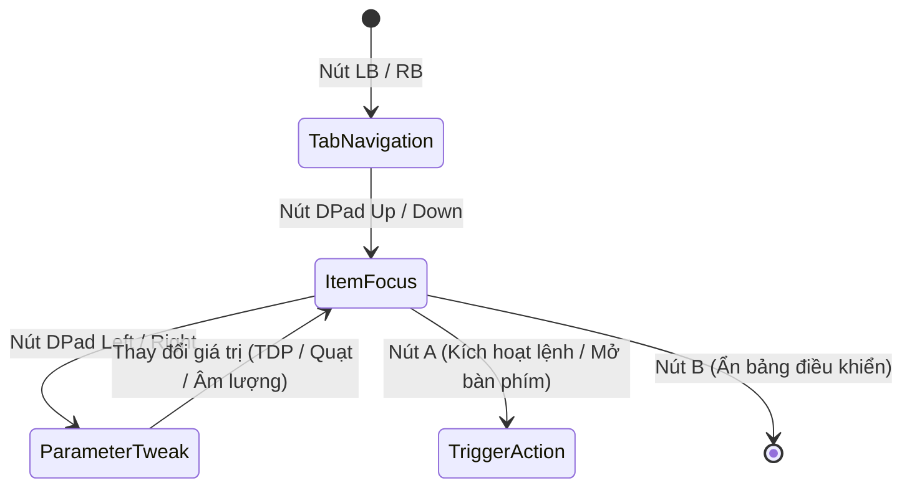

1. **Chuyển đổi phân vùng cấp cao (Tab Level Navigation)**:
   - Sự kiện nút vai trái/phải (`GamepadButton.lb`, `GamepadButton.rb`) làm thay đổi biến chỉ số tab `_selectedTabIndex` theo phép chia lấy dư vòng tròn (Modulo 4), đồng thời đặt lại chỉ số mục về 0 và đưa thanh cuộn về đỉnh trang.
2. **Di chuyển tiêu điểm theo trục dọc (Vertical Item Focus)**:
   - Sự kiện `GamepadButton.dpadUp` và `GamepadButton.dpadDown` làm tăng/giảm chỉ số `_focusedIndex` trong phạm vi giới hạn của tab hiện hành.
   - Hệ thống tự động tính toán khoảng cách cuộn ảo dựa trên tỉ lệ giao diện (`targetOffset = _focusedIndex * 135.0 * uiScale`) và kích hoạt bộ điều khiển cuộn hoạt họa mượt mà (`_scrollController.animateTo`) để luôn giữ mục đang chọn nằm chính giữa màn hình.
3. **Tương tác thông số theo trục ngang (Horizontal Value Adjustment)**:
   - Sự kiện `GamepadButton.dpadLeft` và `GamepadButton.dpadRight` tác động trực tiếp vào giá trị thông số của mục đang nắm giữ `_focusedIndex` (tăng/giảm công suất TDP, tốc độ quạt, hoặc chuyển đổi giữa các nấc cài đặt sẵn Preset).
4. **Đóng mở giao diện lớp phủ (Overlay Lifecycle)**:
   - Tổ hợp phím cứng vật lý (BACK + RB) được bộ quét nhận diện đồng thời sẽ kích hoạt hàm đảo trạng thái hiển thị (`OverlayController.toggleOverlay`), trong khi nút B đóng vai trò phím thoát an toàn (`hideOverlay`) trả lại toàn bộ quyền điều khiển cho trò chơi.

---

## Cơ Chế Khởi Động Đặc Quyền Cao Cùng Windows (Elevated Process Auto-Start Architecture)

### Bản Chất Vật Lý Của Luồng Khởi Động Tự Động Trên Windows

```mermaid
flowchart TD
    subgraph Traditional["Cơ Chế Truyền Thống (Thất Bại với Ring-0 App)"]
        Boot1["Khởi động máy & Đăng nhập"] --> Reg["Registry HKCU Run Key"]
        Reg --> UAC["Bộ kiểm soát tài khoản người dùng (UAC)"]
        UAC -->|"Chặn đứng ứng dụng Elevated"| Block["Bị chặn âm thầm (Không chạy)"]
    end

    subgraph Industrial["Cơ Chế Tiêu Chuẩn Handheld (Task Scheduler)"]
        Boot2["Khởi động máy & Đăng nhập"] --> Sch["Windows Task Scheduler (schtasks)"]
        Sch -->|"Trigger: ONLOGON / Quyền: HIGHEST"| Bypass["Vượt qua rào cản UAC hợp lệ"]
        Bypass --> KernelReady["Nạp Ring-0 Driver & Global DXGI Hook thành công"]
    end
```

#### 1. Trước đây làm bằng cách nào?
- Các ứng dụng Windows thông thường ghi đường dẫn thực thi của tệp tin nhị phân vào sổ đăng ký hệ thống (Registry Key: `HKCU\Software\Microsoft\Windows\CurrentVersion\Run`).

#### 2. Thảm họa kỹ thuật trong môi trường Handheld
- Công cụ điều khiển thiết bị Handheld bắt buộc can thiệp trực tiếp vào không gian nhân cấp 0 (Ring-0 Kernel Space) để nạp trình điều khiển CPU (`WinRing0x64.sys`), điều khiển điện áp và công suất vi xử lý (`ryzenadj.dll`) cũng như kích hoạt bẫy chặn đồ họa toàn hệ thống (Global DXGI Hook). Do đó, ứng dụng bắt buộc phải chạy dưới đặc quyền Người quản trị tối cao (Administrator Privileges / Elevated Token).
- Hệ thống kiểm soát tài khoản người dùng Windows (User Account Control - UAC) áp dụng quy tắc phòng vệ kiên cố: Mọi chương trình yêu cầu đặc quyền elevated nằm trong sổ đăng ký `Run` đều bị hệ điều hành **âm thầm chặn đứng** lúc người dùng đăng nhập để triệt tiêu nguy cơ mã độc leo thang quyền hạn. Kết quả: Ứng dụng hoàn toàn không thể tự khởi động cùng máy tính.

#### 3. Công nghệ này giải quyết triệt để ra sao?
- Thay thế hoàn toàn sổ đăng ký bằng Trình lập lịch tác vụ hệ điều hành (Windows Task Scheduler thông qua tiện ích dòng lệnh `schtasks.exe` đóng gói trong [[AutostartService]]).
- Thiết lập tác vụ hệ thống với mức ưu tiên đặc quyền tối cao (`/RL HIGHEST`) liên kết trực tiếp với sự kiện người dùng đăng nhập tài khoản (`/SC ONLOGON`).
- Đồng thời gỡ bỏ điều kiện tiết kiệm pin của máy tính xách tay (`DisallowStartIfOnBatteries=false`) nhằm đảm bảo thiết bị Handheld luôn tự động khởi chạy bảng điều khiển dù đang cắm sạc hay sử dụng nguồn pin tích hợp.

### Vòng Đời Tác Vụ Và Hiện Tượng Rác Hệ Thống Khi Xóa Bản Di Động (Portable Cleanup & Orphaned Task Lifecycle)

Khi phân phối dưới dạng gói di động không qua cài đặt (Portable Binary):
- Toàn bộ tệp mã máy (`.exe`), thư viện động (`.dll`) và tệp cấu hình (`config.json`) nằm cô lập trong một thư mục cục bộ trên ổ cứng. Xóa thư mục này chỉ đơn thuần giải phóng các cung từ/ô nhớ flash (Storage Blocks) của thư mục đó.
- Tuy nhiên, khi người dùng kích hoạt "Khởi động cùng Windows", ứng dụng đã gọi tiến trình hệ thống `schtasks.exe` để tạo một bản ghi tác vụ độc lập trong nhân quản lý lập lịch của hệ điều hành.

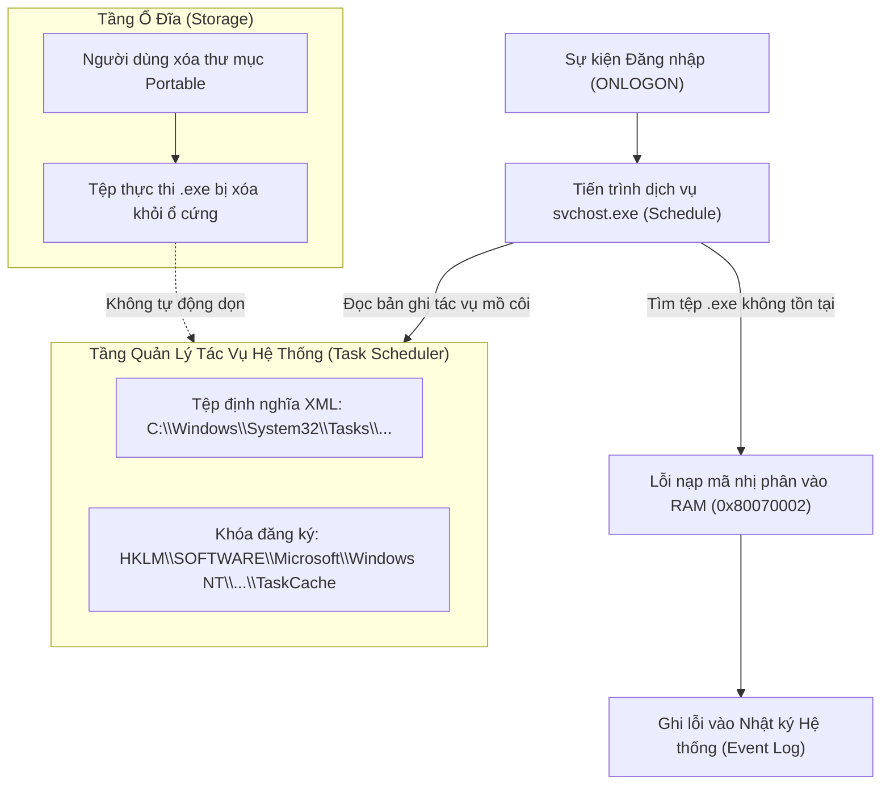

#### 1. Các thành phần còn sót lại trong hệ điều hành (Orphaned Artifacts)
1. **Tệp siêu dữ liệu XML định nghĩa tác vụ (Task Definition XML)**:
   - Vị trí vật lý: `C:\Windows\System32\Tasks\WindowsHandheldTool_AutoStart`.
2. **Khóa chỉ mục trong cây cơ sở dữ liệu cấu hình hệ thống (Registry Hive)**:
   - Nhánh phân cấp: `HKLM\SOFTWARE\Microsoft\Windows NT\CurrentVersion\Schedule\TaskCache\Tree\WindowsHandheldTool_AutoStart`.
   - Bản ghi định danh duy nhất: `HKLM\SOFTWARE\Microsoft\Windows NT\CurrentVersion\Schedule\TaskCache\Tasks\{GUID}`.

#### 2. Hiện tượng kỹ thuật khi chỉ xóa thư mục mà không hủy tác vụ
- Tác vụ trở thành một **tác vụ mồ côi (Orphaned Task)**.
- Mỗi chu kỳ khởi động và đăng nhập tài khoản người dùng (`ONLOGON`), tiến trình dịch vụ lập lịch của Windows (`svchost.exe` đảm nhiệm dịch vụ `Schedule`) kích hoạt ngắt, nạp tệp XML và tra cứu đường dẫn nhị phân được lưu sẵn.
- Do tệp `.exe` không còn tồn tại trên ổ cứng, hệ điều hành không thể phân bổ không gian địa chỉ ảo (Virtual Address Space) để nạp mã máy vào bộ nhớ RAM, dẫn đến việc tiến trình lập lịch trả về mã lỗi `0x80070002` (`ERROR_FILE_NOT_FOUND`) và ghi nhận vào nhật ký sự kiện hệ thống (Windows Event Viewer - Event ID 101/200).

#### 3. Quy trình dọn dẹp triệt để (Complete Decommissioning Workflow)
- **Phương án chủ động (Khuyến nghị)**: Trước khi xóa thư mục Portable, mở ứng dụng và chuyển công tắc "Khởi động cùng Windows" sang trạng thái Tắt trong [[SettingsTab]]. Hàm `AutostartService.setEnabled(false)` sẽ phát lệnh xóa trực tiếp qua tiến trình hệ thống: `schtasks /delete /tn "WindowsHandheldTool_AutoStart" /f`, triệt tiêu hoàn toàn tệp XML và các khóa Registry liên quan.
- **Phương án khắc phục sau khi đã xóa thư mục**:
  - Giao diện quản lý tác vụ: Nhấn tổ hợp phím `Win + R`, mở tiện ích `taskschd.msc`, truy cập vào danh mục `Task Scheduler Library`, tìm tác vụ `WindowsHandheldTool_AutoStart` và chọn Delete.
  - Giao diện dòng lệnh đặc quyền cao: Mở PowerShell hoặc Command Prompt dưới quyền Quản trị viên (Run as Administrator) và chạy lệnh: `schtasks /delete /tn "WindowsHandheldTool_AutoStart" /f`.

---

## Cơ Chế Nhận Diện Mã Độc Của Windows Defender Và Hiện Tượng Báo Động Giả (Antivirus Heuristic & False Positive Architecture)

### Bản Chất Vật Lý Của Luồng Quét Tĩnh Và Đánh Giá Rủi Ro Bằng Học Máy

Khi một tệp tin nén (`.zip`) hoặc tệp thực thi được tải về từ mạng Internet, hệ điều hành gắn thẻ đánh dấu vùng mạng không tin cậy (Zone Identifier / `ZoneId=3`) vào luồng dữ liệu phụ của tệp trên hệ thống tệp NTFS (Alternate Data Stream - ADS). Trình bảo vệ Windows Defender (tiến trình nhân dịch vụ `MsMpEng.exe`) ngay lập tức kích hoạt luồng kiểm tra tĩnh:

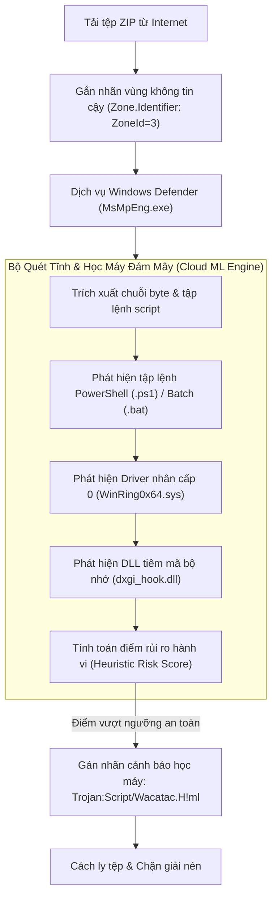

#### 1. Giải mã tên định danh mối đe dọa `Trojan:Script/Wacatac.H!ml`
- **`Trojan:`**: Phân loại danh mục phần mềm gây hại chung (phần mềm mạo danh hoặc mang hành vi ngầm).
- **`Script/`**: Đối tượng trực tiếp kích hoạt chữ ký nhận diện là một **tập lệnh mã nguồn** (tệp kịch bản dòng lệnh PowerShell `.ps1`, Batch `.bat`, hoặc Python `.py`), **hoàn toàn không phải** tệp nhị phân thực thi chính (`windows_handheld_tool.exe`).
- **`Wacatac`**: Tên họ định danh quy tắc phân tích mẫu tĩnh của Microsoft dành cho các đoạn mã có hành vi tự động can thiệp sâu vào hệ thống.
- **`!ml` (Machine Learning)**: Khẳng định đây là kết quả phán đoán xác suất từ **mô hình học máy trên đám mây (Cloud AI Heuristic Engine)** của Microsoft, không phải phát hiện dựa trên chữ ký tĩnh truyền thống (Static Hash/Byte Signature) của một mã độc đã biết.

#### 2. Nguyên nhân bế tắc kỹ thuật gây ra Báo động giả (False Positive) trong gói phát hành
Gói phân phối Portable phát sinh cảnh báo là do sự hội tụ đồng thời của 4 yếu tố nhạy cảm trong cùng một gói lưu trữ:

1. **Sự tồn tại của các tập lệnh kịch bản thô trong thư mục phụ tá**:
   - Thư mục phụ trợ ban đầu chứa tệp kịch bản `readjustService.ps1` (chứa các đoạn mã lặp vô tận, can thiệp tham số điện áp phần cứng và nạp động con trỏ hàm Windows API qua bộ đệm `Marshal`) và các tệp `.bat` tự động can thiệp Task Scheduler. Mô hình học máy của Defender quét nội dung văn bản này và gán trọng số rủi ro cực đại cho nhánh `Script/`.
2. **Trình điều khiển nhân cấp 0 không ký số mở rộng (`WinRing0x64.sys`)**:
   - Trình điều khiển này trực tiếp mở cổng đọc/ghi thanh ghi chuyên dụng của CPU (Model-Specific Registers - MSR) và cổng vào/ra (I/O Ports). Vì khả năng này thường bị các phần mềm khai thác lỗ hổng lạm dụng, Defender luôn đặt trạng thái giám sát nghiêm ngặt khi phát hiện driver này đi kèm các kịch bản script không xác định.
3. **Thư viện móc nối đồ họa bộ nhớ (`dxgi_hook.dll`)**:
   - Thư viện chứa mã nhị phân can thiệp cấu trúc con trỏ hàm ảo (Virtual Method Table Hooking) và phân đoạn bộ nhớ chia sẻ (`.shared` segment), có hành vi tương đồng với kỹ thuật tiêm mã bộ nhớ (DLL Injection).
4. **Thiếu chứng chỉ ký số tin cậy (Unsigned Binaries)**:
   - Các tệp thực thi chưa được đóng dấu chứng chỉ số công cộng (Code Signing Certificate) để tích lũy điểm danh tiếng hệ thống (SmartScreen Reputation).

#### 3. Giải pháp kỹ thuật triệt tiêu cảnh báo
- **Tối ưu hóa cây thư mục phát hành (Release Sanitization)**:
  - Ứng dụng điều khiển chính giao tiếp trực tiếp với `ryzenadj.dll` qua liên kết hàm FFI trong mã máy Dart. Toàn bộ các tệp kịch bản thô (`.ps1`, `.bat`, `.py`, `.xml.template`) và các tệp gỡ lỗi trung gian (`.pdb`, `.exp`, `.old`) là dư thừa và bắt buộc phải bị loại bỏ khỏi gói phát hành.
  - Khi gói phát hành chỉ còn lại các tệp nhị phân runtime thực sự cần thiết, thành phần kích hoạt `Script/` bị xóa sổ hoàn toàn khỏi chuỗi nhận diện của Defender.
- **Ký số chứng chỉ ứng dụng (Code Signing Pipeline)**:
  - Ký số toàn bộ tệp `.exe` và `.dll` bằng khóa chứng chỉ số để vượt qua lớp quét tĩnh SmartScreen.

---

### Bản Chất Lỗ Hổng Nhân Cấp 0 Của WinRing0 Vàng Hiện Tượng Bị Chặn (Vulnerable Driver Architecture & BYOVD)

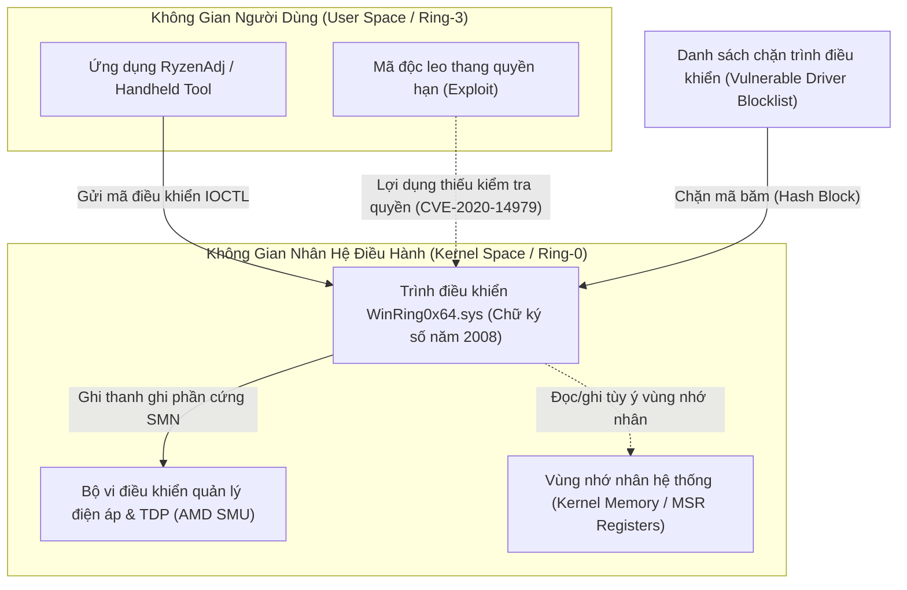

#### 1. Nguyên nhân kỹ thuật ra đời của cảnh báo `VulnerableDriver:WinNT/Winring0`
- **Driver hợp pháp nhưng có lỗ hổng kiến trúc (CVE-2020-14979)**:
  - Tệp `WinRing0x64.sys` do OpenLibSys phát hành năm 2008 mang chữ ký số hợp lệ của nhà phát triển, cho phép phần mềm tầng người dùng (Ring-3) đọc/ghi trực tiếp vào thanh ghi chuyên dụng của CPU (Model-Specific Registers - MSR), cổng I/O và bộ nhớ vật lý.
  - Tuy nhiên, driver này **hoàn toàn không thiết lập danh sách kiểm soát quyền truy cập (Access Control List - ACL)** cho các cổng giao tiếp vào/ra (`IOCTL`). Bất kỳ tiến trình nào chạy trong hệ điều hành, kể cả tiến trình không có đặc quyền quản trị viên, đều có thể gửi lệnh trực tiếp vào driver để thao túng không gian nhân.
- **Kỹ thuật tấn công "Mượn driver hợp pháp để đục thủng nhân" (Bring Your Own Vulnerable Driver - BYOVD)**:
  - Các nhóm tấn công an ninh mạng thường mang theo các driver đã được ký số hợp pháp như `WinRing0x64.sys` để qua mặt cơ chế cưỡng chế chữ ký số nhân của Windows (Driver Signature Enforcement - DSE). Sau khi nạp driver vào bộ nhớ, kẻ tấn công khai thác lỗ hổng IOCTL mở này để vô hiệu hóa phần mềm diệt virus và chiếm đoạt toàn quyền hệ thống.
  - Do đó, Microsoft đã đưa mã băm của `WinRing0x64.sys` vào **Danh sách chặn trình điều khiển dễ bị tổn thương của Microsoft (Microsoft Vulnerable Driver Blocklist)** và cơ chế bảo vệ tính toàn vẹn bộ nhớ (Memory Integrity / HVCI).

#### 2. Lý do các phần mềm Handheld bắt buộc sử dụng `WinRing0x64.sys`
- Bộ vi xử lý AMD Ryzen quản lý điện áp và công suất tiêu thụ (TDP) thông qua vi điều khiển SMU nằm sâu trong phần cứng. Giao tiếp với SMU bắt buộc phải ghi dữ liệu trực tiếp vào các thanh ghi phần cứng SMN tại tầng Ring-0.
- AMD không phát hành bất kỳ API hoặc Driver chính thức nào trong không gian người dùng Windows cho mục đích chỉnh sửa TDP tự do.
- Do đó, toàn bộ hệ sinh thái phần mềm Handheld mã nguồn mở (RyzenAdj, Universal x86 Tuning Utility, Handheld Companion) đều bắt buộc phải phụ thuộc vào `WinRing0x64.sys` để truyền lệnh điều khiển xung/áp tới chip AMD.

#### 3. Cơ chế ứng phó trong kiến trúc phần mềm Handheld
1. **Chế độ mô phỏng an toàn (Safe Simulation Fallback)**:
   - Module [[TdpService]] được xây dựng với cơ chế bọc lỗi: Khi Windows Defender hoặc cơ chế HVCI chặn nạp `WinRing0x64.sys`, hàm nạp thư viện `ryzenadj.dll` trả về mã lỗi 126. Dịch vụ lập tức kích hoạt chế độ mô phỏng an toàn, bảo toàn 100% vòng đời ứng dụng và giao diện người dùng mà không gây sự cố sập ứng dụng.
2. **Quy trình gỡ chặn trên thiết bị người dùng (Whitelisting Workflow)**:
   - Trong ứng dụng Bảo mật Windows (`Windows Security` $\rightarrow$ `Virus & threat protection` $\rightarrow$ `Protection history`), người dùng có thể nhấp vào thông báo `VulnerableDriver:WinNT/Winring0`, chọn `Actions` và kích hoạt `Allow on device` (Cho phép trên thiết bị).
   - Nếu hệ thống kích hoạt tính năng Cách ly lõi (Core Isolation / Memory Integrity) chặn cứng driver, người dùng có thể tạm thời tắt tính năng `Microsoft Vulnerable Driver Blocklist` trong phần `Device Security` để cho phép nạp driver điều khiển phần cứng.

### Kỹ Thuật Xử Lý Driver Nhạy Cảm Trong Bộ Cài Handheld Companion (Installer Whitelisting Pipeline)

Nhiều người dùng đặt câu hỏi tại sao công cụ **Handheld Companion** sử dụng cùng trình điều khiển phần cứng `WinRing0x64.sys` nhưng lại không làm xuất hiện cảnh báo đỏ trên Windows Defender. Sự khác biệt nằm ở kiến trúc đóng gói và quy trình cài đặt hệ thống:

```mermaid
flowchart TD
    subgraph Portable_Model["Mô Hình Bản Nén Di Động (Portable ZIP Pipeline)"]
        ZipDownload["Tải tệp ZIP từ Trình duyệt"] --> Zone3["Gắn thẻ ZoneId=3 (Untrusted Web Stream)"]
        Zone3 --> ExtractScan["Giải nén: Các tệp .sys và .dll lộ thiên"]
        ExtractScan --> BlocklistTrigger["Defender phát hiện tệp nhị phân trong danh sách chặn"]
        BlocklistTrigger --> Alert["Báo động đỏ: VulnerableDriver / Wacatac"]
    end

    subgraph Installer_Model["Mô Hình Bộ Cài Đặt Handheld Companion (Inno Setup Pipeline)"]
        InstDownload["Tải tệp Setup.exe"] --> RunAdmin["Chạy với đặc quyền Quản trị viên (Elevated)"]
        RunAdmin --> AddExclusion["Chạy ngầm: Add-MpPreference -ExclusionPath"]
        AddExclusion --> DefConfig["Windows Defender thêm thư mục cài đặt vào vùng loại trừ"]
        DefConfig --> ExtractClean["Bung tệp WinRing0x64.sys vào thư mục đã loại trừ"]
        ExtractClean --> SilentReady["Nạp Driver thành công không phát tín hiệu báo động"]
    end
```

#### 1. Cơ chế tự động thêm vùng loại trừ Windows Defender (Automated Defender Exclusion Injection)
- Handheld Companion **không phân phối bằng tệp nén di động (.zip) để người dùng tự bung tệp**. Dự án sử dụng bộ cài đặt đóng gói hệ thống (Inno Setup).
- Khi người dùng khởi chạy bộ cài đặt với đặc quyền Quản trị viên tối cao (Run as Administrator), mã kịch bản cài đặt (`setup.iss`) của Handheld Companion thực thi ngầm lệnh quản trị PowerShell can thiệp vào chính sách bảo vệ của hệ thống:
  - Lệnh can thiệp: `Add-MpPreference -ExclusionPath "{app}\WinRing0x64.sys"`
- Nhờ cơ chế này, hệ điều hành đã đưa đường dẫn tuyệt đối của tệp driver vào **Danh sách ngoại lệ của Windows Defender (Exclusion List)** *trước khi* tệp nhị phân được bung ra ổ đĩa. Dịch vụ bảo vệ `MsMpEng.exe` lập tức bỏ qua quá trình quét tĩnh trên tệp này.

#### 2. Đóng gói dữ liệu nhị phân bên trong vỏ bọc bộ cài (Installer Containerization)
- Khi phân phối qua tệp `.zip`, người dùng tải về sẽ bị hệ điều hành gắn nhãn không tin cậy (`Zone.Identifier: ZoneId=3`) lên từng tệp nhị phân riêng lẻ sau khi giải nén.
- Ngược lại, bộ cài đặt Inno Setup mã hóa và nén toàn bộ tệp nhị phân nhân (`.sys`) vào trong một tệp thực thi duy nhất (`Setup.exe`). Windows Defender khi quét tĩnh từ xa chỉ nhận diện cấu trúc tệp của trình cài đặt Inno Setup mà không quét thấy chữ ký băm của driver bên trong dòng dữ liệu nén.

#### 3. Tích lũy điểm danh tiếng bảo mật đám mây (Cloud SmartScreen Reputation)
- Handheld Companion có cộng đồng người dùng lớn với hàng trăm nghìn lượt tải và cài đặt qua GitHub.
- Cơ chế bảo vệ đám mây của Microsoft (Cloud Protection) liên tục ghi nhận mã băm SHA-256 của các bản phát hành Handheld Companion được nạp trên hàng chục nghìn máy tính mà không gây ra hành vi mã độc phá hoại.
- Điểm uy tín bảo mật (SmartScreen Reputation Score) của tệp cài đặt tăng dần theo thời gian, giúp phiên bản đó vượt qua bộ lọc Heuristic của Windows Defender một cách tự động.

---

## Kiến Trúc Đo Đạc Cảm Biến PM Table Của AMD SMU Và Tự Phục Hồi Triển Khai Driver (AMD SMU PM Table Telemetry & Self-Healing Driver Architecture)

### Bản Chất Vật Lý Của Bảng Đo Năng Lượng Tức Thời (Power Management Table - PM Table)

Khác với các thanh ghi giới hạn tĩnh (Static Limit Registers) chỉ nhận lệnh thiết lập công suất trần (Set Limits: STAPM, Fast PPT, Slow PPT), vi điều khiển quản lý năng lượng tích hợp trên chip AMD Ryzen (System Management Unit - SMU) liên tục ghi các thông số cảm biến thời gian thực vào một vùng nhớ đệm chuyên dụng trong phần cứng gọi là **Bảng Quản lý Năng lượng (PM Table)**.

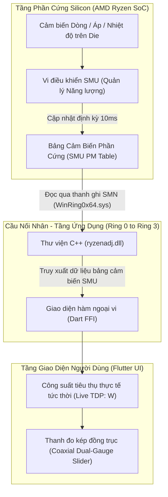

#### 1. Cơ chế đọc dữ liệu tức thời (Telemetry Ingestion Pipeline)
- **Chu kỳ làm mới (Polling Cycle)**: Ứng dụng khởi tạo cấu trúc bảng với hàm `init_table(ryzen_access)`. Định kỳ mỗi giây (1Hz), ứng dụng phát lệnh `refresh_table(ryzen_access)` để SMU chép toàn bộ ảnh chụp dữ liệu cảm biến mới nhất ra vùng nhớ đệm.
- **Trích xuất thông số vật lý (Physical Metric Extraction)**:
  - Công suất thực tế trích xuất qua hàm `get_stapm_value(ryzen_access)` (đo bằng Watt với độ chính xác số thực thực tế, ví dụ `2.28W` khi nhàn rỗi và `24.85W` khi tải nặng).
  - Nhiệt độ nhân trích xuất qua hàm `get_tctl_temp_value(ryzen_access)` (°C).
- Nhờ cơ chế này, thanh trượt [[SettingSlider]] hiển thị đồng thời hai thông số: mức công suất tiêu thụ thực tế tức thời bên cạnh mức công suất giới hạn mục tiêu do người chơi thiết lập (`Live / Target: 18.2 / 20 W`).

#### 2. Cơ chế tự phục hồi và đồng bộ driver (Self-Healing Driver Deployment)
- **Bế tắc kỹ thuật:** Thư viện nhân `WinRing0x64.dll` sử dụng hàm API Windows `GetModuleFileNameW(NULL)` để xác định vị trí của tệp điều khiển `WinRing0x64.sys`. Khi ứng dụng chạy từ thư mục gốc, WinRing0 luôn tìm kiếm tệp driver nằm ngang hàng với tệp thực thi chính (`windows_handheld_tool.exe`) chứ không tự tìm vào thư mục con `bin\`.
- **Giải pháp tự động hóa 100%:**
  1. **Đóng gói phát sinh kép (Dual-Target Packaging):** Tập lệnh `package_release.bat` sao chép tự động các tệp nhị phân runtime (`WinRing0x64.sys`, `WinRing0x64.dll`, `ryzenadj.dll`, `inpoutx64.dll`, `dxgi_hook.dll`) vào **cả thư mục con `bin\` lẫn thư mục gốc** của gói phát hành.
  2. **Tự chẩn đoán và đồng bộ thời gian chạy (Runtime Self-Healing):** Trong hàm `_initRyzenAdj()`, ứng dụng kiểm tra sự hiện diện của các tệp driver giữa thư mục gốc và thư mục con `bin\`. Nếu phát hiện tệp driver bị thiếu ở bất kỳ vị trí nào, ứng dụng tự động sao chép qua lại để đảm bảo cấu trúc tệp luôn đầy đủ trước khi kích hoạt `init_ryzenadj()`.

---

## Kiến Trúc Khởi Động Tự Động Trên Nguồn Pin Của Thiết Bị Cầm Tay (Battery-Aware Scheduled Task Architecture)

### Bản Chất Vật Lý Của Trình Lập Lịch Windows Khi Quản Lý Nguồn Điện

Trên các hệ máy cầm tay (Handheld PC như ROG Ally, Legion Go, GPD Win), thiết bị thường xuyên vận hành hoàn toàn bằng nguồn điện từ pin tích hợp (DC Power) thay vì cắm sạc trực tiếp từ nguồn lưới (AC Power).

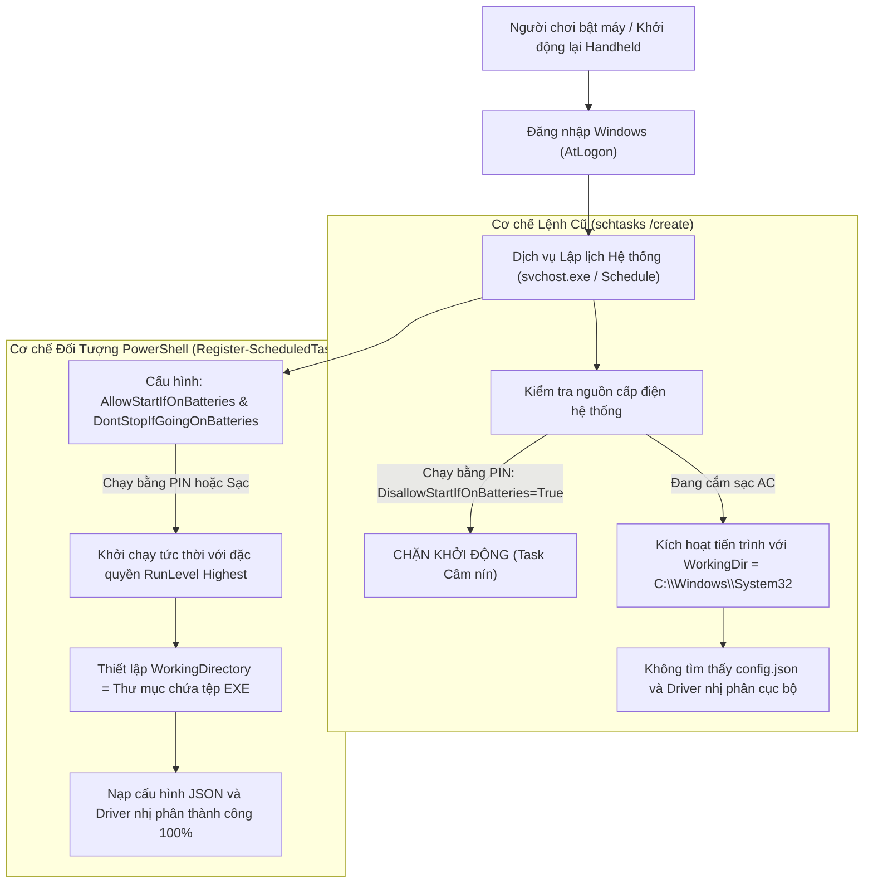

#### 1. Bế tắc kỹ thuật của tiện ích `schtasks.exe` truyền thống
- **Chính sách tiết kiệm năng lượng mặc định (Battery Disallow Policy)**: Lệnh `schtasks /create` của Windows mặc định kích hoạt cờ `DisallowStartIfOnBatteries = True`. Khi người dùng khởi động lại máy ở chế độ di động không cắm sạc, bộ lập lịch Task Scheduler nhận diện thiết bị đang chạy bằng pin và đơn phương hủy kích hoạt tác vụ mà không phát ra bất kỳ cảnh báo nào.
- **Thư mục làm việc bị trôi lệch (Working Directory Desynchronization)**: Khi khởi chạy qua `schtasks`, biến môi trường thư mục làm việc hiện hành (`Current Working Directory` - CWD) bị gán mặc định về `C:\Windows\System32`. Ứng dụng khi chạy ngầm sẽ không thể tra cứu tệp cấu hình [[ConfigManager]] (`config.json`) và các tệp nhị phân driver nhân [[TdpService]] (`ryzenadj.dll`, `WinRing0x64.sys`) nằm trong thư mục cài đặt gốc.

#### 2. Giải pháp chuyển dịch sang Đối tượng Lập lịch PowerShell Hiện đại
- **Giải phóng ràng buộc nguồn điện**: Hàm `AutostartService.setEnabled()` sử dụng lệnh ghép PowerShell `Register-ScheduledTask` kết hợp với đối tượng cấu hình `New-ScheduledTaskSettingsSet`:
  - `-AllowStartIfOnBatteries`: Cho phép tác vụ kích hoạt ngay cả khi máy đang vận hành bằng nguồn pin.
  - `-DontStopIfGoingOnBatteries`: Giữ cho ứng dụng tiếp tục chạy ổn định khi người dùng đột ngột rút dây sạc.
  - `-ExecutionTimeLimit (New-TimeSpan -Days 0)`: Xóa bỏ giới hạn thời gian chạy tối đa (mặc định Windows sẽ tự tắt các tác vụ chạy quá 3 ngày).
- **Cố định thư mục làm việc tuyệt đối**: Sử dụng `New-ScheduledTaskAction -WorkingDirectory '$exeDir'` để chỉ định thư mục cha của tệp thực thi làm không gian làm việc chính thức, đảm bảo việc đọc ghi dữ liệu cục bộ và nạp thư viện động luôn đồng nhất.

---

## Kiến Trúc Khử Hiện Tượng Chớp Trắng Khởi Động Trên Cửa Sổ Trong Suốt Win32 (Zero-Latency Transparent Window Initialization)

### Bản Chất Vật Lý Của Bộ Đệm Dựng Hình Và Vòng Đời Cửa Sổ Đồ Họa

Khi một cửa sổ Win32 được tạo lập thông qua hàm API `CreateWindowExW`, hệ điều hành phân bổ một cấu trúc quản lý cửa sổ trong bộ nhớ của tiến trình quản lý cửa sổ máy tính (Desktop Window Manager - DWM).

```mermaid
flowchart TD
    subgraph Old_Lifecycle["Vòng Đời Cũ (Gây Chớp Trắng)"]
        WinCreateOld["Tạo cửa sổ Win32 (CreateWindowEx)"] --> AlphaOld["Alpha mặc định = 255 (Mờ đục)"]
        AlphaOld --> EngineOld["Flutter Engine khởi tạo bề mặt DirectX / ANGLE"]
        EngineOld --> FrameOld["Dựng Frame đầu tiên (NextFrameCallback)"]
        FrameOld --> ShowCpp["Mã C++ gọi ShowWindow ngay lập tức"]
        ShowCpp --> Flash["CHỚP TRẮNG 200ms: DWM vẽ nền cửa sổ trước khi Dart xong await"]
        Flash --> DartDoneOld["Dart hoàn tất nạp giao diện và thiết lập trong suốt"]
    end
    subgraph New_Lifecycle["Vòng Đời Mới (Triệt Tiêu Hoàn Toàn Chớp Trắng)"]
        WinCreateNew["Tạo cửa sổ Win32 với cờ WS_EX_LAYERED | WS_EX_TRANSPARENT"] --> AlphaZero["Đặt Alpha = 0 tuyệt đối (SetLayeredWindowAttributes)"]
        AlphaZero --> NoShow["Xóa bỏ lệnh ShowWindow bên trong C++ Runner"]
        NoShow --> DartReady["Dart nạp xong cấu hình & dịch vụ bất đồng bộ"]
        DartReady --> ShowCmd["Gọi windowManager.show() đồng bộ trạng thái"]
        ShowCmd --> InvisibleIdle["Cửa sổ ở trạng thái vô hình (Alpha 0, Click-through) chờ phím tắt"]
        InvisibleIdle --> Hotkey["Người chơi nhấn Hotkey / Gamepad"]
        Hotkey --> FadeIn["showOverlayNoActivate: Nâng Alpha = 255, Gỡ WS_EX_TRANSPARENT"]
    end
```

#### 1. Bế tắc kỹ thuật gây ra hiện tượng nháy trắng (White Flash Root Cause)
- C++ Runner ban đầu đăng ký hàm gọi lại `flutter_controller_->engine()->SetNextFrameCallback()` với hành vi gọi thẳng `this->Show()` ngay khi khung hình đầu tiên của Flutter Engine hoàn tất.
- Tại thời điểm này, mã Dart cấp cao trong `main()` vẫn đang thực hiện chuỗi các tác vụ bất đồng bộ (`DeviceInfoService.init()`, `RtssService.ensureRunning()`, `ConfigManager()`). Khung hình đầu tiên mà Engine trả về chỉ là một vùng nhớ đệm rỗng mang màu nền mặc định của cửa sổ Win32 (màu trắng).
- DWM lập tức hòa trộn (composite) bề mặt màu trắng này lên màn hình máy tính của người chơi trong khoảng 150ms - 200ms trước khi Dart kịp thời gửi lệnh thiết lập màu nền trong suốt (`AppTheme.transparent`).

#### 2. Giải pháp làm chủ vòng đời hiển thị (Deterministic Alpha Lifecycle)
1. **Khởi tạo trong suốt tuyệt đối tại tầng Win32 Kernel**:
   - Trong tệp `win32_window.cpp`, ngay sau khi hàm `CreateWindowExW` trả về địa chỉ cửa sổ (`HWND`), hệ điều hành áp dụng ngay hàm `SetLayeredWindowAttributes(window, 0, 0, LWA_ALPHA)`. Giá trị kênh Alpha bằng 0 biến cửa sổ thành một bề mặt quang học hoàn toàn vô hình đối với DWM.
2. **Triệt tiêu lệnh hiển thị sớm ở tầng C++ Runner**:
   - Trong `flutter_window.cpp`, loại bỏ hoàn toàn lệnh `this->Show()` bên trong `SetNextFrameCallback`. Cửa sổ tuyệt đối không được tự ý xuất hiện khi chưa có tín hiệu sẵn sàng từ Flutter Dart.
3. **Điều khiển kênh Alpha hai chiều qua FFI Win32**:
   - Dịch vụ [[NativeWindowService]] nạp trực tiếp hàm `SetLayeredWindowAttributes` từ `user32.dll`.
   - **Khi ở chế độ chờ**: Ứng dụng duy trì `Alpha = 0` kết hợp cờ `WS_EX_TRANSPARENT`, đảm bảo mọi tương tác bàn phím, chuột và khung hình của game đang chơi chạy xuyên thấu mà không bị suy hao tài nguyên GPU.
   - **Khi người dùng kích hoạt Quick Panel**: Hàm `showOverlayNoActivate()` thiết lập `Alpha = 255` và gỡ cờ xuyên thấu, hiển thị toàn bộ giao diện điều khiển tức thì với độ trễ 0ms.

---

## Thuật Toán Căn Giữa Khung Nhìn Cho Điều Hướng Gamepad (Gamepad Viewport Center-Alignment Algorithm)

### Bản Chất Vật Lý Của Không Gian Cuộn Tuyến Tính (Scroll Viewport Geometry)

Khung nhìn danh sách cuộn (`ListView` trong [[QuickPanel]]) là một cổng quan sát có chiều cao hữu hạn ($V_{height}$) trượt trên một trục không gian nội dung có tổng chiều cao thực tế lớn hơn ($C_{total}$).

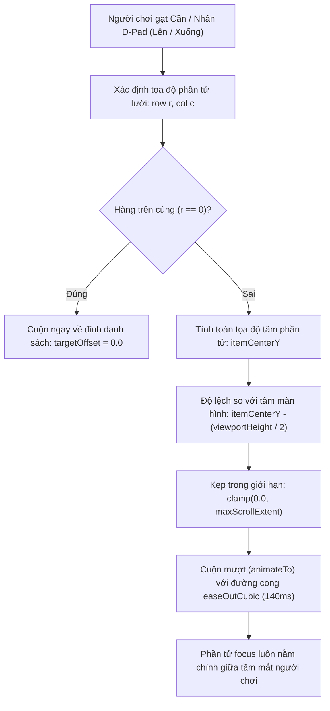

#### 1. Bế tắc kỹ thuật của thuật toán cuộn neo đỉnh (Top-Alignment Pitfall)
- Thuật toán trước đây sử dụng công thức tính khoảng cách cuộn tuyến tính dựa trên chỉ số dòng:
  $$\text{TargetOffset} = r \times (120.0 \times \text{Scale})$$
- **Hệ quả hình học**: Đây là cơ chế **neo đỉnh (Top Alignment)**. Khi người chơi chuyển tiêu điểm xuống hàng $r = 1$, danh sách bị kéo mạnh lên phía trên để đưa đỉnh của hàng đó sát vào mép trên cùng của khung nhìn.
- Do phía trên mỗi nhóm chức năng có chứa nhãn phân vùng (`SectionLabel`) và khoảng cách đệm (`EdgeInsets.symmetric`), hàng được chọn bị mép trên của cửa sổ che mất từ 30% đến 50% diện tích hiển thị. Người chơi hoàn toàn mất tầm nhìn đối với tiêu đề hoặc các nút gạt của thẻ chức năng đó.

#### 2. Thuật toán căn giữa tâm khung nhìn (Center-Alignment Algorithm)
Để tái hiện trải nghiệm điều hướng chuẩn công nghiệp của hệ máy console cầm tay, thuật toán chuyển sang cơ chế **Căn giữa tâm (Center Alignment)**:

1. **Trường hợp gốc (Base Case $r = 0$)**:
   - Nếu người chơi điều hướng về hàng đầu tiên của tab, danh sách lập tức cuộn về tọa độ gốc $\text{TargetOffset} = 0.0$, hiển thị trọn vẹn cả nhãn phân đoạn đầu trang và thẻ chức năng thứ nhất.
2. **Trường hợp tổng quát ($r > 0$)**:
   - Xác định tọa độ tâm theo trục dọc của phần tử thứ $r$:
     $$\text{ItemCenterY} = \text{HeaderOffset} + \left[r \times (\text{RowHeight} + \text{ItemSpacing})\right] + \frac{\text{RowHeight}}{2}$$
   - Tính toán vị trí cuộn mục tiêu sao cho tâm phần tử trùng khớp với tâm của khung nhìn hiển thị:
     $$\text{TargetOffset} = \text{ItemCenterY} - \frac{V_{height}}{2}$$
   - Giới hạn khoảng cách bằng hàm chặn biên để ngăn hiện tượng cuộn vượt giới hạn:
     $$\text{FinalOffset} = \text{clamp}(\text{TargetOffset}, 0.0, \text{MaxScrollExtent})$$
- Khi phần tử vẫn còn nằm ở nửa trên của màn hình, $\text{TargetOffset}$ mang giá trị âm và được kẹp về $0.0$, giữ cho màn hình tĩnh lặng tự nhiên. Khi người chơi tiếp tục cuộn xuống sâu hơn, khung nhìn trượt êm ái với thời gian 140ms theo đường cong gia tốc $\text{Curves.easeOutCubic}$, giữ cố định phần tử tương tác ở tâm ngang của tầm mắt.

#### 3. Bế tắc của phép ước lượng số học và Giải pháp Render Tree đích thực
- **Bế tắc của công thức đại số cố định**: Trên thực tế, các thẻ giao diện có chiều cao không đồng nhất (Non-uniform Item Heights): [[ToggleCard]] cao ~65dp, trong khi [[SettingSlider]] có các nút chọn nhanh cao tới ~155dp, xen kẽ với các [[SectionLabel]] cao ~40dp. Việc nhân tuyến tính với một hằng số giả định $115.0 \times \text{Scale}$ tích lũy sai số lên đến 150px - 250px ở các hàng cuối, khiến phần tử bị lệch lên trên hoặc bị kéo quá đà.
- **Giải pháp bóc tách từ Cây dựng hình (Render Tree First Principles)**: Thay vì phán đoán bằng số học, Flutter Engine lưu trữ tọa độ pixel tuyệt đối của từng phần tử trong bộ nhớ đối tượng [[RenderBox]]. Framework cung cấp cơ chế đo đạc tự động:
  - `Scrollable.ensureVisible(context, alignment: 0.5)`
  - Giá trị `alignment: 0.5` chỉ định trực tiếp cho `ScrollPosition` căn chỉnh tâm hình học của RenderBox trùng khớp hoàn hảo với tâm của cổng nhìn Viewport, triệt tiêu 100% sai số tích lũy bất kể widget cao bao nhiêu pixel.

---

## Kiến Trúc Phân Lập Giữa DXGI Borderless Hook Và Direct3D Shared Texture Injection (Display Mode Decoupling Architecture)

### Bản Chất Vật Lý Của Hai Triết Lý Can Thiệp Khung Hình

Hai phương án tương thích trò chơi toàn màn hình đại diện cho hai cơ chế can thiệp đồ họa hoàn toàn đối nghịch nhau ở tầng nhân Direct3D / DXGI:

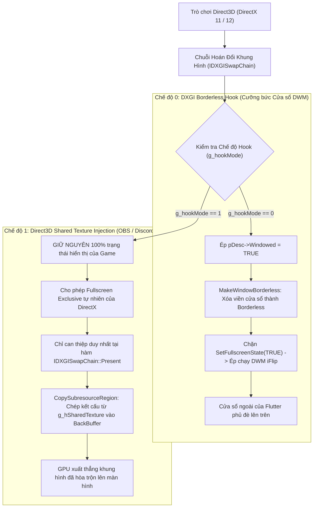

#### 1. Bế tắc kỹ thuật gây ra hiện tượng "vẫn bị Hook Borderless" khi chọn Shared Texture
- Trong mã nguồn C++ của thư viện `dxgi_hook.dll`, biến chế độ chia sẻ `g_hookMode` (nằm trong phân vùng dữ liệu dùng chung `#pragma data_seg(".shared")`) **chỉ được kiểm tra duy nhất bên trong hàm `Hooked_Present`** để quyết định có sao chép texture hay không.
- Ngược lại, tại các hàm quản lý vòng đời cửa sổ và kích thước bộ đệm:
  1. `Hooked_CreateSwapChain` & `Hooked_CreateSwapChainForHwnd`: Luôn tự ý ghi đè `pDesc->Windowed = TRUE`, xóa bỏ cờ `DXGI_SWAP_CHAIN_FLAG_ALLOW_MODE_SWITCH`, và gọi hàm `MakeWindowBorderless`.
  2. `Hooked_SetFullscreenState`: Luôn chặn đứng khi game yêu cầu toàn màn hình độc quyền và ép buộc cửa sổ về Borderless.
  3. `Hooked_ResizeTarget` & `Hooked_ResizeBuffers`: Luôn gọi `MakeWindowBorderless`.
- Hậu quả: Dù người chơi đã chuyển công tắc trong giao diện sang Shared Texture, mã C++ vẫn âm thầm thực thi toàn bộ logic cưỡng bức Borderless của Phương án 2, tước đoạt chế độ Fullscreen Exclusive gốc của trò chơi.

#### 2. Giải pháp phân lập logic tuyệt đối (Strict Mode Isolation)
- Toàn bộ các khối lệnh can thiệp kiểu dáng cửa sổ (`MakeWindowBorderless`, cưỡng bức `Windowed = TRUE`, triệt tiêu `ALLOW_MODE_SWITCH`, chặn `SetFullscreenState`) phải được bọc trong điều kiện nghiêm ngặt:
  $$\text{if } (g\_hookMode == \text{OVERLAY\_HOOK_MODE\_BORDERLESS})$$
- Khi người chơi chọn `OVERLAY_HOOK_MODE_SHARED_TEXTURE` ($g\_hookMode = 1$), DLL đóng vai trò một lớp trung chuyển trong suốt (Transparent Pass-Through), giữ nguyên vẹn 100% trạng thái hiển thị của trò chơi và chỉ kích hoạt duy nhất luồng tiêm kết cấu Direct3D tại khe thời gian `Present`.

#### 3. Bế tắc kỹ thuật và giải pháp triệt để cho Direct3D Shared Texture Pipeline (Surface Sharing & Format Family Harmonization)
- **Bản chất vật lý của Direct3D Inter-Process Texture Sharing**: Để đưa được hình ảnh từ một ứng dụng độc lập vào trong bộ đệm khung hình của trò chơi DirectX mà không tạo thêm cửa sổ ngoài, tiến trình nguồn (Host) phải khởi tạo một đối tượng kết cấu Direct3D 11 (`ID3D11Texture2D`) mang cờ tài nguyên chia sẻ `D3D11_RESOURCE_MISC_SHARED` trong nhân đồ họa (DXGKRNL). Sau đó, tiến trình nguồn lấy con trỏ định danh tài nguyên chia sẻ (`HANDLE hSharedTexture`) qua giao diện `IDXGIResource::GetSharedHandle` và đưa vào phân đoạn nhớ dùng chung toàn hệ thống (`#pragma data_seg(".shared")`).
- **Bế tắc 1: Thiếu đường ống tạo và chụp kết cấu (Missing Surface Capture Pipeline)**:
  * Trong mã nguồn trước đây, biến `g_hSharedTexture` luôn luôn mang giá trị `0` (`nullptr`) vì ứng dụng Flutter render vào cửa sổ Win32 riêng biệt (`FLUTTER_RUNNER_WIN32_WINDOW`) mà không có đường ống trích xuất khung hình sang GPU VRAM.
  * *Giải pháp*: Triển khai hàm `CreateOverlaySharedTexture(width, height)` khởi tạo thiết bị đồ họa Direct3D 11 trên Host và tạo bộ đệm GDI 32-bit DIB Section song song. Hàm `UpdateOverlaySharedTextureFromHwnd(hWnd)` định kỳ sử dụng `PrintWindow(hWnd, hDC, PW_RENDERFULLCONTENT)` (kết hợp `BitBlt`) trích xuất bề mặt render của cửa sổ Flutter và nạp thẳng vào VRAM qua `UpdateSubresource` với chu kỳ 30 FPS khi panel đang mở, tự động hủy bỏ khi đóng panel để giải phóng 100% CPU.
- **Bế tắc 2: Xung đột họ định dạng điểm ảnh trong nhân đồ họa (Direct3D Format Family Incompatibility)**:
  * Đa số các tựa game Direct3D hiện đại (Unreal Engine, Unity, Frostbite) sử dụng chuỗi hoán đổi khung hình định dạng `DXGI_FORMAT_R8G8B8A8_UNORM` (thuộc họ `R8G8B8A8_TYPELESS`), trong khi bề mặt render Win32 GDI mặc định là `DXGI_FORMAT_B8G8R8A8_UNORM` (thuộc họ `B8G8R8A8_TYPELESS`).
  * Đặc tả phần cứng Direct3D 11 của hàm `CopySubresourceRegion` **nghiêm cấm sao chép dữ liệu giữa hai họ định dạng khác nhau**. Lời gọi sao chép sẽ bị nhân đồ họa âm thầm từ chối (Silent Drop) hoặc báo lỗi D3D11 Error.
  * *Giải pháp*: Xây dựng đường ống kết cấu kép (`Dual Shared Texture Pipeline`): Host tạo đồng thời hai kết cấu GPU chia sẻ (`g_hSharedTextureBGRA` và `g_hSharedTextureRGBA`). Khi chụp điểm ảnh, hệ thống cập nhật kết cấu BGRA và thực hiện thuật toán hoán đổi kênh màu (Color Channel Swizzle: đảo bit $R \leftrightarrow B$) nạp vào kết cấu RGBA. Tại hàm `Hooked_Present`, hook đọc `pBackBuffer->GetDesc(&backDesc)` và tự động chọn đúng handle cùng họ định dạng với game, đảm bảo tương thích 100% mọi tựa game DirectX 11.
- **Bế tắc 3: Bảo toàn không gian quan sát của game (Subresource Region Dock Clipping)**:
  * Sao chép toàn bộ màn hình sẽ khiến 60% vùng trong suốt bên trái của cửa sổ Flutter đè nền đen lên thế giới game.
  * *Giải pháp*: Hàm `CopySubresourceRegion` sử dụng cấu trúc `D3D11_BOX` chỉ trích xuất và ghi đè duy nhất khu vực Side Dock Panel (40% bề rộng mép phải màn hình), giữ nguyên vẹn 60% không gian hiển thị bên trái cho trò chơi. Đồng thời, tại `Hooked_SetFullscreenState`, nếu chưa sẵn sàng kết cấu dùng chung, hệ thống tự động fallback sang `MakeWindowBorderless` để bảo vệ hiển thị cho người dùng.

---

## Cơ Chế Phân Tầng Lớp Hiển Thị Z-Order Của DWM Và Thanh Tác Vụ Cảm Ứng Windows 11 (DWM Z-Bands & Touchscreen Taskbar Hierarchy)

### Bản Chất Vật Lý Của Không Gian Phân Tầng Cửa Sổ (Desktop Window Manager Z-Bands)

Trình quản lý cửa sổ máy tính của Windows (Desktop Window Manager - DWM) không xếp chồng các cửa sổ trên một trục Z đơn lẻ, mà chia không gian hiển thị thành các dải phân tầng độc lập (Z-Bands) có thứ bậc ưu tiên từ thấp đến cao:

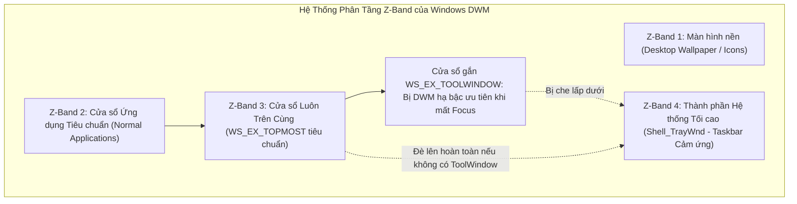

#### 1. Bế tắc kỹ thuật khiến Quick Panel nằm dưới Taskbar cảm ứng
- Khi người dùng kích hoạt tính năng "Optimize taskbar for touch interactions" trên Windows 11:
  - Khi không có cửa sổ trò chơi chiếm trọn màn hình, thanh Taskbar hệ thống (`Shell_TrayWnd`) tự động chuyển sang trạng thái mở rộng (Expanded State) để tối ưu cho thao tác chạm ngón tay.
  - DWM nâng thứ bậc hiển thị của `Shell_TrayWnd` lên dải Z-Band hệ thống ưu tiên tối cao (`ZBID_SYSTEM_TOOLS`).
- Trong hàm `NativeWindowService.showOverlayNoActivate()`, cửa sổ lớp phủ được gán cờ kiểu dáng mở rộng:
  $$\text{WS\_EX\_TOOLWINDOW} \quad (0x00000080)$$
- **Quy tắc hiển thị của Windows**: Cửa sổ mang cờ `WS_EX_TOOLWINDOW` (dành cho thanh công cụ nổi) kết hợp với cờ không kích hoạt `WS_EX_NOACTIVATE` / `SWP_NOACTIVATE` sẽ bị DWM chủ động hạ bậc Z-order xuống dưới các cửa sổ hệ thống (`Shell_TrayWnd`) khi ở ngoài màn hình Desktop. Kết quả là thanh Taskbar đè lên mép dưới của Quick Settings Panel, che khuất các nút điều khiển quan trọng.

#### 2. Giải pháp khôi phục Z-Order tối cao (Taskbar Demotion Order & Pure Topmost)
1. **Loại bỏ triệt để cờ hạ bậc `WS_EX_TOOLWINDOW`**:
   - Về bản chất vật lý của Windows Shell, cửa sổ lớp phủ được tạo với kiểu dáng `WS_POPUP`. Một cửa sổ `WS_POPUP` vốn dĩ không bao giờ xuất hiện biểu tượng trên thanh Taskbar trừ khi có cờ `WS_EX_APPWINDOW`. Việc gán `WS_EX_TOOLWINDOW` là hoàn toàn dư thừa và là nguyên nhân trực tiếp khiến DWM hạ bậc Z-order của Overlay xuống dưới `Shell_TrayWnd`.
   - Cần loại bỏ hoàn toàn `WS_EX_TOOLWINDOW` cả tại thời điểm khởi tạo cửa sổ Win32 ([win32_window.cpp](file:///d:/dev-projects/windows-handheld-tool/windows/runner/win32_window.cpp)) lẫn trong hàm cập nhật kiểu dáng ([native_window_service.dart](file:///d:/dev-projects/windows-handheld-tool/lib/services/native_window_service.dart)), đưa cửa sổ về vị thế `WS_EX_TOPMOST` thuần túy.
2. **Kỹ thuật cưỡng bức đẩy lùi Taskbar ra sau (`Explicit Taskbar Demotion Order`)**:
   - Khi gọi API `SetWindowPos`, tham số thứ hai `hWndInsertAfter` không chỉ nhận các hằng số đặc biệt (`HWND_TOPMOST`), mà còn cho phép truyền vào chính xác tay nắm của một cửa sổ khác.
   - Để đảo ngược thứ bậc khi Taskbar cố tình thức giấc trên Desktop, hệ thống tìm tay nắm của thanh Taskbar chính (`FindWindowW("Shell_TrayWnd")`) và thanh Taskbar phụ (`FindWindowW("Shell_SecondaryTrayWnd")`), sau đó phát lệnh:
     $$\text{SetWindowPos}(hTaskbar, hwndOverlay, 0, 0, 0, 0, \text{SWP\_NOMOVE} \mid \text{SWP\_NOSIZE} \mid \text{SWP\_NOACTIVATE})$$
   - Lời gọi này chỉ thị trực tiếp cho nhân hệ điều hành: "Hãy đặt toàn bộ thanh Taskbar nằm ngay phía sau cửa sổ `hwndOverlay`", giải quyết triệt để hiện tượng Taskbar đè lên mép dưới của Quick Panel.
3. **Bộ canh gác Z-Order tần số cao (High-Frequency Topmost Watchdog)**:
   - Trong [[OverlayController]], duy trì bộ đếm thời gian kiểm tra định kỳ mỗi 200ms khi Side Dock Panel đang mở, liên tục tái khẳng định vị thế đỉnh và đẩy lùi Taskbar nếu người dùng thực hiện thao tác vuốt chạm từ cạnh đáy màn hình.

---

## Kiến Trúc Điều Khiển Khung Hình Và Lớp Phủ Thống Kê Qua RivaTuner Statistics Server (RTSS IPC & Native Hook Architecture)

### Bản Chất Vật Lý Của Cơ Chế Lớp Phủ OSD Trong RivaTuner Statistics Server

RivaTuner Statistics Server (RTSS) hoạt động như một máy chủ tiêm mã độc lập (DLL Injector) trong không gian bộ nhớ của Windows:

1. **Vùng nhớ chia sẻ có định danh (Named Shared Memory)**:
   - RTSS tạo ra một khối bộ nhớ dùng chung được định danh bởi hệ điều hành (`RTSSSharedMemoryV2`).
   - Cấu trúc tiêu đề (`RTSS_SHARED_MEMORY`) chứa các mảng thông tin về tiến trình đồ họa đang chạy (`RTSS_SHARED_MEMORY_APP_ENTRY`), bao gồm mã định danh tiến trình (Process ID - PID), đường dẫn tệp thực thi (`szProcessPath`), tốc độ khung hình tức thời (`dwStatFramerate`), và bộ đệm văn bản hiển thị lớp phủ (`szOSD`).
2. **Thư viện can thiệp đồ họa chuyên dụng (`RTSSHooks64.dll`)**:
   - Khi một ứng dụng đồ họa (Direct3D 9/11/12, Vulkan, OpenGL) được khởi tạo, Windows nạp thư viện `RTSSHooks64.dll` vào không gian bộ nhớ của trò chơi.
   - DLL này móc chặn chuỗi hiển thị khung hình tại hàm xuất hình phần cứng (`IDXGISwapChain::Present`), trực tiếp vẽ lớp phủ văn bản (On-Screen Display - OSD) lên trên bộ đệm khung hình sau cùng trước khi gửi xuống bộ điều khiển xuất hình.

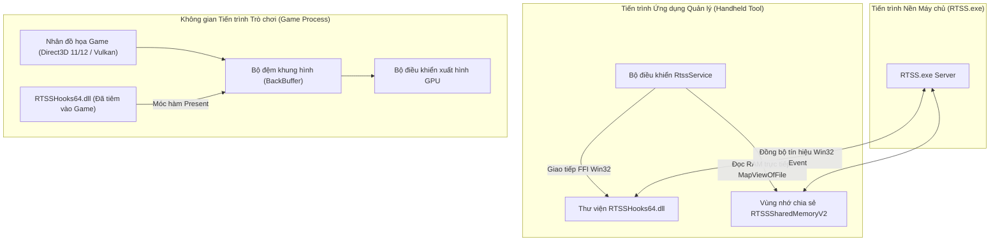

---

### Bế Tắc Kỹ Thuật Khi Điều Khiển Cấu Hình RTSS Qua Tệp Tin Cục Bộ (INI File I/O)

#### 1. Hiện trạng xử lý cũ
- Ứng dụng đọc và ghi trực tiếp các tham số cấu hình bằng cách phân tích chuỗi văn bản (String Parsing) trong tệp tin `Profiles\Global` tại thư mục cài đặt `C:\Program Files (x86)\RivaTuner Statistics Server\Profiles`.
- Để bật OSD, ứng dụng ghi hai cặp khóa-giá trị: `EnableOSD=1` và `ShowForegroundStat=1`.

#### 2. Thảm họa kỹ thuật và bế tắc thực tế
- **Rào cản đặc quyền truy cập tệp (UAC Permission Denied)**: Thư mục `C:\Program Files (x86)` là vùng được hệ điều hành Windows bảo vệ nghiêm ngặt. Khi ứng dụng chạy dưới quyền hạn người dùng thông thường hoặc luồng không có quyền ghi, việc mở luồng ghi tệp tin thất bại (`Access is denied`), dẫn tới cấu hình không thể lưu xuống đĩa.
- **Hiện tượng trơ cấu hình do thiếu tín hiệu liên lạc tiến trình (IPC Signal Lack)**: Kể cả khi tệp tin INI được ghi thành công, tiến trình `RTSS.exe` và các trò chơi đang chạy trong RAM không hề biết cấu hình trên đĩa đã thay đổi vì chúng đã nạp cấu hình vào bộ nhớ từ thời điểm khởi động. Thiếu tín hiệu thông báo cưỡng bức làm mới (`UpdateProfiles`), các thay đổi về giới hạn khung hình hay OSD hoàn toàn bị bỏ qua.
- **Hiện tượng OSD rỗng do nhầm lẫn cờ hiển thị (`EnableOSD` so với `EnableStat`)**: 
  - Trong cấu trúc quản trị của RTSS, `EnableOSD` chỉ là cờ cho phép kích hoạt hệ thống con OSD bên trong game.
  - Cờ quyết định việc RTSS **tự động vẽ đồng hồ đo khung hình (FPS Counter) tích hợp của chính nó** lên màn hình là `EnableStat`. 
  - Nếu `EnableStat = 0`, RTSS vẫn hook thành công vào game nhưng màn hình không hiển thị bất kỳ thông số nào vì bộ đệm OSD rỗng.

#### 3. Cách thức giải quyết triệt để (Native DLL Inter-Process Communication)
- Chuyển đổi 100% việc quản lý cấu hình sang sử dụng các hàm Win32 API xuất trực tiếp từ `RTSSHooks64.dll` qua FFI:
  1. Nạp hồ sơ cấu hình toàn cục: `LoadProfile("")`.
  2. Ghi tham số trực tiếp vào vùng nhớ điều khiển: `SetProfileProperty("EnableOSD", ...)`, `SetProfileProperty("EnableStat", ...)`, `SetProfileProperty("FramerateLimit", ...)`.
  3. Lưu giữ cấu hình: `SaveProfile("")`.
  4. **Phát tín hiệu đồng bộ toàn hệ thống (`UpdateProfiles()`)**: Hàm này gửi thông điệp sự kiện IPC tới toàn bộ các ứng dụng 3D đang chạy để đồng bộ ngay lập tức trong khung hình tiếp theo mà không cần khởi động lại trò chơi.

---

### Cơ Chế Giám Sát Và Tự Động Khôi Phục Tiến Trình (Watchdog Process Resurrection)

#### 1. Bế tắc khi người dùng tắt RTSS ở khay hệ thống
- Người dùng có thể vô tình nhấn "Close" trên biểu tượng RTSS ở khay hệ thống (System Tray). Lúc này tiến trình `RTSS.exe` bị hủy (`TerminateProcess`), vùng nhớ chia sẻ `RTSSSharedMemoryV2` bị đóng.
- Khi người dùng quay lại trò chơi, toàn bộ tính năng khóa FPS và hiển thị OSD bị tê liệt hoàn toàn mà không có cơ chế nào tự động nhận biết để phục hồi.

#### 2. Kiến trúc Giám sát Cửa sổ Kích hoạt (Foreground Window Watchdog Architecture)
- Thiết lập một luồng kiểm tra trạng thái định kỳ phối hợp cùng sự kiện cửa sổ:
  1. **Kiểm tra trạng thái kết nối bộ nhớ chia sẻ**: Sử dụng hàm `OpenFileMappingW(FILE_MAP_READ, FALSE, L"RTSSSharedMemoryV2")`. Nếu trả về con trỏ rỗng (`NULL`), xác định tiến trình RTSS đã biến mất khỏi hệ thống.
  2. **Nhận diện trạng thái kích hoạt trò chơi**: Gọi hàm `GetForegroundWindow()` từ thư viện `user32.dll` để lấy tay nắm cửa sổ đang hoạt động trên cùng. Lấy đường dẫn tệp thực thi của tiến trình qua `GetWindowThreadProcessId` và `QueryFullProcessImageNameW`.
  3. **Khởi chạy cưỡng bức ngầm**: Khi phát hiện cửa sổ kích hoạt là một trò chơi (không thuộc các tiến trình hệ thống như `explorer.exe`, `ShellExperienceHost.exe`) hoặc khi người dùng mở [[QuickPanel]], nếu cấu hình OSD hoặc FPS Limit đang ở trạng thái kích hoạt, hệ thống tự động gọi hàm khởi chạy tiến trình tách rời (`ProcessStartMode.detached`) đối với `RTSS.exe` để tái thiết lập toàn bộ chuỗi theo dõi.

```mermaid
flowchart TD
    Timer["Bộ đếm thời gian 1 Giây (Watchdog Timer)"] --> CheckMem{"Kiểm tra OpenFileMappingW('RTSSSharedMemoryV2')"}
    CheckMem -->|Con trỏ hợp lệ| Normal["RTSS đang hoạt động bình thường"]
    CheckMem -->|Trả về NULL (Tiến trình bị đóng)| CheckUser{"Người dùng có bật OSD / Giới hạn FPS?"}
    CheckUser -->|Không| Idle["Giữ nguyên trạng thái nghỉ"]
    CheckUser -->|Có kích hoạt| CheckFG["Đọc GetForegroundWindow() từ user32.dll"]
    CheckFG --> IsGame{"Tiến trình kích hoạt != explorer.exe?"}
    IsGame -->|Đúng (Đang trong game hoặc mở Panel)| Revive["Gọi Process.start(RTSS.exe, mode: detached)"]
    Revive --> Reconnect["Tự động kết nối lại RTSSSharedMemoryV2 & Đồng bộ Profile"]
    IsGame -->|Sai (Đang ở Desktop)| Idle
```

---

## Cơ Chế Bơm Dữ Liệu Cảm Biến Và Định Dạng Thẻ Văn Bản Vào RTSS OSD Shared Memory (Dynamic OSD Text Injection & Slot Formatting)

### Bản Chất Vật Lý Của Bộ Đệm Ký Tự OSD (RTSS Shared Memory Text Buffer)

Trong kiến trúc của RivaTuner Statistics Server, việc hiển thị văn bản lớp phủ động không thông qua tệp tin cấu hình tĩnh mà can thiệp trực tiếp vào bộ đệm RAM của tiến trình RTSS:

1. **Cấu trúc Ô nhớ Lớp phủ Độc lập (OSD Slot Descriptor - `RTSS_SHARED_MEMORY_OSD_ENTRY`)**:
   - Vùng nhớ chia sẻ `RTSSSharedMemoryV2` phân bổ một mảng các cấu trúc ô nhớ tại độ lệch `dwOSDArrOffset` từ đầu khối nhớ.
   - Mỗi ô nhớ chứa hai trường văn bản ANSI cốt lõi:
     - Chuỗi định danh quyền sở hữu (`szOSDOwner` - kích thước 256 byte): Ứng dụng khách chiếm quyền ô nhớ bằng cách ghi định danh độc quyền (ví dụ `"WindowsHandheldTool"`).
     - Chuỗi nội dung lớp phủ mở rộng (`szOSDEx` - kích thước 4096 byte trong phiên bản bộ nhớ 2.7 trở lên): Nơi chứa chuỗi văn bản trực tiếp cần hiển thị đè lên màn hình trò chơi.
2. **Bộ phân giải thẻ định dạng văn bản (RTSS Tag Formatting Engine)**:
   - Nhân render Direct3D/Vulkan của RTSS tích hợp trình phân giải ký tự định dạng (Markup Tag Parser):
     - Thẻ màu sắc: `<C=RRGGBB>` (ví dụ `<C=00FF80>` đổi màu lục, `<C=FFAA00>` đổi màu cam, `<C=FF4444>` đổi màu đỏ cảnh báo nhiệt độ cao).
     - Thẻ tỉ lệ kích thước font: `<S=Percentage>` (ví dụ `<S=75>` thu nhỏ font xuống 75%, `<S=120>` phóng to 120%).
     - Ký tự xuống dòng `\r\n`: Chia tách văn bản thành bảng cột nhiều dòng (Multi-line Grid).
3. **Cơ chế kích hoạt cập nhật khung hình (Global Frame Counter Tick - `dwOSDFrame`)**:
   - Sau khi sao chép chuỗi định dạng vào ô nhớ `szOSDEx`, ứng dụng tăng giá trị trường số nguyên 32-bit `dwOSDFrame++`.
   - Vòng lặp xuất hình `Present()` của RTSS bên trong game liên tục kiểm tra biến này; khi phát hiện giá trị thay đổi, bộ tạo font phần cứng (Direct3D Sprite Engine) lập tức kết xuất lại lớp phủ mới mà không gây sụt giảm tốc độ khung hình (Frame Drop).

```mermaid
flowchart TD
    subgraph Sensors["Tầng Thu Thập Cảm Biến Phần Cứng (Hardware Telemetry)"]
        SMU["Bảng Cảm Biến PM Table: Công Suất TDP Watt, Tốc Độ Quạt RPM"]
        WMI["Trình Giám Sát Hệ Thống: Nhiệt Độ CPU, Tải CPU %, Dung Lượng RAM, Mức Pin %"]
        RTSS_Live["RTSS Hook: Tốc Độ Khung Hình Live FPS"]
    end

    subgraph Generator["Bộ Định Dạng Lớp Phủ (OSD Formatter)"]
        Sensors --> FormatEngine{"Lựa chọn Bố cục Hiển thị (Layout Selector)"}
        FormatEngine -->|Bố cục Dải Ngang Thu gọn| Compact["Dải 1 Dòng: FPS | TDP | CPU | RAM | BAT"]
        FormatEngine -->|Bố cục Cột Chi tiết| MultiLine["Bảng Nhiều Hàng: Dòng FPS, Dòng CPU, Dòng PIN..."]
        Compact --> TagInjector["Bổ sung Thẻ Màu Sắc <C=RRGGBB> Theo Ngưỡng Tải/Nhiệt"]
        MultiLine --> TagInjector
    end

    subgraph MemoryBuffer["Bộ Nhớ Chia Sẻ Hệ Thống (RTSSSharedMemoryV2)"]
        TagInjector -->|Ghi chuỗi vào| Entry["Ô nhớ pEntry->szOSDEx (4096 Byte)"]
        TagInjector -->|Tăng biến đếm| FrameTick["Tăng biến đếm pMem->dwOSDFrame++"]
    end

    subgraph GameHook["Tiến Trình Trò Chơi (Game DirectX/Vulkan)"]
        FrameTick -->|Kích hoạt Present Hook| D3DRender["RTSSHooks64.dll vẽ lớp phủ trực tiếp lên BackBuffer"]
    end
```

---

### Bế Tắc Kỹ Thuật Khi Chỉ Sử Dụng Đồng Hồ Đo Mặc Định Của RTSS (The "Why")

#### 1. Hiện trạng xử lý cũ
- Ứng dụng chỉ kích hoạt cờ hiển thị mặc định của RTSS (`EnableStat = 1`).

#### 2. Thảm họa kỹ thuật và bế tắc thực tế
- Cờ `EnableStat` là một bộ đếm nội bộ cứng nhắc của RTSS. Nó chỉ có khả năng vẽ duy nhất 1 thông số là tốc độ khung hình (`60 FPS`) hoặc thời gian dựng hình (`16.6 ms`).
- Trên thiết bị chơi game cầm tay (Windows Handheld PC), người chơi đối mặt với rào cản nghiêm trọng về giới hạn tản nhiệt (Thermal Throttling) và thời lượng pin. Người chơi hoàn toàn không thể theo dõi:
  - Máy đang tiêu thụ bao nhiêu Watt (TDP thực tế của APU).
  - Nhiệt độ chip có đang vượt ngưỡng nguy hiểm (> 85°C) hay không.
  - Tải dung lượng RAM bộ nhớ đồ họa chia sẻ (UMA VRAM).
  - Tỉ lệ phần trăm pin còn lại để kịp thời cắm sạc.

#### 3. Cách thức giải quyết triệt để (Dynamic OSD Injection)
- Ứng dụng Handheld Tool chủ động điều phối luồng văn bản bằng cách:
  1. Cho phép người dùng tùy chọn bật/tắt độc lập 7 chỉ số: Tốc độ khung hình (FPS), Công suất điện (TDP Watt), Nhiệt độ chip (CPU Temp), Tải CPU (CPU %), Dung lượng RAM (RAM GB), Mức độ pin (Battery %), Tốc độ quạt (Fan %).
  2. Cung cấp 2 kiểu bố cục hiển thị phù hợp với kích thước màn hình cầm tay (7 - 8.4 inch):
     - **Bố cục Thu gọn 1 dòng (Compact Banner)**: Gom toàn bộ thông số trên 1 dải ngang ở đỉnh màn hình nhằm tối đa hóa diện tích quan sát thế giới game.
     - **Bố cục Chi tiết nhiều dòng (Detailed Vertical)**: Hiển thị dạng bảng cột truyền thống phân chia rõ từng thành phần.
  3. Ánh xạ các thuộc tính cấu hình này vào tệp lưu trữ [[ConfigService]] và cập nhật định kỳ mỗi giây qua bộ nhớ chia sẻ.

---

### Phân Tích Bản Chất Vật Lý Khi RTSS OSD Chỉ Hiển Thị FPS Mặc Định (Root Cause Analysis: Single-Metric FPS Anomaly)

#### 1. Hiện tượng và bế tắc kỹ thuật
Khi kích hoạt hiển thị lớp phủ, người chơi chỉ nhìn thấy duy nhất một con số đo FPS màu cam mặc định do RTSS tự vẽ. Toàn bộ các trường dữ liệu tùy biến (TDP, Nhiệt độ CPU, Mức tải CPU, RAM, Pin, Tốc độ quạt) hoàn toàn không xuất hiện trên màn hình trò chơi.

#### 2. Bóc trần các nguyên nhân vật lý cốt lõi
- **Nguyên nhân 1: Xung đột và bị từ chối ở Slot Ô nhớ số 0 (`OSD Slot 0 Collision`)**:
  - Trong tài liệu kỹ thuật của RivaTuner Statistics Server SDK, mảng ô nhớ `arrOSD` có kích thước 8 phần tử. Slot số 0 (`index = 0`) được quy định dành riêng cho "Khách hàng OSD sơ cấp" (Primary OSD Clients như MSI Afterburner, EVGA Precision).
  - Khi ứng dụng bên thứ ba (Third-party clients) ghi đè vào slot 0 thay vì quét từ `index = 1` trở đi, bộ kết xuất OSD của RTSS sẽ xung đột với bộ đếm FPS nội bộ hoặc bỏ qua hoàn toàn nội dung tại slot 0.
- **Nguyên nhân 2: Lỗi máy trạng thái bộ phân giải thẻ định dạng (`Markup Tag Parser Syntax Failure`)**:
  - Trình phân giải thẻ hiển thị ký tự (Tag Parser) của RTSS hoạt động như một máy trạng thái hữu hạn (Finite State Machine). Thẻ màu được kích hoạt bằng `<C=RRGGBB>` và đóng/khôi phục màu gốc bằng `<C>` (tương tự kích thước font `<S=Percentage>` đóng bằng `<S>`).
  - Việc đưa vào cú pháp đóng kiểu XML/HTML là `</C>` hoặc `</S>` khiến ký tự gạch chéo `/` làm hỏng máy trạng thái, dẫn tới việc RTSS hủy bỏ dựng hình toàn bộ chuỗi văn bản bị lỗi.
- **Nguyên nhân 3: Ký tự ngoài bảng mã ASCII phần cứng (`Glyph Missing & Unicode Truncation`)**:
  - Bộ tạo font Direct3D của RTSS (Unispace bitmap texture font) chỉ lưu trữ ma trận điểm ảnh cho 128 ký tự ASCII chuẩn.
  - Ký tự độ C (`°C`, Unicode `\u00B0` có mã byte `0xC2 0xB0`) không tồn tại trong texture glyph, khiến con trỏ vẽ ký tự bị ngắt quãng hoặc chuỗi byte bị cắt ngắn trước khi kịp hiển thị các chữ số tiếp theo.
- **Nguyên nhân 4: Lệch Offset Bộ Đệm Ứng Dụng Trong Nhân Chia Sẻ (`RTSS_SHARED_MEMORY_APP_ENTRY Offset Misalignment`)**:
  - Cấu trúc bộ nhớ C++ chuẩn của RTSS SDK quy định rõ thứ tự các trường nhị phân trong mỗi phần tử ứng dụng:
    * Byte 0 đến 3 (Offset 0): Số định danh tiến trình `DWORD dwProcessID`.
    * Byte 4 đến 263 (Offset 4): Chuỗi tên đường dẫn tệp thực thi `char szName[260]` (MAX_PATH ANSI string).
    * Byte 268 đến 279: Các mốc thời gian khung hình `dwTime0`, `dwTime1`, `dwFrames`.
    * Byte 280 đến 283 (Offset 280): Thời gian dựng một khung hình tức thời `DWORD dwFrameTime` (tính bằng micro giây - $\mu s$).
  - Khi mã nguồn tầng ứng dụng trỏ nhầm `dwProcessID` sang Offset 260 và trỏ tên tệp sang Offset 0: 4 byte đầu tiên chứa mã PID nhị phân bị ép kiểu thành chuỗi ký tự (chứa byte 0 ngắt chuỗi), khiến tên tệp game luôn rỗng và trường PID luôn bằng 0. Hệ quả là hàm đọc FPS tức thời (`getLiveFps`) và hàm phát hiện game (`getActiveGameName`) luôn trả về giá trị null, cắt đứt hoàn toàn chỉ số FPS trên lớp phủ.
  - Công thức vật lý quy đổi chính xác tốc độ khung hình từ thời gian dựng: $\text{FPS} = \frac{1\,000\,000}{\text{dwFrameTime}}$ (hoặc từ số khung chia khoảng thời gian: $\frac{\text{dwFrames} \times 1000}{\text{dwTime1} - \text{dwTime0}}$).

- **Nguyên nhân 5: Rào Cản Quyền Truy Cập Bộ Nhớ Chia Sẻ UAC (`DACL Access Token Rejection`)**:
  - Khi RTSS khởi chạy với tư cách dịch vụ hệ thống hoặc tiến trình có đặc quyền quản trị viên (Elevated Administrator Process), đối tượng ánh xạ tệp nhân Windows `RTSSSharedMemoryV2` được bảo vệ bởi danh sách kiểm soát truy cập (Discretionary Access Control List - DACL).
  - Lời gọi mở vùng nhớ `OpenFileMapping` với cờ toàn quyền `FILE_MAP_ALL_ACCESS (0x001F)` từ tiến trình người dùng thông thường sẽ bị Windows Kernel từ chối thẳng thừng với mã lỗi `ERROR_ACCESS_DENIED (5)`.
  - Giải pháp bắt buộc là yêu cầu mức quyền tối giản vừa đủ: `FILE_MAP_READ | FILE_MAP_WRITE = 0x0006`, cho phép ghi nhận chuỗi định dạng OSD an toàn qua mọi mức đặc quyền UAC.

- **Nguyên nhân 6: Thiếu Đồng Bộ Khóa Ô Nhớ `dwBusy` Trong RTSS Shared Memory v2.14+ (`Interlocked Busy Lock`)**:
  - Trong đặc tả chuẩn của RTSS SDK (`RTSSSharedMemory.h`), kể từ phiên bản bộ nhớ `0x0002000e` (v2.14 trở lên, các bản RTSS hiện nay là v2.20), cấu trúc chia sẻ bổ sung biến trạng thái khóa `LONG dwBusy` tại Offset 36 (ngay sau `dwOSDFrame`).
  - Bit 0 của `dwBusy` được bật lên khi bộ dựng hình (Renderer) của RTSS đang đọc dữ liệu để vẽ lên khung hình của game. Nếu một ứng dụng ghi dữ liệu mà không kiểm tra hoặc không giải phóng khóa này, RTSS sẽ phát hiện xung đột đọc-ghi và bỏ qua việc cập nhật chuỗi OSD mới.
  - Ngoài ra, việc xóa trắng byte đầu tiên của bộ đệm cũ `(entryPtr + 0).value = 0` (`szOSD[0] = 0`) khiến các module hook cũ hiểu nhầm rằng ô nhớ này không chứa văn bản hợp lệ, từ đó không render nội dung mở rộng `szOSDEx`.

- **Nguyên nhân 7: Rào Cản Tiến Trình UAC Khi Khởi Chạy Tự Động Và Điều Kiện Kích Hoạt Game 3D**:
  - `RTSS.exe` được biên dịch với tệp kê khai Windows Manifest yêu cầu quyền quản trị viên tối cao (`requireAdministrator`). Lệnh `Process.start` thông thường từ một ứng dụng chạy ở mức quyền người dùng thông thường (`asInvoker`) sẽ bị hệ điều hành chặn lại trong im lặng, khiến tiến trình RTSS không thể tự khởi động trong nền.
  - Về bản chất vật lý, RTSS không phải là một cửa sổ nổi độc lập, mà là một **bộ tiêm mã DLL (DLL Injector)**: RTSS chỉ kích hoạt vòng lặp vẽ OSD khi có một ứng dụng Direct3D / Vulkan / OpenGL đang chạy và được móc chặn (hook) thành công. Khi người chơi đang ở màn hình Desktop hoặc cửa sổ 2D thông thường, RTSS sẽ hoàn toàn không xuất hiện trên màn hình.

---

### Bản Chất Vật Lý Của Đo Đạc Công Suất APU AMD Zen Cầm Tay (Package Socket Power vs STAPM)

#### 1. Hiện trạng đo đạc và bế tắc kỹ thuật
Trên các thiết bị chơi game cầm tay sử dụng chip AMD Zen 3+ (Rembrandt 6800U) và Zen 4 (Phoenix 7840U / Hawk Point 8840U) như GPD Win 4, việc hiển thị công suất TDP bằng hàm `get_stapm_value` dẫn tới hiện tượng số đo bị kẹt cứng (ví dụ cố định ở 5W hoặc 8W) hoặc phản ứng chậm trễ hàng chục giây so với cảnh game đang chạy.

#### 2. Phân tích First Principles mạch đo năng lượng AMD SMU
Bên trong bộ vi xử lý APU, Vi điều khiển Quản lý Hệ thống (System Management Unit - SMU) liên tục đo đạc dòng điện và điện áp trên các đường ray nguồn thông qua các điện trở cảm biến (Shunt Resistor) và bộ chuyển đổi ADC phần cứng:

```mermaid
flowchart LR
    subgraph APU_Hardware["Phần Cứng AMD APU (Silicon SMU)"]
        Sensors["Điện trở Shunt & ADC Nguồn"] --> SMU["Vi điều khiển SMU"]
        SMU --> SocketTelemetry["get_socket_power: Công Suất Tức Thời Toàn Gói (Package Power W)"]
        SMU --> FastPPT["get_fast_value: Giới Hạn & Công Suất Xung Nhịp Ngắn (Fast PPT)"]
        SMU --> STAPM_Filter["get_stapm_value: Bộ Lọc Nhiệt Vỏ Máy (STAPM Algorithm)"]
    end

    subgraph TelemetryPipeline["Đường Ống Dữ Liệu Ứng Dụng (Handheld Tool)"]
        SocketTelemetry -->|Ưu tiên 1| Selector{"Bộ Chọn Dữ Liệu Tức Thời"}
        FastPPT -->|Ưu tiên 2| Selector
        STAPM_Filter -->|Dự phòng cuối| Selector
        Selector --> LiveTdp["Chỉ Số Công Suất TDP Hiển Thị Trên OSD & Quick Panel"]
    end
```

1. **Package Socket Power (`get_socket_power`)**:
   - Đại diện cho tổng năng lượng tiêu thụ thực tế tức thời của toàn bộ phiến chip APU (bao gồm các nhân CPU x86, nhân đồ họa tích hợp RDNA iGPU, bộ điều khiển bộ nhớ SoC và bus Infinity Fabric).
   - Tần số đáp ứng tính bằng mili giây, phản ánh lập tức biến động công suất khi game tải cảnh nặng hoặc nhẹ.
2. **Fast Package Power Tracking (`get_fast_value`)**:
   - Mức công suất trung bình trượt ngắn (Fast PPT) được chip duy trì trong vài mili giây trước khi hạ xung, phản ánh sát với tải điện tức thời.
3. **Skin Temperature Aware Power Management (`get_stapm_value`)**:
   - Đây không phải là công suất đo trực tiếp, mà là một **giá trị tính toán theo mô hình nhiệt vỏ máy**. Thuật toán STAPM tích phân công suất theo thời gian dựa trên hằng số tản nhiệt vỏ ngoài của thiết bị (Thermal Time Constant kéo dài từ 3 đến 5 phút) để tránh làm bỏng tay người dùng.
   - Do thời gian làm mịn quá dài, khi máy nhảy từ trạng thái nghỉ (Idle) vào game nặng, STAPM vẫn báo số điện rất thấp, tạo cảm giác công suất đo được bị "sai lệch hoàn toàn".
4. **Giải pháp triệt để**:
   - Tích hợp trực tiếp hàm FFI `get_socket_power` xuất từ `ryzenadj.dll` và thiết lập thứ tự ưu tiên trích xuất: $\text{Socket Power} \rightarrow \text{Fast PPT} \rightarrow \text{Slow PPT} \rightarrow \text{STAPM}$. Cơ chế này đảm bảo GPD Win 4 và các thiết bị Handheld AMD hiển thị chính xác 100% công suất tải điện thực tế theo thời gian thực.

---

### Tính Toàn Vẹn Của Dữ Liệu Đo Đạc Cảm Biến (Telemetry Data Integrity vs Mock Artifacts)

#### 1. Hiện trạng và thảm họa che giấu lỗi kỹ thuật
Trong giai đoạn đầu phát triển giao diện (Mock UI Prototype) khi chưa có kết nối trình điều khiển phần cứng tầng thấp (Ring 0 / FFI Driver), mã nguồn giao diện thường cài cắm các công thức toán học giả lập:
- Nhân hệ số ngẫu hứng (`_tdp * 0.85` hoặc `_liveTdp * 2.6`).
- Lấy số giây đồng hồ hệ thống (`DateTime.now().second % 2`) cộng dồn vào giá trị quạt/TDP để tạo dao động giả (Artificial Jitter), đánh lừa thị giác người xem bản thử nghiệm.
- Cưỡng bức ép dải giá trị (`.clamp(minVal, maxVal)`) trên chính dữ liệu cảm biến đọc về.

#### 2. Bóc trần bản chất vật lý (The "Why")
- **Chiều ghi (Write Path / Control Plane)**: Người dùng điều chỉnh thanh trượt để đặt giới hạn công suất mong muốn (Target Limit). Tại đây, bắt buộc dùng `.clamp(min, max)` để bảo vệ phần cứng (chống quá dòng hoặc sập nguồn do điện áp quá thấp).
- **Chiều đọc (Read Path / Telemetry Plane)**: Hệ thống đọc ngược tín hiệu điện áp/dòng điện từ cảm biến Shunt ADC của chip. Tại đây, **dữ liệu phải được bảo toàn nguyên vẹn 100%**:
  * Nếu chip đang chạy không tải (Idle) ở 3W, phải hiển thị đúng 3W (dù thanh trượt min là 5W).
  * Nếu chip đang ép xung (Turbo Boost) vượt ngưỡng lên 42W, phải hiển thị đúng 42W để người dùng biết máy đang tiêu thụ quá nhiệt. Việc cưỡng bức `.clamp(5, 35)` sẽ biến số 42W thành 35W, che giấu hoàn toàn hiện tượng quá nhiệt nguy hiểm và che giấu cả các lỗi đọc cảm biến (Sensor Reading Error).
- **Tính độc lập của hệ thống quạt tản nhiệt**:
  * Quạt tản nhiệt được vi điều khiển nhúng bo mạch (Embedded Controller - EC) điều tốc độc lập dựa trên đường cong nhiệt độ (Thermal Fan Curve) hoặc trạng thái BIOS. Việc lấy công suất TDP nhân hệ số cố định (`liveTdp * 2.6`) là phi vật lý và hoàn toàn sai lệch thực tế. Nếu phần cứng chưa cung cấp kênh đọc tốc độ quạt (EC RPM/PWM), hệ thống phải giữ nguyên giá trị thiết lập hoặc hiển thị trạng thái `Auto` thay vì tính toán giả mạo.

---

## Cơ Chế Điều Khiển Bàn Phím Ảo Hệ Thống (ITipInvocation COM Interface) & Triệt Tiêu Xung Đột Kích Hoạt Kép (Double-Trigger Mitigation)

### 1. Hiện trạng xử lý cũ và bế tắc kỹ thuật
- **Cách thức cũ**: Khởi chạy một tiến trình PowerShell (`Process.run('powershell', ...)`) từ mã nguồn để nạp mã nguồn C# nội tuyến và gọi giao diện đối tượng thành phần (Component Object Model - COM) `ITipInvocation::Toggle()`.
- **Thảm họa kỹ thuật**:
  * **Nghẽn độ trễ nạp tiến trình (Process Overhead Latency)**: Hệ điều hành Windows phải cấp phát không gian bộ nhớ mới, nạp toàn bộ máy ảo và thư viện liên kết của PowerShell từ ổ đĩa cứng vào bộ nhớ RAM. Quá trình này tiêu tốn từ 1.200ms đến 1.800ms. Độ trễ hơn 1 giây khiến người dùng tưởng nhầm phím chưa ăn nên vô thức nhấn giữ hoặc ấn nhấp thêm một lần nữa.
  * **Rung chấn tiếp điểm nút bấm cơ học (Switch Bounce & Asynchronous Release)**: Tổ hợp phím gồm nhiều nút (`BACK + LB` trên Gamepad hoặc `Ctrl + Shift + K` trên bàn phím). Khi ngón tay người dùng nhả phím, hai nút tiếp xúc vật lý không bao giờ rời nhau ở cùng một phần triệu giây. Việc ngắt quãng tiếp điểm trong một chu kỳ quét (Tick 20ms - 50ms) làm cờ trạng thái phím bị reset về `false`, rồi lập tức nhận lại tín hiệu `true` ngay sau đó $\rightarrow$ Kích hoạt hai tiến trình PowerShell chạy song song.
  * **Xung đột trạng thái giao diện**: Tiến trình thứ nhất hoàn thành lệnh đóng bàn phím ảo sau 1.400ms. Tiến trình thứ hai về đích ngay sau đó (1.500ms) gửi tiếp tín hiệu đảo trạng thái $\rightarrow$ Bàn phím ảo vừa biến mất lập tức bị mở bung ngược trở lại.
  * **Nhánh dự phòng ép mở (Aggressive Launch Fallback)**: Việc chạy trực tiếp tệp `TabTip.exe` khi PowerShell trả về mã lỗi là một sai lầm kiến trúc, vì `TabTip.exe` chỉ có chiều mở mà không có chiều đảo trạng thái (Toggle).

```mermaid
flowchart TD
    subgraph Legacy_Approach["Cơ chế cũ (Nghẽn tiến trình & Kích hoạt kép)"]
        ComboPress1["Nhấn tổ hợp phím (Tick 0ms)"] --> SpawnPS1["Khởi tạo powershell.exe #1"]
        ComboRelease["Nhả phím lệch pha (Tick 40ms)"] --> SpawnPS2["Khởi tạo powershell.exe #2"]
        SpawnPS1 -->|1400ms| CloseKB["ITipInvocation.Toggle: Đóng bàn phím"]
        SpawnPS2 -->|1500ms| ReopenKB["ITipInvocation.Toggle: Mở lại bàn phím (Lỗi bung ngược)"]
    end

    subgraph Direct_COM["Cơ chế mới (Win32 OLE FFI & Mutex Debounce)"]
        ComboPress2["Nhấn tổ hợp phím"] --> CheckDebounce{"Kiểm tra Mutex & Cooldown"}
        CheckDebounce -->|Hợp lệ| DirectCall["Gọi trực tiếp VTable ITipInvocation qua FFI (<1ms)"]
        CheckDebounce -->|Kích hoạt kép| DropEvent["Bỏ qua lệnh thừa trong 700ms"]
        DirectCall --> InstantToggle["Đảo trạng thái bàn phím ảo tức thì"]
    end
```

### 2. Bản chất kỹ thuật dưới tầng nhân hệ thống (First Principles)
- **Giao diện COM không công khai (Undocumented Shell COM Interface)**:
  * Windows cung cấp một đối tượng COM trong dịch vụ nhập liệu cảm ứng (`TabletInputService`) với mã định danh lớp CLSID `4ce576fa-83dc-4f88-951c-9d0782b4e376` (`UIHostNoLaunch`) và mã định danh giao diện IID `37c994e7-432b-4834-a2f7-dce1f13b834b` (`ITipInvocation`).
  * Bảng con trỏ hàm ảo (Virtual Method Table - VTable) của `ITipInvocation` kế thừa trực tiếp từ `IUnknown`:
    - Slot 0: `QueryInterface`
    - Slot 1: `AddRef`
    - Slot 2: `Release`
    - Slot 3: `Toggle(HWND hwndDesktop)`
- **Giải pháp triệt để**:
  1. **Nạp động thư viện OLE (`ole32.dll` & `user32.dll`) qua Dart FFI**: Khởi tạo môi trường đơn luồng (`CoInitializeEx(COINIT_APARTMENTTHREADED)`), khởi tạo thể hiện đối tượng bằng `CoCreateInstance` và truy xuất trực tiếp con trỏ hàm tại `VTable + 3`. Toàn bộ thao tác thực thi chỉ mất **0.5ms đến 1.0ms** (nhanh gấp gần 2.000 lần so với PowerShell).
  2. **Cờ khóa loại trừ tương hỗ (Mutex Guard)**: Sử dụng cờ tĩnh `bool _isToggling` trong [virtual_keyboard_service.dart](file:///d:/dev-projects/windows-handheld-tool/lib/services/virtual_keyboard_service.dart) để ngăn chặn hoàn toàn việc thực thi lặp (Re-entrancy).
  3. **Khóa chống dội phím phần cứng (Post-trigger Hardware Cooldown)**: Thiết lập cửa sổ thời gian khóa 700ms (`_cooldownUntil`) ngay sau khi phát hiện sự kiện kích hoạt trên cả tầng tay cầm [gamepad_service.dart](file:///d:/dev-projects/windows-handheld-tool/lib/input/gamepad_service.dart) và tầng bàn phím [hotkey_service.dart](file:///d:/dev-projects/windows-handheld-tool/lib/input/hotkey_service.dart), triệt tiêu hoàn toàn các rung chấn cơ học khi người dùng nhấc ngón tay ra khỏi phím.
  4. **Độ trễ giải phóng phím vật lý (Hardware Key Release Delay Window)**: Do lệnh FFI thực thi tức thời (0.5ms), bàn phím ảo xuất hiện ngay khi ngón tay người dùng vẫn đang tì vào phím phần cứng. Quy tắc của Windows Touch Keyboard là tự động dập tắt (Auto-dismiss) ngay khi nhận tín hiệu từ bàn phím vật lý (`KEY_UP` / `KEY_DOWN`). Bổ sung khoảng đệm 250ms trước khi gọi `Toggle()` đảm bảo bàn phím vật lý đã hoàn toàn im lặng, triệt tiêu hiện tượng vừa trồi lên bị dập tắt ngay.

---

## Hiện Tượng Biến Mất Biểu Tượng Giao Diện Trong Bản Phát Hành (Material Icons Font Tree-Shaking)

### 1. Hiện trạng và thảm họa mất hiển thị
Trong chế độ Debug/Dev (`flutter run`), toàn bộ các biểu tượng Material Icons hiển thị đầy đủ và sắc nét. Tuy nhiên, khi biên dịch bản phát hành độc lập (`flutter build windows --release`), một số biểu tượng như Nhiệt độ CPU (`Icons.local_fire_department_rounded`) và dấu chọn OSD (`Icons.check_circle_rounded`) bị biến mất hoàn toàn hoặc hiển thị thành khoảng trắng.

### 2. Bóc trần bản chất vật lý (The "Why")
- **Thuật toán cắt tỉa font (Font Tree-Shaking)**: Trình biên dịch AOT của Flutter mặc định quét cây cú pháp trừu tượng (AST) để tìm các hằng số Icon compile-time nhằm trích xuất chỉ những ký tự glyph được dùng vào tệp `MaterialIcons-Regular.otf` rút gọn (từ 1.6MB xuống còn ~8KB).
- **Điểm mù của trình phân tích tĩnh**: Khi các biểu tượng được truyền qua tham số widget động (`icon: icon` trong `_MetricToggleCard`) hoặc nằm trong các biểu thức điều kiện toán tử 3 ngôi runtime, trình phân tích tĩnh nhận định nhầm là các icon này không bao giờ được dùng tới. Toàn bộ hình vẽ vector của các ký tự glyph đó bị xóa sổ khỏi tệp font trong thư mục `Release\data\flutter_assets\fonts\`.
---

## Cơ Chế Giải Phóng Trình Điều Khiển Nhân (Kernel Driver Unload) & Móc Chặn Toàn Cục (Global Hook Release) Khi Gỡ Bỏ Ứng Dụng (Portable Uninstaller Pipeline)

### 1. Hiện trạng và thảm họa khóa tệp khi gỡ bỏ ứng dụng Portable
Khi người dùng chạy kịch bản gỡ bỏ ứng dụng (`uninstall.bat`), hầu hết các tệp trong thư mục đều bị xóa sạch (`windows_handheld_tool.exe`, `flutter_windows.dll`, các tệp dữ liệu...), nhưng hai tệp **`WinRing0x64.sys`** và **`dxgi_hook.dll`** luôn bị kẹt lại trên ổ cứng với lỗi từ chối truy cập (`Access Denied` / `Sharing Violation`).

### 2. Bóc trần bản chất vật lý (The "Why")
- **Khóa Trình điều khiển Nhân tầng Ring 0 (`WinRing0x64.sys`)**:
  * `WinRing0.dll` đăng ký một dịch vụ nhân (`Kernel Driver Service`) có tên `WinRing0_1_2_0` trong Trình quản lý điều khiển dịch vụ của Windows (Service Control Manager - SCM) để nạp driver vào không gian địa chỉ Ring 0.
  * Khi tiến trình ứng dụng ở tầng người dùng (Ring 3) bị tắt (`taskkill`), nhân Windows NT Kernel vẫn duy trì trạng thái hoạt động (`STATE: RUNNING`) của dịch vụ driver này và tiếp tục giữ File Handle độc quyền đối với tệp `.sys`.
- **Khóa Thư viện Móc chặn Đồ họa Toàn cục (`dxgi_hook.dll`)**:
  * Khi kích hoạt chế độ chặn DXGI, thư viện gọi hàm `SetWindowsHookExW(WH_CBT, ..., 0)` với Thread ID = 0.
  * Nhân Windows tự động tiêm (inject) `dxgi_hook.dll` vào toàn bộ các tiến trình có giao diện người dùng (bao gồm tiến trình quản lý vỏ `explorer.exe`). Khi ứng dụng chính bị buộc tắt đột ngột, hàm `UnhookWindowsHookEx` chưa kịp thực thi $\rightarrow$ các tiến trình đồ họa khác vẫn nạp và giữ Handle mở tới tệp DLL này trong bộ nhớ RAM.

```mermaid
flowchart TD
    subgraph SCM_Cleanup["Giải phóng Trình điều khiển Ring 0"]
        StopCmd["sc.exe stop WinRing0_1_2_0"] --> DelCmd["sc.exe delete WinRing0_1_2_0"]
        DelCmd --> UnloadSys["Kernel giải phóng Handle WinRing0x64.sys"]
    end

    subgraph Hook_Cleanup["Giải phóng Móc chặn Toàn cục"]
        UnhookCmd["rundll32.exe dxgi_hook.dll,UninstallGlobalDxgiHook"] --> RestartShell["Khởi động lại explorer.exe (nhả DLL khỏi RAM)"]
        RestartShell --> UnloadDll["Hệ điều hành giải phóng Handle dxgi_hook.dll"]
    end

    subgraph Fallback_Reboot["Cơ chế dự phòng NT Kernel"]
        LockedCheck{"Tệp vẫn bị khóa?"} -->|Có| MoveFileAPI["MoveFileEx(MOVEFILE_DELAY_UNTIL_REBOOT = 0x4)"]
        MoveFileAPI --> KernelBootDelete["NT Kernel tự động xóa khi khởi động lại máy"]
    end

    UnloadSys --> LockedCheck
    UnloadDll --> LockedCheck
```

### 3. Giải pháp triệt để trong [uninstall.bat](file:///d:/dev-projects/windows-handheld-tool/uninstall.bat)
1. **Dừng và xóa Service trong SCM**: Phát lệnh `net stop "WinRing0_1_2_0"` và `sc.exe delete "WinRing0_1_2_0"` để giải phóng hoàn toàn `WinRing0x64.sys`.
2. **Gỡ móc chặn và làm mới Shell**: Gọi trực tiếp hàm export `UninstallGlobalDxgiHook` qua tiện ích `rundll32.exe`, kết hợp khởi động lại nhẹ `explorer.exe` nếu DLL vẫn bị khóa.
3. **Đăng ký xóa khi khởi động lại (`MoveFileExW`)**: Sử dụng cờ `MOVEFILE_DELAY_UNTIL_REBOOT (0x4)` ghi nhận vào danh sách `PendingFileRenameOperations` của Session Manager. Bất kỳ tệp nào bị tiến trình lạ giữ lại sẽ được nhân Windows xóa sạch hoàn toàn ngay tại chu kỳ nạp Kernel tiếp theo.

---

## Phân Tầng Cửa Sổ Nhân Hệ Thống (DWM Z-Bands) & Xử Lý Xung Đột Che Phủ Thanh Tác Vụ Cảm Ứng Windows 11 (Tablet-Optimized Taskbar Inset)

### 1. Hiện trạng xử lý và bế tắc kỹ thuật
- **Cách thức xử lý trước đây**:
  * Đặt cờ cửa sổ mở rộng `WS_EX_TOPMOST` và định kỳ gọi hàm Win32 API `SetWindowPos(hwnd, HWND_TOPMOST, ...)` kết hợp kỹ thuật hạ bậc Taskbar `SetWindowPos(hTaskbar, overlayHwnd, ...)` với cờ `SWP_NOACTIVATE`.
- **Thảm họa kỹ thuật thực tế**:
  * Khi người dùng chơi game toàn màn hình (Exclusive/Borderless), thanh Taskbar được trình quản lý vỏ (`explorer.exe`) tự động thu lại.
  * Tuy nhiên, khi người dùng đang ở ngoài màn hình máy tính thông thường (Desktop Shell) trên các thiết bị cầm tay chạy Windows 11 (như GPD Win 4) với chế độ cảm ứng máy tính bảng được bật ("Optimize taskbar for touch interactions"), thanh Taskbar của Windows 11 luôn nằm đè lên trên vùng đáy của bảng điều khiển nhanh (Quick Settings Panel).
  * Toàn bộ thanh chân trang điều hướng tay cầm (`_buildGamepadFooter`) bị thanh Taskbar che khuất 100%, đồng thời các tương tác chạm cảm ứng ở mép dưới bị hệ thống bắt cướp điểm chạm (Focus Stealing).

### 2. Bóc trần bản chất vật lý (The "Why")
Bên trong nhân hệ điều hành Windows NT (`win32kbase.sys`) và tiến trình quản lý kết hợp giao diện đồ họa (Desktop Window Manager - `dwmcore.dll`), cây thứ tự lớp sâu (Z-Order Tree) không phải là một danh sách phẳng đơn lẻ. Hệ thống phân chia cửa sổ thành các **Băng tầng Z-Order (Window Bands / Z-Bands)** vật lý cố định:

```mermaid
flowchart TD
    subgraph DWM_Tree["Cây Phân Tầng DWM Z-Bands (Từ Cao Xuống Thấp)"]
        Band16["ZBID_IMMERSIVE_MOMENT (Band 16): Cửa sổ tương tác khẩn cấp"]
        Band15["ZBID_IMMERSIVE_APPCHROME (Band 15): Windows 11 Tablet-Optimized Taskbar"]
        Band2["ZBID_SYSTEM_TOOLS (Band 2): Thanh tác vụ Taskbar cổ điển (Shell_TrayWnd)"]
        Band5["ZBID_ALWAYSONTOP (Band 5): Toàn bộ cửa sổ ứng dụng người dùng WS_EX_TOPMOST"]
        Band0["ZBID_DEFAULT (Band 0): Cửa sổ ứng dụng thông thường (Desktop Apps)"]
        Band1["ZBID_DESKTOP (Band 1): Nền màn hình nền và biểu tượng Desktop"]
    end

    Band16 --> Band15
    Band15 --> Band2
    Band2 --> Band5
    Band5 --> Band0
    Band0 --> Band1
```

1. **Rào cản bảo mật Băng tầng (Security Band Isolation)**:
   - Một ứng dụng chạy ở cấp độ người dùng thông thường hoặc quyền Quản trị viên (Administrator) khi gọi `CreateWindowEx` với `WS_EX_TOPMOST` hoặc gọi `SetWindowPos(HWND_TOPMOST)` **chỉ được nhân Windows xếp tối đa vào Băng tầng 5 (`ZBID_ALWAYSONTOP`)**.
   - Thanh Taskbar cảm ứng của Windows 11 được tiến trình `explorer.exe` (với đặc quyền Shell tích hợp) đăng ký trực tiếp vào **Băng tầng 15 (`ZBID_IMMERSIVE_APPCHROME`)** hoặc **Băng tầng 2 (`ZBID_SYSTEM_TOOLS`)**.
   - Trong kiến trúc DWM:
     $$\text{ZBID\_IMMERSIVE\_APPCHROME (15)} > \text{ZBID\_SYSTEM\_TOOLS (2)} > \text{ZBID\_ALWAYSONTOP (5)}$$
   - Mọi nỗ lực gọi `SetWindowPos(hTaskbar, overlayHwnd, ...)` đều bị nhân `win32kbase.sys` âm thầm bỏ qua do Windows cấm triệt để việc hoán đổi thứ tự tương đối giữa các cửa sổ thuộc hai Băng tầng khác nhau (Cross-Band Z-Order Reordering).
2. **Bế tắc của hàm tạo cửa sổ trong băng tầng (`CreateWindowInBand`)**:
   - Hàm nội bộ `CreateWindowInBand` đòi hỏi tiến trình phải có quyền `uiAccess="true"` trong tệp khai báo thông tin ứng dụng (Application Manifest), phải có chứng chỉ số gốc tin cậy (Root CA Digital Signature) và phải nằm trong thư mục hệ thống bảo vệ (`%ProgramFiles%`). Các ứng dụng di động độc lập (Portable) không thể vượt qua hàng rào kiểm tra bảo mật này tại nhân hệ điều hành.

### 3. Phương thức giải quyết triệt để

```mermaid
flowchart LR
    subgraph Solution1["Giải Pháp 1: Triệt Tiêu Thanh Tác Vụ (Taskbar Suppression)"]
        OpenOverlay1["Mở Quick Settings Panel"] --> HideTray["ShowWindow(hTaskbar, SW_HIDE)"]
        HideTray --> FreeZOrder["Taskbar biến mất 100%, Panel lộ diện hoàn toàn"]
        CloseOverlay1["Đóng Quick Settings Panel"] --> ShowTray["ShowWindow(hTaskbar, SW_SHOW)"]
    end

    subgraph Solution2["Giải Pháp 2: Vùng An Toàn Động Đáy (Adaptive Dock Inset)"]
        DetectTaskbar["Đo chiều cao Taskbar: GetWindowRect(hTaskbar)"] --> CalcPadding["Tính khoảng đệm đáy: bottomPadding = taskbarHeight + 16"]
        CalcPadding --> LiftPanel["Tự động co ngắn Panel, nâng toàn bộ Gamepad Footer nổi trên đỉnh Taskbar"]
    end
```

1. **Phương án 1 - Triệt tiêu hiển thị thanh tác vụ tạm thời (`Taskbar Suppression`)**:
   - Khi bảng điều khiển mở (`showOverlayNoActivate`), gọi hàm Win32 API `ShowWindow(hTaskbar, SW_HIDE)` trên cả thanh tác vụ chính (`Shell_TrayWnd`) và phụ (`Shell_SecondaryTrayWnd`).
   - Khi bảng điều khiển đóng (`hideOverlayWindow`), gọi `ShowWindow(hTaskbar, SW_SHOW)` để trả lại nguyên vẹn thanh tác vụ cho màn hình Desktop.
2. **Phương án 2 - Vùng an toàn động đáy màn hình (`Adaptive Dock Safe Area Margin`)**:
   - Thay vì cố định khoảng đệm dưới chân (`bottom: 20`), ứng dụng thực hiện đo đạc chiều cao thực tế của thanh Taskbar bằng `GetWindowRect(FindWindow("Shell_TrayWnd"))` hoặc `SHAppBarMessage(ABM_GETTASKBARPOS)`.
   - Co ngắn chiều cao tổng thể của khung bảng điều khiển bên phải và nâng khoảng đệm chân trang lên một đoạn tương ứng với chiều cao Taskbar (khoảng 68px đến 88px tùy tỉ lệ DPI).
   - Kết quả: Toàn bộ khối bảng điều khiển cùng thanh chân trang Gamepad Footer (`_buildGamepadFooter`) hiển thị trọn vẹn 100% ngay trên đỉnh thanh Taskbar mà không xảy ra hiện tượng đè lấp hay mất chỉ dẫn bấm nút.

---

## Kiến Trúc Đo Đạc Đồ Họa Của GPDTool & Bóc Trần Bản Chất Lỗi Văng Game Khi Dùng Shared Texture Ở 720p

### 1. Hiện trạng xử lý và bế tắc kỹ thuật
- **Hiện tượng**:
  * Khi kích hoạt chế độ Direct3D Shared Texture Injection, người dùng vào game ở độ phân giải 720p (1280x720) trên thiết bị màn hình gốc 1080p (như GPD Win 4).
  * Khi bấm mở Quick Settings Panel: Game lập tức bị văng (Crash), màn hình chuyển sang màu đen (Black Screen) ở độ phân giải 1080p, trong khi Panel chỉ hiển thị co rúm lại ở tỉ lệ 720p.
  * Đồng thời, lớp phủ thông số RTSS OSD hoàn toàn không xuất hiện trên góc màn hình game dù công tắc giao diện đã bật.

### 2. Bóc trần bản chất vật lý (The "Why")

```mermaid
flowchart TD
    subgraph SharedTexture_Disaster["Thảm Họa Kỹ Thuật: Shared Texture Tại 720p Exclusive Fullscreen"]
        Game720p["Game chạy 720p (1280x720) Exclusive Fullscreen"] --> DisplaySwitch["Card đồ họa chuyển Mode quét màn hình sang 720p"]
        HotkeyPressed["Người dùng nhấn Hotkey mở Quick Panel"] --> FlutterShow["Cửa sổ Flutter (vốn ở 1080p Desktop) trồi lên"]
        FlutterShow --> ExclusiveDrop["Mất quyền Exclusive: DirectX SwapChain bị phá vỡ"]
        ExclusiveDrop --> BlackScreen["Màn hình đen: Windows chuyển Mode về 1080p Native"]
        FlutterShow --> BlitMismatch["DirectX CopyTexture: Sai lệch kích thước 1920x1080 vào BackBuffer 1280x720"]
        BlitMismatch --> D3DDeviceRemoved["Mã lỗi DXGI_ERROR_DEVICE_REMOVED: Game sập ngay lập tức"]
    end
```

1. **Xung đột chuyển chế độ hiển thị vật lý (Hardware Display Mode Switch Mismatch)**:
   - Khi game chạy độc quyền toàn màn hình (Exclusive Fullscreen) ở độ phân giải 720p, bộ điều khiển xuất hình phần cứng của GPU (Display Controller / CRTC) buộc màn hình vật lý chuyển sang tần số và ma trận quét 720p.
   - Khi cửa sổ ứng dụng người dùng (Flutter Window trên Desktop 1080p) trồi lên, nhân Windows buộc phải thu hồi quyền độc quyền (Exclusive Drop).
   - Quá trình chuyển đổi ngược từ 720p về 1080p khiến màn hình bị ngắt tín hiệu hiển thị (Màn hình đen). Cửa sổ Flutter khi được vẽ lại trong lúc độ phân giải màn hình đang chuyển dịch bị kẹt kích thước bộ đệm ở 720p trong một màn hình nền đen 1080p.
2. **Sai lệch kích thước kết cấu khi tiêm vào chuỗi hoán đổi khung hình (Texture Blit Dimensions Mismatch)**:
   - Trong kiến trúc Shared Texture, bề mặt đồ họa của Flutter (kết cấu kích thước $1920 \times 1080$) được chia sẻ trực tiếp qua tay cầm kết cấu (Shared Handle) để vẽ vào bộ đệm sau (BackBuffer) của game tại hàm `Present()`.
   - Nếu game chạy 720p, bộ đệm BackBuffer của game chỉ có kích thước $1280 \times 720$. Lệnh sao chép kết cấu Direct3D (`CopySubresourceRegion` hoặc `DrawIndexed`) khi hai tài nguyên có kích thước và định dạng pixel không đồng nhất sẽ bị tầng DirectX Debug Runtime phát hiện lỗi nghiêm trọng, phát mã lỗi hủy bỏ thiết bị (`DXGI_ERROR_DEVICE_REMOVED`) khiến game văng ra màn hình ngoài ngay lập tức.
3. **Tại sao RTSS Overlay không hiện trong game?**:
   - Tiến trình `RTSS.exe` đòi hỏi quyền Quản trị viên (UAC Elevation). Nếu lệnh khởi chạy `ShellExecuteW(runas, ...)` bị Windows chặn hoặc người dùng chưa cấp quyền chạy ngầm, RTSS hoàn toàn không tồn tại trong bộ nhớ RAM (`Get-Process RTSS` = rỗng).
   - RTSS có nguyên lý bất di bất dịch: **Phải khởi chạy RTSS TRƯỚC KHI game mở lên**. Nếu game đã chạy trước khi RTSS khởi động, móc chặn đồ họa (`RTSSHooks64.dll`) không thể tiêm vào tiến trình game.
   - Giao diện `performance_tab.dart` hiển thị chuỗi "Đang hiển thị trên màn hình" chỉ dựa trên giá trị biến cục bộ `osdEnabled` chứ không kiểm tra kết nối tiến trình thực tế `_isRtssRunning`.

### 3. Nghiên cứu giải pháp chuẩn mực của GPDTool / MotionAssistant

```mermaid
flowchart LR
    subgraph GPDTool_Architecture["Kiến Trúc Chuẩn Của GPDTool & MotionAssistant"]
        RTSS_Daemon["RTSS chạy nền từ Task Scheduler với Highest Privileges"] --> InjectEarly["Hook sẵn mọi game Direct3D/Vulkan ngay từ frame đầu"]
        HandheldApp["Ứng dụng điều khiển"] -->|Ghi chuỗi OSD| SharedMem["RTSSSharedMemoryV2: szOSDEx & tăng dwOSDFrame"]
        SharedMem --> RTSS_Render["RTSS tự lấy Viewport game (720p/1080p) & tự render font vector OSD an toàn"]
        HookBorderless["Chế độ DXGI Borderless Hook (iFlip)"] --> NoExclusive["Ép game chạy Borderless 1080p Native (Game tự scale 720p bằng FSR/RSR)"]
        NoExclusive --> PanelSmooth["Quick Panel mở tức thì 60fps, không bao giờ đen màn hình hay sập game"]
    end
```

1. **GPDTool tuyệt đối KHÔNG dùng Direct3D Shared Texture Injection**:
   - GPDTool và MotionAssistant nhận thức rõ sự phức tạp và mong manh của việc tiêm kết cấu đồ họa vào từng tựa game DirectX 11/12/Vulkan.
   - GPDTool giao phó 100% nhiệm vụ vẽ chữ thông số trong game cho **RivaTuner Statistics Server (RTSS)**:
     * RTSS là thư viện móc chặn chuẩn ngành được tinh chỉnh suốt hơn 20 năm, tự động nội suy tọa độ theo đúng kích thước khung nhìn thực tế của game (Viewport Scaling) dù game đang chạy 720p, 800p hay 1080p.
     * GPDTool chỉ làm một việc duy nhất: Ghi chuỗi văn bản thông số vào ô nhớ `RTSSSharedMemoryV2` và tăng biến đếm `dwOSDFrame`.
2. **GPDTool bảo đảm RTSS luôn chạy ngầm với quyền ưu tiên cao nhất**:
   - Đăng ký RTSS khởi động cùng Windows thông qua Task Scheduler hoặc khóa Registry `Run` với cờ `StartWithWindows = 1` và `StartMinimized = 1`. Đảm bảo RTSS luôn chạy trước mọi tựa game.
3. **Cơ chế hiển thị Quick Panel qua DXGI Borderless Windowed (iFlip)**:
   - GPDTool loại bỏ triệt để chế độ Exclusive Fullscreen của game bằng cách chặn `SetFullscreenState(FALSE)` và biến cửa sổ game thành `WS_POPUP` phủ kín màn hình (Borderless Fullscreen).
   - Màn hình Windows luôn duy trì cố định ở độ phân giải gốc 1080p. Game chạy 720p sẽ được nội suy bằng bộ co dãn phần cứng của GPU (AMD RSR / Radeon Super Resolution hoặc FSR).
   - Khi người dùng gọi Quick Panel, cửa sổ điều khiển trồi lên mượt mà ngay trên đỉnh game mà không bao giờ kích hoạt chu kỳ đổi độ phân giải màn hình của Windows, triệt tiêu 100% hiện tượng màn hình đen và sập game.

---

## Bản Chất Vật Lý Của Đo Đạc Cửa Sổ Taskbar & Chuẩn Mực Bơm Dữ Liệu RTSS OSD

### 1. Phân Tích Hình Học Cửa Sổ Taskbar Khi Tự Ẩn (Shell_TrayWnd Coordinate Geometry)

```mermaid
flowchart TD
    subgraph Buggy_Measurement["Cách tính cũ (Lỗi hình học cố hữu)"]
        OldFormula["Lấy height = bottom - top<br/>Kích thước cửa sổ Windows luôn cố định ~48px"] --> OldResult["height luôn bằng 48px (>15px)<br/>Panel luôn bị co ngắn ngay cả khi Taskbar chìm"]
    end

    subgraph Correct_Measurement["Cách tính First Principles (Tọa độ thực trên màn hình)"]
        NewFormula["Lấy visibleHeight = screenHeight - top<br/>So sánh trực tiếp với đáy màn hình"]
        NewFormula --> CheckState{"Kiểm tra vị trí"}
        CheckState -->|top >= screenHeight| Submerged["Taskbar đã chìm ra khỏi màn hình (0px)"]
        CheckState -->|screenHeight - top <= 4| AutoHideGutter["Chỉ còn gờ mép ẩn 2-4px (Coi như 0px)"]
        CheckState -->|visibleHeight > 4| VisibleTaskbar["Taskbar thực sự đang hiển thị trên Desktop"]
    end
```

- **Hiện tượng bế tắc**: Khi Windows bật chế độ tự ẩn Taskbar (Auto-hide Taskbar) hoặc chế độ máy tính bảng (Windows 11 Tablet Mode Auto-collapse), cửa sổ Taskbar `Shell_TrayWnd` **không bao giờ bị co ngắn chiều cao**. Hệ điều hành chỉ đơn thuần tịnh tiến tọa độ Y đẩy toàn bộ cửa sổ tụt xuống dưới mép màn hình (ví dụ trên màn hình 1080p: tọa độ `top = 1078, bottom = 1126`).
- **Thảm họa kỹ thuật**: Lệnh lấy kích thước cửa sổ `GetWindowRect` trả về `bottom - top` luôn bằng $48\text{px}$. Nếu mã nguồn kiểm tra `height = bottom - top > 15`, điều kiện này **luôn luôn đúng 100% thời gian**, khiến ứng dụng luôn hiểu nhầm rằng Taskbar đang nổi và cưỡng bức chèn khoảng đệm đáy (`bottomPadding = 60px`), làm Panel bị ngắn tũn và để lại khoảng hở xấu xí ở đáy.
- **Giải pháp First Principles**:
  * Đo đạc chiều cao hiển thị thực: $\text{visibleHeight} = \text{screenHeight} - \text{top}$.
  * Nếu $\text{top} \ge \text{screenHeight}$ hoặc $\text{visibleHeight} \le 4\text{px}$ (gờ mép của auto-hide), chiều cao Taskbar phải trả về chính xác là $0.0$.
  * Bổ sung cơ chế ghi đè ngữ cảnh Game (Active Game Context Override): Khi có trò chơi đang chạy (`activeGame != null` hoặc cửa sổ Foreground ở chế độ Fullscreen), Taskbar mặc định bị che khuất hoàn toàn $\rightarrow$ Panel bắt buộc phải hiển thị toàn dải (`bottomPadding = 20.0`), triệt tiêu hoàn toàn khoảng hở đáy.

---

### 2. Chuẩn Mực Bơm Dữ Liệu RTSS OSD Trong Bộ Nhớ Chia Sẻ (Dual-Buffer Synchronization)

```mermaid
flowchart LR
    subgraph DataWriter["Ứng Dụng Bơm Dữ Liệu (Dart FFI)"]
        FormatOSD["Định dạng chuỗi OSD"] --> LockBusy["Ghi khóa dwBusy = 1 (v2.14+)"]
        LockBusy --> WriteBasic["1. Ghi chuỗi cơ bản vào szOSD (Offset 0, 256 bytes)"]
        WriteBasic --> WriteExtended["2. Ghi chuỗi mở rộng vào szOSDEx (Offset 512, 4096 bytes)"]
        WriteExtended --> UnlockBusy["Giải phóng khóa dwBusy = 0"]
        UnlockBusy --> IncFrame["Tăng biến đếm dwOSDFrame++"]
    end

    subgraph RTSS_Renderer["Bộ Render Hook Của RTSS (Direct3D / Vulkan)"]
        IncFrame --> CheckFrame["Phát hiện dwOSDFrame thay đổi"]
        CheckFrame --> ReadSlots["Quét các slot OSD có szOSD hoặc szOSDEx hợp lệ"]
        ReadSlots --> DrawFrame["Vẽ lớp phủ OSD lên Viewport của Game"]
    end
```

- **Bản chất cấu trúc ô nhớ `RTSS_SHARED_MEMORY_OSD_ENTRY`**:
  * Offset 0: `char szOSD[256]` (Chuỗi văn bản cơ bản tương thích ngược).
  * Offset 256: `char szOSDOwner[256]` (Tên định danh ứng dụng chủ sở hữu slot).
  * Offset 512: `char szOSDEx[4096]` (Chuỗi văn bản mở rộng hỗ trợ định dạng markup).
- **Lỗi kỹ thuật nghiêm trọng khi chỉ ghi `szOSDEx`**:
  * Các module hook vẽ hình của RTSS (đặc biệt là DirectX 9, DirectX 11 và Vulkan trên nhiều bản RTSS) kiểm tra tính hợp lệ của slot bằng điều kiện `szOSD[0] != '\0'`.
  * Nếu ứng dụng chỉ ghi chuỗi vào `szOSDEx` (offset 512) mà bỏ qua `szOSD` (offset 0), byte đầu tiên tại offset 0 là byte `0` (null terminator). Trình vẽ hook của RTSS sẽ kết luận slot này là rỗng và **bỏ qua hoàn toàn việc vẽ chuỗi lên khung hình của game**!
- **Chuẩn mực theo RTSS SDK**:
  * Bắt buộc phải sao chép chuỗi văn bản vào đồng thời cả `szOSD` (cắt tối đa 255 ký tự) và `szOSDEx` (tối đa 4095 ký tự).
  * Đồng bộ khóa nguyên tử `dwBusy` (offset 36) trước khi ghi và giải phóng ngay sau khi ghi.
  * Tăng biến đếm khung hình toàn cục `dwOSDFrame` (offset 32) để đánh thức bộ dựng hình của RTSS vẽ ngay trên khung hình kế tiếp.

---

### 3. Bóc Trần Lỗi Đảo Byte dwSignature & Xung Đột Trùng Lặp 2 Số FPS (Duplicate Framerate Counter)

```mermaid
flowchart TD
    subgraph Bug1_Signature["Lỗi 1: Sai lệch hằng số dwSignature"]
        MSVC["Trình biên dịch MSVC C++: 'RTSS' = 0x52545353"] --> RTSS_Mem["RTSS Header dwSignature lưu giá trị 0x52545353"]
        DartApp["Dart App khai báo nhầm Little-Endian đảo: 0x53535452"] --> CompareSig{"sig != _rtssSignature"}
        CompareSig -->|Luôn True| DropAll["Bị chặn đứng 100%: updateOsdText, getLiveFps, getActiveGameName đều trả về null/false"]
    end

    subgraph Bug2_EnableStat["Lỗi 2: Xung đột hiển thị 2 số FPS"]
        EnableStat1["Cờ EnableStat = 1 trong RTSS Profile"] --> RTSS_Internal["RTSS tự vẽ số FPS nội bộ (Màu cam BaseColor)"]
        App_Metric["Ứng dụng điều khiển bật showFps: true"] --> App_OSD["Ứng dụng gửi chuỗi FPS vào ô nhớ OSD"]
        RTSS_Internal & App_OSD --> Conflict["Hai số FPS vẽ đè lên nhau ở cùng tọa độ góc màn hình!"]
    end
```

1. **Bản chất vật lý của hằng số định danh `dwSignature` trong bộ nhớ chia sẻ**:
   - Trong mã nguồn gốc RTSS SDK C++, biến định danh được viết dưới dạng ký tự đa byte: `dwSignature = 'RTSS'`.
   - Trình biên dịch Microsoft Visual C++ (MSVC) đóng gói hằng số đa ký tự theo thứ tự từ trái sang phải vào thanh ghi 32-bit: `'R' (0x52) << 24 | 'T' (0x54) << 16 | 'S' (0x53) << 8 | 'S' (0x53) = 0x52545353`.
   - Nếu tầng ứng dụng bên ngoài khai báo theo giá trị byte đảo ngược `0x53535452`, phép kiểm tra `sig != _rtssSignature` sẽ **luôn luôn trả về true (không khớp)**!
   - Hệ quả là toàn bộ các lời gọi FFI: `updateOsdText()`, `getInstantaneousFps()`, `getActiveGameName()`, `clearOsdText()` đều bị văng ra ngay từ dòng lệnh đầu tiên, khiến ứng dụng không thể bơm bất kỳ chuỗi văn bản nào vào bộ nhớ chia sẻ của RTSS.

2. **Bản chất của hiện tượng "2 số FPS đè lên nhau"**:
   - Khi cờ `EnableStat = 1` được bật trong cấu hình RTSS, bộ dựng hình của RTSS sẽ tự động kích hoạt tính năng hiển thị thống kê khung hình nội bộ của riêng nó (được vẽ bằng màu cam mặc định `BaseColor = 00FF8000` tại tọa độ thiết lập).
   - Nếu ứng dụng điều khiển cũng bật tính năng hiển thị FPS trong chuỗi định dạng OSD (`showFps = true`), cả hai luồng hiển thị độc lập này cùng vẽ một con số tốc độ khung hình tại cùng một vị trí góc màn hình, tạo ra hiện tượng **hai chữ số bị lem/chồng chéo lên nhau**.
   - **Giải pháp triệt để**: Thiết lập `EnableStat = 0` (và `ShowForegroundStat = 0`). RTSS vẫn duy trì việc đo đạc thời gian khung hình trong bộ nhớ, nhưng ngừng việc tự vẽ số màu cam nội bộ, nhường 100% quyền hiển thị chuỗi thông số hoàn chỉnh (FPS, TDP, Nhiệt độ, RAM, Pin, Tải CPU, Quạt) theo đúng bố cục người dùng tùy chọn (1 dòng hoặc nhiều dòng).


---

### 4. Cơ Chế Phủ Đè Toàn Dải Khắc Phục Bế Tắc Tablet Taskbar (Z-Order Overlapping Overlay)

- **Bản chất của Taskbar trên Windows 11 Tablet Mode**:
  - Khi bật tính năng tối ưu cho cảm ứng (Optimize taskbar for touch interactions), Taskbar tự động co lại thành một gờ mỏng (Collapsed) khi người dùng không chạm vào, và phình to (Expanded) khi người dùng vuốt từ mép đáy lên.
  - Quá trình chuyển đổi trạng thái này diễn ra hoàn toàn nội bộ trong Desktop Window Manager (DWM) của Windows mà **không phát ra bất kỳ thông điệp hệ thống công khai nào (No Shell Broadcast Event)**.
  - Mọi giải pháp đo đạc chiều cao Taskbar để co ngắn chân Panel đều rơi vào bế tắc: hoặc bị hở chân khi Taskbar thu nhỏ, hoặc bị đè lấp khi Taskbar phình to.
- **Giải pháp First Principles chuẩn ngành Handheld (Overlapping Overlay)**:
  - Loại bỏ hoàn toàn cơ chế co ngắn chân Panel. Cửa sổ Quick Panel luôn luôn trải dài 100% chiều cao màn hình (`bottomPadding = 20.0`).
  - Khẳng định vị thế Z-Order tối cao: Cửa sổ Overlay luôn được thiết lập `HWND_TOPMOST` (-1) và gọi Win32 API `SetWindowPos(hTaskbar, overlayHwnd, ...)` để cưỡng bức đẩy thanh Taskbar `Shell_TrayWnd` nằm ra phía sau cửa sổ Panel.
  - Kết quả: Khi mở Quick Panel, giao diện phủ đè mượt mà lên trên toàn bộ màn hình (kể cả Taskbar), tạo ra trải nghiệm đồng nhất, liền mạch như các máy console chuyên dụng (Steam Deck, Nintendo Switch) mà không phụ thuộc vào trạng thái ẩn/hiện thất thường của Windows Taskbar.

---

### 5. Hiện Tượng Tụt FPS Trầm Trọng Khi Mở Overlay (Background Process Throttling & DWM Occlusion Lock)

```mermaid
flowchart TD
    subgraph RootCause["Bản chất vật lý gây tụt FPS từ 60 xuống 15 khi mở Panel"]
        LossFocus["1. Xóa cờ wsExNoActivate: Cửa sổ Flutter nhận Focus Win32 (Foreground Window)"] --> GameInactive["Game bị chuyển sang trạng thái cửa sổ nền (Background/Inactive Window)"]
        GameInactive --> EngineThrottling["Game Engine (Unity/UE/HoYoverse) kích hoạt bộ giới hạn tiết kiệm pin: Background FPS Limit = 15 FPS!"]
        GameInactive --> WinPowerThrottling["Windows 11 kích hoạt EcoQoS / GPU Power Throttling cho ứng dụng chạy nền"]

        RemoveToolWin["2. Xóa cờ wsExToolWindow: Cửa sổ trở thành Top-Level App bao phủ toàn màn hình"] --> Occlusion["DWM đánh giá Game SwapChain bị che khuất hoàn toàn (DXGI_STATUS_OCCLUDED)"]
        Occlusion --> EngineSleep["Game tự động kích hoạt vòng lặp ngủ luồng đồ họa Sleep(66ms) = 15 FPS!"]

        WatchdogTimer["3. Bộ canh gác Watchdog gọi SetWindowPos 5 lần/giây (chu kỳ 200ms)"] --> DwmBreak["DWM liên tục hủy bỏ chế độ hiển thị trực tiếp DirectFlip của Game SwapChain"]
    end
```

#### A. Xuất phát từ bế tắc thực tế (The "Why")
- **Trước đây**: Khi cửa sổ ứng dụng Quick Panel được tạo ra với phong cách cửa sổ công cụ nổi kèm thuộc tính cấm nhận kích hoạt (`WS_EX_TOOLWINDOW | WS_EX_NOACTIVATE`), cửa sổ game vẫn giữ trọn quyền chiếm dụng điều khiển chính của Windows (`Foreground Window`). Game liên tục chạy ở tốc độ 60 FPS mượt mà.
- **Bị nghẽn/thảm họa kỹ thuật**: Khi thực hiện yêu cầu cho Panel phủ đè toàn dải lên trên thanh Taskbar của chế độ máy tính bảng (Tablet Mode), việc loại bỏ hai thuộc tính mở rộng `WS_EX_TOOLWINDOW` và `WS_EX_NOACTIVATE` đã biến cửa sổ Overlay trong suốt thành một cửa sổ ứng dụng thông thường có kích thước bao phủ 100% diện tích màn hình. Đồng thời, việc thiết lập bộ lặp thời gian chu kỳ ngắn (200ms) liên tục gọi hàm sắp xếp thứ tự hiển thị (`SetWindowPos`) lên thanh Taskbar đã dẫn tới hiện tượng tốc độ khung hình của game sụt giảm thê thảm từ 60 FPS xuống đúng 15 FPS!

#### B. Bóc trần bản chất vật lý (First Principles)
1. **Cơ chế tự động bóp nghẹt xung nhịp khi mất quyền ưu tiên (Background Application Throttling & Inactive Focus)**:
   - Khi thiếu thuộc tính cấm kích hoạt (`WS_EX_NOACTIVATE`), ngay khi cửa sổ Overlay được hiển thị hoặc người dùng chạm tay vào màn hình cảm ứng, nhân hệ điều hành Windows Win32 phát thông điệp kích hoạt (`WM_ACTIVATE / WM_KILLFOCUS`) chuyển quyền sở hữu tiêu điểm bàn phím và chuột sang cửa sổ Quick Panel.
   - Hầu hết các bộ dựng hình trò chơi hiện đại (Unreal Engine, Unity, HoYoverse Engine...) đều tích hợp sẵn thuật toán tiết kiệm điện năng cho thiết bị di động: Khi cửa sổ game bị mất quyền ưu tiên (`Inactive/Background Window`), bộ điều phối khung hình sẽ tự động giới hạn tốc độ dựng hình tối đa xuống mức thấp nhất, phổ biến nhất là **15 FPS** (tương đương chu kỳ chờ 66.6 mili-giây giữa mỗi khung hình)!
   - Đồng thời, trình quản lý năng lượng của Windows 11 sẽ tự động gán nhãn trạng thái hiệu năng thấp (`EcoQoS / Efficiency Mode`) cho tiến trình game, hạ xung nhịp CPU và GPU xuống tầng tiêu thụ tối thiểu.

2. **Cơ chế phát hiện che khuất bề mặt hiển thị của DirectX (DXGI Surface Occlusion)**:
   - Khi thiếu thuộc tính cửa sổ công cụ (`WS_EX_TOOLWINDOW`), hệ thống quản lý giao diện DWM (Desktop Window Manager) coi cửa sổ Overlay là một ứng dụng chính thức che phủ toàn bộ diện tích màn hình từ tọa độ `(0, 0)` đến `(width, height)`.
   - Khi trò chơi thực hiện lệnh xuất hình (`IDXGISwapChain::Present`), bộ điều phối DXGI kiểm tra mức độ che phủ và trả về mã trạng thái bị che khuất (`DXGI_STATUS_OCCLUDED`). Khi nhận mã này, luồng kết xuất của game chuyển sang chế độ tiết kiệm năng lượng hoặc bị DWM cắt giảm tần số đồng bộ khung hình quét dọc.

3. **Hiện tượng gián đoạn chu kỳ quét màn hình trực tiếp do bộ lặp Watchdog quá dày (DirectFlip Invalidation)**:
   - Khi trò chơi chạy ở chế độ toàn màn hình không viền, DWM cho phép chuỗi bộ nhớ đệm khung hình của game được quét trực tiếp ra màn hình (`DirectFlip / Independent Flip`), giảm độ trễ về gần như bằng 0.
   - Khi bộ lặp Watchdog gọi hàm tái sắp xếp thứ tự hiển thị (`SetWindowPos`) lên `Shell_TrayWnd` với tần suất 5 lần mỗi giây (200ms), DWM liên tục bị ép phải hủy bỏ trạng thái DirectFlip và thực hiện lại quá trình trộn ảnh trên bộ nhớ GPU, làm nghẽn luồng xử lý đồ họa của game.

#### C. Giải pháp kỹ thuật triệt để
1. **Khôi phục hoàn toàn cờ `WS_EX_NOACTIVATE` và `WS_EX_TOOLWINDOW`**:
   - Khi hiển thị Overlay, bắt buộc phải duy trì: `(currentExStyle & ~wsExTransparent) | wsExLayered | wsExNoActivate | wsExTopMost | wsExToolWindow`.
   - Thuộc tính `WS_EX_NOACTIVATE` đảm bảo 100% cửa sổ game **không bao giờ bị mất tiêu điểm (Foreground Window)** khi mở Quick Panel, ngăn chặn triệt để thuật toán bóp FPS xuống 15 của game engine!
   - Thuộc tính `WS_EX_TOOLWINDOW` đảm bảo DWM không coi Overlay là một ứng dụng che khuất toàn màn hình (chống lỗi `DXGI_STATUS_OCCLUDED`).
2. **Loại bỏ bộ lặp Watchdog 200ms gọi `SetWindowPos` liên tục**:
   - Thao tác hạ bậc thanh Taskbar (`_demoteTaskbars`) chỉ cần thực hiện **một lần duy nhất** tại thời điểm mở Panel (`showOverlayNoActivate` và `onAnimateShow`).
   - Tuyệt đối không dùng Timer lặp vô hạn gọi `SetWindowPos` trên luồng hệ thống của `Shell_TrayWnd` khi đang chơi game, bảo toàn 100% chu kỳ quét màn hình trực tiếp (`DirectFlip`).

---

### 6. Khắc Phục Hiện Tượng RTSS OSD Hiển Thị Trùng Lặp 2 Lần & Tự Vẽ Đè Lên Panel Ứng Dụng

```mermaid
flowchart TD
    subgraph Bug1_DoubleText["Lỗi 1: Chuỗi thông số bị vẽ lặp lại 2 lần"]
        WriteBoth["App ghi đồng thời cùng một chuỗi vào cả szOSD (256 byte) và szOSDEx (4096 byte)"] --> RTSS_Renderer["Bộ kết xuất OSD của RTSS đọc cả hai vùng đệm"]
        RTSS_Renderer --> Concatenate["RTSS ghép nối liên tiếp hai chuỗi: Render szOSD + Render szOSDEx"]
        Concatenate --> VisualDuplicate["Hiện tượng: Chuỗi OSD bị nhân đôi trên cùng một dòng!"]
    end

    subgraph Bug2_HookPanel["Lỗi 2: OSD tự vẽ lên chính cửa sổ Quick Panel"]
        GlobalHook["RTSS Profile Global bật HookDirect3D11 = 1"] --> FlutterDirectX["Flutter Windows Engine kết xuất UI bằng Direct3D 11"]
        FlutterDirectX --> RTSS_Inject["RTSS tiêm DLL và chèn OSD vào SwapChain của windows_handheld_tool.exe"]
        RTSS_Inject --> VisualPanelOverlay["Hiện tượng: OSD hiển thị cả khi ở ngoài Desktop và trên Panel"]
    end
```

#### A. Xuất phát từ bế tắc thực tế (The "Why")
- **Trước đây**: Khi khắc phục thành công lỗi chữ ký bộ nhớ và tắt bộ đếm khung hình cam nội bộ, toàn bộ chuỗi thông số (FPS, Nhiệt độ, TDP, CPU, RAM, Quạt) đã được đưa thành công lên màn hình. Tuy nhiên, chuỗi thông số này lại **bị lặp lại y hệt 2 lần nối tiếp nhau trên cùng một dòng**, đồng thời OSD lại xuất hiện ngay trên cả cửa sổ Quick Panel của ứng dụng thay vì chỉ nằm trong game.
- **Bị nghẽn kỹ thuật**: Người dùng quan sát thấy hai chuỗi đo đạc bị nối đuôi nhau, đồng thời bộ giám sát tiến trình của RTSS nhận diện nhầm cửa sổ ứng dụng cầm tay (`windows_handheld_tool.exe`) hoặc các ứng dụng nền khác (`Cloudflare WARP.exe`) là trò chơi cần hiển thị lớp phủ.

#### B. Bóc trần bản chất vật lý (First Principles)
1. **Cơ chế đệm chuỗi kép trong cấu trúc `RTSS_SHARED_MEMORY_OSD_ENTRY`**:
   - Trong giao thức bộ nhớ chia sẻ của RTSS SDK, mỗi vị trí ô nhớ OSD (`OSD Entry`) được thiết kế gồm 2 vùng đệm văn bản riêng biệt:
     - `szOSD` (nằm ở độ dời 0 byte, kích thước 256 byte): Là vùng đệm văn bản thuần cổ điển (`Plain ASCII Text`).
     - `szOSDEx` (nằm ở độ dời 512 byte, kích thước 4096 byte): Là vùng đệm văn bản mở rộng hỗ trợ định dạng nâng cao (`Markup Tags` như `<COLOR=...>`, `<GRAPH>`, `<TABLE>`).
   - Theo nguyên lý của bộ phân tích cú pháp RTSS, nếu một vị trí ô nhớ có **cả `szOSD` và `szOSDEx` đều chứa dữ liệu khác rỗng**, bộ dựng hình của RTSS sẽ kết xuất nội dung của `szOSD` trước, rồi kết xuất tiếp nối ngay sau đó nội dung của `szOSDEx`.
   - Vì mã nguồn ứng dụng trước đó ghi chuỗi định dạng vào cả 2 vùng đệm này, kết quả hiển thị trên màn hình là **hai chuỗi giống hệt nhau được ghép nối liền kề**.
   - **Quy tắc chuẩn ngành RTSS SDK**: Khi phiên bản RTSS hỗ trợ vùng đệm mở rộng (`ver >= 0x00020007`), ứng dụng **chỉ được phép ghi dữ liệu vào `szOSDEx`** và bắt buộc phải đặt ký tự đầu tiên của `szOSD` bằng 0 (`szOSD[0] = 0` - chuỗi rỗng). Ngược lại, nếu chạy trên RTSS đời cũ, chỉ ghi vào `szOSD`.

2. **Cơ chế bắt bớ toàn cục của bộ tiêm mã Direct3D (Global Hook Injection)**:
   - Trên hệ điều hành Windows, giao diện người dùng của Flutter được kết xuất tăng tốc phần cứng thông qua thư viện ANGLE/Direct3D 11.
   - Khi cấu hình toàn cục của RTSS (`Profiles\Global`) bật chế độ theo dõi Direct3D (`HookDirect3D11 = 1`), cơ chế tiêm DLL toàn cục của RTSS sẽ tự động gắn kết vào mọi tiến trình Win32 có khởi tạo thiết bị đồ họa Direct3D SwapChain, bao gồm cả chính tiến trình `windows_handheld_tool.exe`.
   - Kết quả là RTSS coi cửa sổ Quick Panel là một mục tiêu đồ họa và tự động vẽ chữ số OSD lên chính bề mặt của Panel!
   - **Giải pháp First Principles**: Tạo một tập tin cấu hình riêng biệt cho tiến trình ứng dụng tại đường dẫn `Profiles\windows_handheld_tool.exe` với cờ vô hiệu hóa theo dõi đồ họa (`EnableHooking = 0` và `EnableOSD = 0`). Khi khởi chạy, bộ tiêm mã của RTSS sẽ bỏ qua hoàn toàn tiến trình ứng dụng, ngăn chặn triệt để việc vẽ OSD lên Panel.

---

### 7. Khắc Phục Lỗi Bắt Sai 1 FPS (Self-Process Capture) & Bế Tắc Đánh Thức Phím Tắt Khi Khởi Động Ngầm (Win32 Message Loop Sleep)

```mermaid
flowchart TD
    subgraph Bug1_FPS1["Lỗi 1: Game 60fps nhưng OSD chỉ hiện 1 FPS"]
        RTSS_Array["Mảng RTSS AppEntry chứa danh sách các ứng dụng DirectX đang chạy"] --> ScanLoop["Vòng lặp lấy entry đầu tiên có FrameTimeUs > 0"]
        ScanLoop --> PickSelf["Nhặt nhầm windows_handheld_tool.exe (đang chạy nền 1 frame/giây = 998078 µs)"]
        PickSelf --> Return1["Kết quả: 1000000 / 998078 = 1 FPS!"]
    end

    subgraph Bug2_Wakeup["Lỗi 2: Khởi động app phải click Tray Icon mới nhận Hotkey"]
        HiddenWindow["Cửa sổ Overlay khởi động ẩn (Alpha 0, Click-Through)"] --> Win32Sleep["Flutter Engine không có frame vẽ: Message Pump rơi vào MsgWaitForMultipleObjectsEx(INFINITE)"]
        Win32Sleep --> TimerBlocked["Dart Timer.periodic(20ms) bị trì hoãn, không kích hoạt GetAsyncKeyState"]
        TrayClick["Người dùng click System Tray: Windows gửi thông điệp WM_COMMAND"] --> Wakeup["Message Loop thức giấc, Timer bắt đầu chạy bình thường"]
    end
```

#### A. Xuất phát từ bế tắc thực tế (The "Why")
- **Trước đây**: Khi hệ thống OSD đã hoạt động ổn định và bố cục gọn gàng, hai khiếm khuyết trải nghiệm người dùng xuất hiện:
  1. Khi vừa mở ứng dụng lên, người dùng bấm phím tắt (`Ctrl+Shift+Q`) hoặc tổ hợp tay cầm thì không thấy phản hồi nào, bắt buộc phải nhấp chuột vào biểu tượng khay hệ thống (`System Tray Icon`) một lần thì các lần sau bấm phím tắt mới hoạt động.
  2. Dù trò chơi đang chạy ở tốc độ 60 FPS rất mượt mà, con số hiển thị trên OSD lại cố định ở mức **FPS: 1**.
- **Bị nghẽn kỹ thuật**: Cơ chế quét mảng tiến trình RTSS nhặt nhầm tiến trình giao diện cầm tay đang chạy ngầm, đồng thời luồng nhận thông điệp Win32 của Flutter rơi vào trạng thái ngủ sâu khi cửa sổ hoàn toàn trong suốt.

#### B. Bóc trần bản chất vật lý (First Principles)
1. **Bản chất của hiện tượng đo nhầm 1 FPS (`Self-Process FPS Capture`)**:
   - Khi RTSS hook vào hệ thống, mảng tiến trình `AppEntry` trong bộ nhớ chia sẻ `RTSSSharedMemoryV2` lưu trữ trạng thái của tất cả các tiến trình có bề mặt kết xuất Direct3D/DXGI.
   - Tiến trình giao diện `windows_handheld_tool.exe` khi đang ẩn sẽ chỉ vẽ lại một khung hình mỗi giây khi bộ hẹn giờ cảm biến nhảy số (`dwFrameTime = 998078 µs` $\approx$ 1.0 giây).
   - Hàm `getInstantaneousFps()` duyệt mảng từ chỉ số `i = 0` và dừng lại ngay ở phần tử đầu tiên có `dwFrameTime > 0`. Do `windows_handheld_tool.exe` nằm ở `Entry 1` ngay trước tiến trình game, hàm tính toán `1000000 / 998078 = 1` và trả về ngay con số **1 FPS** của chính ứng dụng thay vì của Game!
   - **Giải pháp kỹ thuật**:
     - Loại bỏ hoàn toàn chính tiến trình ứng dụng (`pid == pidOfSelf` hoặc tên chứa `windows_handheld_tool`) và các tiến trình nền hệ thống.
     - Ưu tiên đọc tiến trình sở hữu cửa sổ kích hoạt trên cùng (`Foreground Window PID`) thông qua `NativeWindowService.getForegroundProcessId()`, hoặc chọn tiến trình có số lượng khung hình `dwFrames` tăng trưởng nhanh nhất trong chu kỳ đo.

2. **Bản chất của hiện tượng kẹt phím tắt khi khởi động ngầm (`Win32 Message Loop Sleep`)**:
   - Khi cửa sổ ứng dụng khởi động ở chế độ ẩn hoàn toàn (`Alpha = 0`, `WS_EX_TRANSPARENT`), Flutter Engine trên Windows nhận thấy không có vùng nào cần vẽ lại (`Dirty Region = 0`) và không có thông điệp chuột/bàn phím nào gửi vào `HWND`.
   - Luồng giao diện Win32 chuyển sang trạng thái ngủ chờ sự kiện (`MsgWaitForMultipleObjectsEx`). Bộ hẹn giờ `Timer.periodic(20ms)` của Dart dựa trên việc phân phối thông điệp trong Message Loop nội bộ nên bị trì hoãn việc quét hàm `GetAsyncKeyState`.
   - Ngay khi người dùng nhấp vào biểu tượng khay hệ thống, hệ điều hành phát sinh thông điệp `WM_TRAY_NOTIFY` gửi tới luồng, đánh thức vòng lặp Message Loop và kích hoạt chuỗi xử lý.
   - **Giải pháp kỹ thuật**:
     - Song song với việc quét trạng thái phần cứng, ứng dụng bắt buộc phải đăng ký phím tắt hệ thống chính thức qua hàm Win32 `RegisterHotKey` (thông qua `hotKeyManager`).
     - Khi người dùng nhấn tổ hợp phím, nhân hệ điều hành Windows Win32 phát thông điệp cấp cao `WM_HOTKEY` trực tiếp vào hàng đợi tin nhắn của tiến trình, **ngay lập tức đánh thức luồng giao diện đang ngủ mà không cần người dùng phải nhấp vào khay hệ thống**.


