# Cơ Chế Hiển Thị Lớp Phủ (Overlay) Trên Trò Chơi Toàn Màn Hình Độc Quyền (Exclusive Fullscreen)

## Bản Chất Vật Lý Của Cơ Chế Xuất Hình Trên Windows

Trong hệ điều hành Windows, việc hiển thị hình ảnh từ card đồ họa (GPU) lên màn hình vật lý diễn ra qua hai cơ chế xử lý bộ đệm khung hình (Frame Buffer SwapChain):

1. **Chế độ Hợp thành Cửa sổ Mặc định (DWM Desktop Composition)**:
   - Các ứng dụng thông thường vẽ giao diện vào bộ đệm riêng của từng cửa sổ.
   - Trình quản lý cửa sổ của Windows (Desktop Window Manager - DWM) gom toàn bộ các bộ đệm này lại, ghép thành một khung hình tổng thể (Composite Frame) và gửi ra cổng xuất hình của card màn hình (Display Scanout).
2. **Chế độ Độc chiếm Phần cứng Toàn màn hình (DirectX Hardware Exclusive Mode - FSE)**:
   - Khi trò chơi kích hoạt chế độ toàn màn hình độc quyền (Exclusive Fullscreen), bộ điều khiển đồ họa (DirectX / DXGI) ngắt kết nối của DWM đối với màn hình hiển thị.
   - Chuỗi bộ đệm của game (SwapChain) được ánh xạ trực tiếp 1:1 tới bộ điều khiển quét tín hiệu phần cứng (Display Controller Scanout) nhằm triệt tiêu độ trễ xử lý (Latency) và loại bỏ chi phí hợp thành khung hình của DWM.

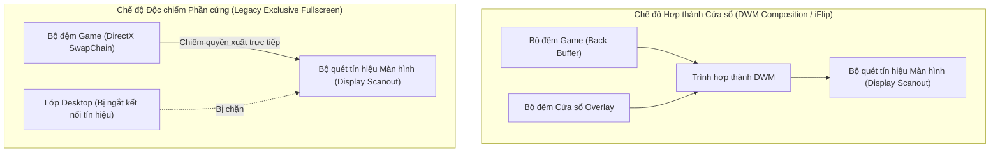

---

## Bế Tắc Kỹ Thuật Khi Hiển Thị Cửa Sổ Win32 Truyền Thống

### 1. Hiện trạng xử lý cũ
- Ứng dụng tạo một cửa sổ Win32 với các thuộc tính cửa sổ mở rộng: nổi trên cùng (`WS_EX_TOPMOST`), không nhận tiêu điểm chuột (`WS_EX_NOACTIVATE`), trong suốt nhiều lớp (`WS_EX_LAYERED`).

### 2. Sự cố và thảm họa kỹ thuật
- Windows phân chia không gian hiển thị của các cửa sổ thành nhiều phân lớp theo trục Z (Z-Order Bands). Cửa sổ `WS_EX_TOPMOST` thông thường được xếp vào **Phân lớp Mặc định của Môi trường Desktop** (`ZBID_DEFAULT`).
- Khi một trò chơi (như *Metro Exodus*) chạy ở chế độ Độc chiếm Phần cứng, toàn bộ phân lớp `ZBID_DEFAULT` bị tách khỏi chuỗi tín hiệu quét ra màn hình.
- Khi cửa sổ lớp phủ cố gắng xuất hiện hoặc yêu cầu làm mới khung hình (Render Invalidation), DWM nhận diện sự xuất hiện của một bề mặt thuộc phân lớp Desktop đang cố gắng đè lên vùng quét độc quyền. Để đảm bảo an toàn giao diện và khôi phục đường truyền DWM, Windows **cưỡng bức ngắt quyền độc chiếm phần cứng của trò chơi và thu nhỏ cửa sổ game xuống thanh tác vụ (Minimize to Taskbar)**.

---

## Phân Tích Kiến Trúc Các Phần Mềm Handheld Thương Mại (GPD Tool, AYASpace, Handheld Companion)

Các phần mềm chuyên dụng trên thiết bị chơi game cầm tay (GPD Win, AYANEO, ROG Ally) giải quyết triệt để bài toán này bằng cách kết hợp 4 phương án kỹ thuật từ tầng hệ điều hành đến tầng nhân đồ họa DirectX:

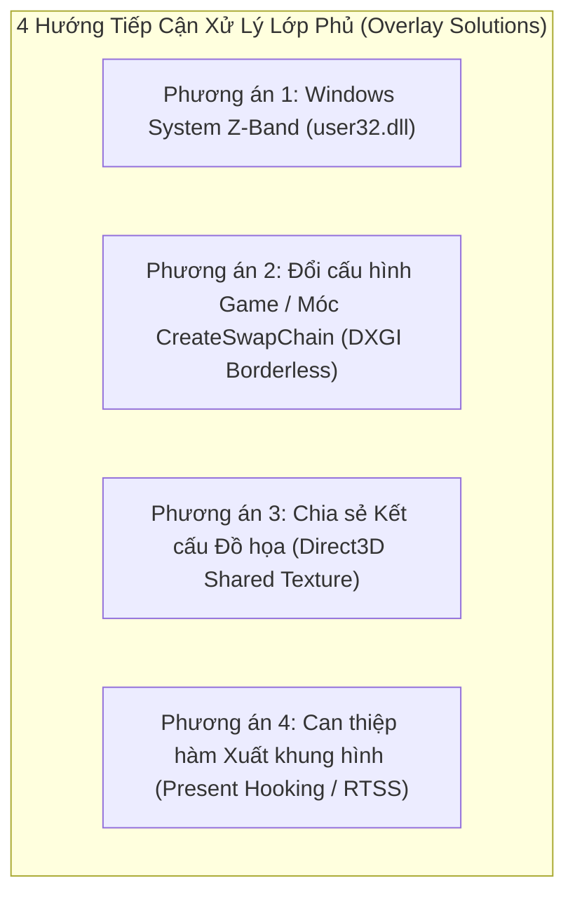

---

## Phương Án 1: Đưa Cửa Sổ Vào Phân Lớp Hệ Thống (Windows System Z-Band)

### 1. Cơ chế kỹ thuật
- Windows quản lý các lớp phủ hệ thống (như Bàn phím ảo cảm ứng `TabTip.exe`, Thanh trò chơi `Xbox Game Bar`, Thông báo hệ thống) trong một phân lớp đặc quyền cao hơn Desktop: **Phân lớp Công cụ Hệ thống (`ZBID_SYSTEM_TOOLS = 2`)** hoặc **Phân lớp Giao diện Nhúng (`ZBID_IMMERSIVE_APPCHROME = 15`)**.
- Các cửa sổ nằm trong phân lớp này được DWM cấp quyền vẽ đè trực tiếp lên trên các bề mặt đang độc chiếm màn hình mà không làm kích hoạt cơ chế thu nhỏ game.

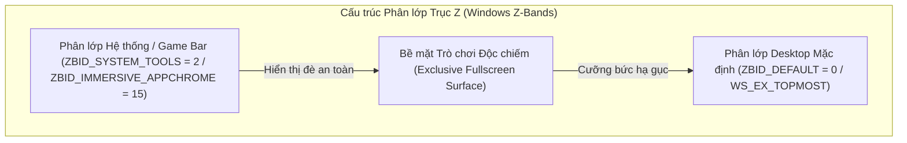

### 2. Cách thức giải quyết triệt để
- Nạp hàm nội bộ không công khai từ thư viện `user32.dll`:
  * Hàm API: `CreateWindowInBand` và `SetWindowBand`.
  * Chỉ số phân lớp (Band ID): `ZBID_SYSTEM_TOOLS` (giá trị nguyên `2`).
- **Điều kiện cốt lõi**: Yêu cầu quyền **UIAccess (`uiAccess="true"`)** trong Token tiến trình. Nếu chưa được ký số tin cậy (Digital Certificate), nhân Windows sẽ âm thầm hạ cấp cửa sổ về `ZBID_DEFAULT = 0`.

---

## Phương Án 2: Móc Hàm Khởi Tạo Chuỗi Khung Hình Cưỡng Bức Không Viền (DXGI `CreateSwapChain` Hooking)

### 1. Cơ chế kỹ thuật (Kiến trúc AYASpace / Handheld Companion)
- Khi trò chơi khởi động, game gọi hàm của DirectX Graphics Infrastructure (DXGI): `IDXGIFactory::CreateSwapChain` (hoặc `CreateSwapChainForHwnd`).
- Trong cấu trúc tham số `DXGI_SWAP_CHAIN_DESC`, game truyền cờ `Windowed = FALSE` để yêu cầu chạy Toàn màn hình độc quyền.
- Một thư viện C++ hook (`dxgi_hook.dll`) được chèn vào không gian bộ nhớ của game (qua `SetWindowsHookEx` hoặc DLL Injection), chặn hàm này và **sửa tham số thành `Windowed = TRUE`** trước khi gửi xuống Driver GPU.

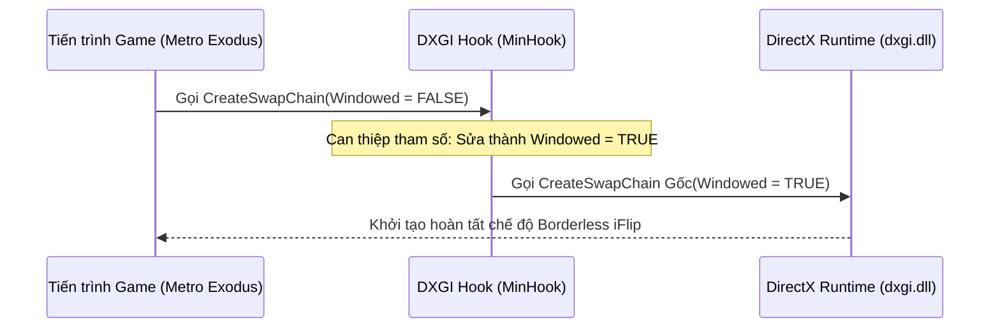

### 2. Cách thức giải quyết triệt để
- Game hoàn toàn tin rằng mình đang chạy Toàn màn hình độc quyền, nhưng thực chất Windows DWM đang quản lý game dưới dạng **Cửa sổ Không viền (Borderless Windowed / Independent Flip)**.
- Khi đó, cửa sổ Flutter Quick Settings Panel của bạn sẽ hiển thị đè lên game 100% mượt mà và không bao giờ bị văng.

---

## Phương Án 3: Chia Sẻ Kết Cấu Đồ Họa Độc Lập (Direct3D Shared Texture Injection)

### 1. Cơ chế kỹ thuật (Kiến trúc OBS Game Capture / Discord Overlay / Steam Overlay)
- Ứng dụng Flutter render toàn bộ giao diện bảng điều khiển vào một kết cấu đồ họa ngoài màn hình (Off-Screen Surface) với cờ chia sẻ vùng nhớ: **`D3D11_RESOURCE_MISC_SHARED`** (hoặc `D3D11_RESOURCE_MISC_SHARED_NTHANDLE`).
- Lấy con trỏ chia sẻ tài nguyên (`HANDLE sharedHandle`) từ DirectX Device của Flutter.
- Thư viện hook bên trong game gọi `ID3D11Device::OpenSharedResource(sharedHandle)` để nạp trực tiếp tấm ảnh kết cấu của Flutter vào bộ nhớ game.
- Tại hàm xuất hình ảnh **`IDXGISwapChain::Present`**, thư viện hook vẽ một tấm ảnh phẳng (2D Quad) chứa giao diện Flutter đè lên bộ đệm khung hình của game.

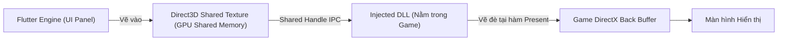

### 2. Cách thức giải quyết triệt để
- Triệt tiêu 100% sự phụ thuộc vào cửa sổ Win32 Desktop.
- Giao diện Flutter được nhúng trực tiếp vào chính luồng dữ liệu 60fps/120fps của game, không làm thay đổi trạng thái cửa sổ của trò chơi.
- **Cơ chế chuyển đổi động tại thời gian chạy (Runtime Switchable Engine)**:
  - Thư viện `dxgi_hook.dll` tích hợp phân đoạn nhớ dùng chung giữa các tiến trình (`.shared` segment) lưu trữ cờ chế độ `g_hookMode` (0: `DXGI_BORDERLESS`, 1: `SHARED_TEXTURE`).
  - Người dùng có thể chuyển đổi trực tiếp giữa hai phương án trong tab Cài đặt [[SettingsTab]] thông qua giao diện hàm ngoại vi (Dart FFI) `SetOverlayHookMode(mode)` mà không cần khởi động lại toàn bộ ứng dụng.

---

## Phương Án 4: Can Thiệp Trực Tiếp Vào Hàm Xuất Khung Hình (Present Hooking / RTSS OSD)

### 1. Cơ chế kỹ thuật
- Chèn mã thực thi nhị phân vào hàm `IDXGISwapChain::Present` (DirectX 11/12) để vẽ trực tiếp thông số HUD (TDP, Quạt, FPS, Pin) lên bộ đệm game.
- Dự án đã có sẵn module [rtss_service.dart](file:///c:/Users/h/dev-projects/windows-handheld-tools/lib/hardware/rtss_service.dart) giao tiếp qua bộ nhớ chia sẻ `RTSSSharedMemoryV2` của RivaTuner Statistics Server.

---

## Ma Trận So Sánh Kỹ Thuật Toàn Diện

| Tiêu chí | Phương án 1: Windows System Z-Band | Phương án 2: DXGI Borderless Hook | Phương án 3: Direct3D Shared Texture | Phương án 4: RTSS OSD Injection |
| :--- | :--- | :--- | :--- | :--- |
| **Bản chất kỹ thuật** | Tầng hệ điều hành (OS Window Management) | Móc hàm tạo chuỗi khung hình (`CreateSwapChain`) | Móc hàm xuất hình + Chia sẻ GPU Memory | Chèn chuỗi text/vector vào hàm `Present` |
| **Bảo tồn giao diện Flutter** | Giữ nguyên 100% | Giữ nguyên 100% | Giữ nguyên 100% (Texture Stream) | Chỉ hiển thị Text HUD / Không có Widget |
| **Khắc phục game Exclusive** | Phụ thuộc quyền UIAccess ký số | Khắc phục 100% (Ép game sang Borderless) | Khắc phục 100% (Vẽ trực tiếp vào game) | Khắc phục 100% (Chỉ áp dụng đo đạc OSD) |
| **Độ ổn định & Tương thích** | Cao | Rất cao (Chuẩn Handheld Companion) | Rất cao (Chuẩn Discord / OBS) | Tối đa |
| **Độ phức tạp triển khai** | Thấp (Đã tích hợp trong `win32_window.cpp`) | Trung bình (Tạo DLL `dxgi_hook.dll` với MinHook) | Nâng cao (Tạo DLL Hook + IPC Texture Handle) | Thấp (Đã tích hợp trong `rtss_service.dart`) |

---

## Kiến Trúc Thu Nhận Tín Hiệu Tay Cầm Và Điều Hướng Không Tiêu Điểm (Focusless Gamepad Input Pipeline)

### Bản Chất Vật Lý Của Luồng Tín Hiệu Tay Cầm Trên Windows

Trên các thiết bị chơi game, tín hiệu điều khiển từ tay cầm vật lý truyền về hệ điều hành theo chuỗi liên kết phần cứng - phần mềm:

1. **Ngắt tín hiệu phần cứng (Hardware Interrupt)**:
   - Khi người dùng nhấn nút hoặc gạt cần analog, vi điều khiển tích hợp trên tay cầm biến đổi mức điện áp analog thành giá trị số nguyên (Analog-to-Digital Converter - ADC).
   - Gói dữ liệu nhị phân (HID Data Packet) được gửi qua bus giao tiếp USB hoặc sóng vô tuyến Bluetooth tới bộ điều khiển ngắt (Interrupt Controller) của bo mạch chủ.
2. **Giải mã tại nhân hệ điều hành (Kernel-mode Driver)**:
   - Trình điều khiển thiết bị của Windows (`xusb22.sys` hoặc `hidclass.sys`) tiếp nhận ngắt, phân giải gói tin nhị phân thành cấu trúc dữ liệu chuẩn gồm:
     * Mặt nạ bit 16-bit thể hiện trạng thái đóng/ngắt của các nút bấm (`wButtons`).
     * Độ nén lò xo của hai nút cò Left/Right Trigger (giá trị 8-bit không dấu từ 0 đến 255: `bLeftTrigger`, `bRightTrigger`).
     * Tọa độ điện áp của hai cần gạt Analog Left/Right Thumbstick (giá trị 16-bit có dấu từ -32768 đến 32767: `sThumbLX`, `sThumbLY`, `sThumbRX`, `sThumbRY`).
   - Cấu trúc này được lưu cố định trong vùng nhớ nhân hệ thống và sẵn sàng để ứng dụng tầng người dùng truy xuất.

```mermaid
flowchart TD
    subgraph Hardware_Layer["Tầng Phần Cứng (Hardware Layer)"]
        Buttons["Nút bấm & Cần gạt Analog"] -->|Điện áp ADC| MCU["Vi điều khiển Tay cầm (MCU)"]
        MCU -->|Gói tin nhị phân USB/BT| Bus["Bus Giao Tiếp (USB / Bluetooth)"]
    end

    subgraph Kernel_Layer["Tầng Nhân Hệ Điều Hành (Windows Kernel)"]
        Bus -->|Ngắt phần cứng (IRQ)| Driver["Driver XInput (xusb22.sys)"]
        Driver -->|Ghi dữ liệu nhị phân| KernelBuffer["Bộ đệm trạng thái (XINPUT_STATE)"]
    end

    subgraph User_Layer["Tầng Ứng Dụng (User Space)"]
        KernelBuffer -->|Gọi hàm FFI liên ngôn ngữ| PollTimer["Bộ đếm thời gian quét định kỳ 50ms"]
        PollTimer --> NativeMem["Bộ nhớ con trỏ RAM tĩnh (calloc)"]
        NativeMem --> Filter["Bộ lọc Sườn xung (Edge Trigger) & Vùng chết (Deadzone)"]
        Filter --> Stream["Luồng sự kiện (Gamepad Event Stream)"]
        Stream --> UIState["Chỉ số điều hướng ảo (_focusedIndex / _selectedTabIndex)"]
    end
```

---

### Bế Tắc Kỹ Thuật Của Vòng Lặp Thông Điệp Cửa Sổ Truyền Thống

#### 1. Hiện trạng xử lý cũ
- Ứng dụng Desktop tiêu chuẩn thu nhận lệnh điều khiển thông qua hàng đợi thông điệp của cửa sổ Win32 (Message Loop / `GetMessage` / `PeekMessage`) với các thông điệp bàn phím (`WM_KEYDOWN`, `WM_KEYUP`) hoặc thông điệp thô (`WM_INPUT`).

#### 2. Thảm họa kỹ thuật trong môi trường trò chơi
- Windows áp dụng nguyên tắc: **Chỉ cửa sổ đang nắm giữ tiêu điểm nhập liệu chủ động (Active Keyboard Focus / `HWND Focus`) mới được nhân hệ thống phân phối thông điệp `WM_KEYDOWN`**.
- Khi một trò chơi đang chạy toàn màn hình, trò chơi chiếm giữ 100% tiêu điểm cửa sổ. Bảng điều khiển Quick Settings nằm ở trạng thái nền hoặc lớp phủ không chiếm tiêu điểm (`WS_EX_NOACTIVATE`) để tránh làm đứt đoạn trận đấu của người chơi.
- Hậu quả: Mọi thông điệp phím thông thường đều bị chuyển toàn bộ vào game, bảng điều khiển hoàn toàn "mù" dữ liệu nhập và không thể phản hồi bất kỳ thao tác nào từ tay cầm.

#### 3. Giải pháp triệt tiêu rào cản: Quét trạng thái trực tiếp không cần tiêu điểm (Zero-Focus Polling)
- Ứng dụng nạp trực tiếp thư viện liên kết động tầng hệ thống (`xinput1_4.dll` / `xinput1_3.dll`) thông qua cơ chế gọi hàm liên ngôn ngữ (Foreign Function Interface - FFI).
- Hàm hệ thống `XInputGetState(dwUserIndex, pState)` cho phép đọc trực tiếp bộ đệm trạng thái phần cứng của tối đa 4 tay cầm kết nối mà **hoàn toàn không quan tâm cửa sổ nào đang giữ tiêu điểm Windows**.
- Một bộ đếm thời gian (Periodic Timer) chạy vòng lặp ngắt đều đặn mỗi 50ms (tần số 20Hz), trích xuất trạng thái nhị phân trực tiếp từ RAM máy tính vào cấu trúc con trỏ tĩnh được cấp phát trước (`Pointer<_XInputState>`).

---

### Xử Lý Xung Tín Hiệu Và Trạng Thái Điều Hướng Tại Tầng Ứng Dụng

Vì cơ chế đọc trạng thái là quét định kỳ (Polling), việc giữ một nút vật lý trong 1 giây sẽ sinh ra 20 lần đọc trạng thái dương tính liên tiếp. Để chuyển đổi thành thao tác điều hướng chuẩn xác trên giao diện, luồng dữ liệu bắt buộc đi qua 3 bộ lọc vật lý:

1. **Bộ lọc sườn xung kích hoạt đơn (Rising-Edge Triggering)**:
   - Dành cho các nút bấm tác vụ (A, B, X, Y, Start, Back).
   - Thuật toán so khớp trạng thái: Chỉ phát ra sự kiện khi giá trị chuyển từ sai sang đúng (tín hiệu đi từ mức 0 lên mức 1). Nếu người dùng tiếp tục đè nút, các chu kỳ quét tiếp theo bị chặn đứng hoàn toàn.
2. **Bộ lọc vùng chết cần gạt (Stick Deadzone Filtering)**:
   - Cần analog vật lý luôn có sai số cơ học và hiện tượng trôi cần (Stick Drift), khiến giá trị điện áp luôn dao động nhẹ quanh điểm gốc tọa độ 0.
   - Thuật toán thiết lập biên độ ngưỡng: Bỏ qua toàn bộ giá trị có độ lớn tuyệt đối nhỏ hơn 15000 (trên thang đo toàn phần từ 0 đến 32767). Chỉ khi người chơi đẩy cần vượt qua ngưỡng này, tín hiệu mới được công nhận là một thao tác gạt hướng (Stick Up/Down/Left/Right).
3. **Bộ mô phỏng nhịp lặp điều hướng (Hold-to-Repeat State Machine)**:
   - Dành cho các phím di chuyển danh mục (D-Pad Lên/Xuống/Trái/Phải và Cần Analog).
   - Lần nhấn đầu tiên: Phát sự kiện điều hướng ngay lập tức (độ trễ 0ms).
   - Nếu tiếp tục giữ nút: Khóa sự kiện trong 6 chu kỳ quét liên tiếp (~300ms) để chống nhảy mục ngoài ý muốn. Sau ngưỡng trễ này, phát nhịp lặp đều đặn mỗi 2 chu kỳ quét (~100ms/lần) giúp người chơi lướt nhanh danh sách tùy chọn mượt mà.

---

### Ánh Xạ Sự Kiện Vào Cây Trạng Thái Giao Diện (Virtual Focus Navigation)

Sau khi được chuẩn hóa, sự kiện nút bấm được đẩy vào luồng bất đồng bộ (Broadcast Stream). Giao diện Quick Settings tiếp nhận sự kiện và điều hướng hoàn toàn bằng **Chỉ số tiêu điểm ảo (Virtual Focus Index)** mà không cần chuột hay chạm:

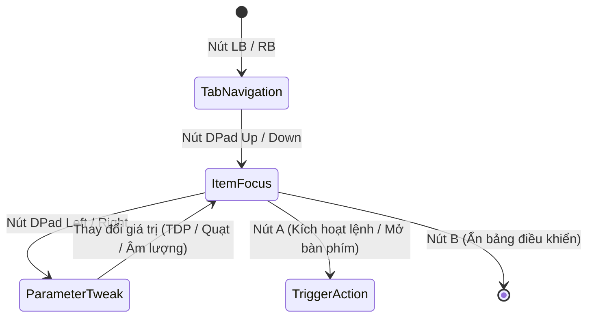

1. **Chuyển đổi phân vùng cấp cao (Tab Level Navigation)**:
   - Sự kiện nút vai trái/phải (`GamepadButton.lb`, `GamepadButton.rb`) làm thay đổi biến chỉ số tab `_selectedTabIndex` theo phép chia lấy dư vòng tròn (Modulo 4), đồng thời đặt lại chỉ số mục về 0 và đưa thanh cuộn về đỉnh trang.
2. **Di chuyển tiêu điểm theo trục dọc (Vertical Item Focus)**:
   - Sự kiện `GamepadButton.dpadUp` và `GamepadButton.dpadDown` làm tăng/giảm chỉ số `_focusedIndex` trong phạm vi giới hạn của tab hiện hành.
   - Hệ thống tự động tính toán khoảng cách cuộn ảo dựa trên tỉ lệ giao diện (`targetOffset = _focusedIndex * 135.0 * uiScale`) và kích hoạt bộ điều khiển cuộn hoạt họa mượt mà (`_scrollController.animateTo`) để luôn giữ mục đang chọn nằm chính giữa màn hình.
3. **Tương tác thông số theo trục ngang (Horizontal Value Adjustment)**:
   - Sự kiện `GamepadButton.dpadLeft` và `GamepadButton.dpadRight` tác động trực tiếp vào giá trị thông số của mục đang nắm giữ `_focusedIndex` (tăng/giảm công suất TDP, tốc độ quạt, hoặc chuyển đổi giữa các nấc cài đặt sẵn Preset).
4. **Đóng mở giao diện lớp phủ (Overlay Lifecycle)**:
   - Tổ hợp phím cứng vật lý (BACK + RB) được bộ quét nhận diện đồng thời sẽ kích hoạt hàm đảo trạng thái hiển thị (`OverlayController.toggleOverlay`), trong khi nút B đóng vai trò phím thoát an toàn (`hideOverlay`) trả lại toàn bộ quyền điều khiển cho trò chơi.

---

## Cơ Chế Khởi Động Đặc Quyền Cao Cùng Windows (Elevated Process Auto-Start Architecture)

### Bản Chất Vật Lý Của Luồng Khởi Động Tự Động Trên Windows

```mermaid
flowchart TD
    subgraph Traditional["Cơ Chế Truyền Thống (Thất Bại với Ring-0 App)"]
        Boot1["Khởi động máy & Đăng nhập"] --> Reg["Registry HKCU Run Key"]
        Reg --> UAC["Bộ kiểm soát tài khoản người dùng (UAC)"]
        UAC -->|"Chặn đứng ứng dụng Elevated"| Block["Bị chặn âm thầm (Không chạy)"]
    end

    subgraph Industrial["Cơ Chế Tiêu Chuẩn Handheld (Task Scheduler)"]
        Boot2["Khởi động máy & Đăng nhập"] --> Sch["Windows Task Scheduler (schtasks)"]
        Sch -->|"Trigger: ONLOGON / Quyền: HIGHEST"| Bypass["Vượt qua rào cản UAC hợp lệ"]
        Bypass --> KernelReady["Nạp Ring-0 Driver & Global DXGI Hook thành công"]
    end
```

#### 1. Trước đây làm bằng cách nào?
- Các ứng dụng Windows thông thường ghi đường dẫn thực thi của tệp tin nhị phân vào sổ đăng ký hệ thống (Registry Key: `HKCU\Software\Microsoft\Windows\CurrentVersion\Run`).

#### 2. Thảm họa kỹ thuật trong môi trường Handheld
- Công cụ điều khiển thiết bị Handheld bắt buộc can thiệp trực tiếp vào không gian nhân cấp 0 (Ring-0 Kernel Space) để nạp trình điều khiển CPU (`WinRing0x64.sys`), điều khiển điện áp và công suất vi xử lý (`ryzenadj.dll`) cũng như kích hoạt bẫy chặn đồ họa toàn hệ thống (Global DXGI Hook). Do đó, ứng dụng bắt buộc phải chạy dưới đặc quyền Người quản trị tối cao (Administrator Privileges / Elevated Token).
- Hệ thống kiểm soát tài khoản người dùng Windows (User Account Control - UAC) áp dụng quy tắc phòng vệ kiên cố: Mọi chương trình yêu cầu đặc quyền elevated nằm trong sổ đăng ký `Run` đều bị hệ điều hành **âm thầm chặn đứng** lúc người dùng đăng nhập để triệt tiêu nguy cơ mã độc leo thang quyền hạn. Kết quả: Ứng dụng hoàn toàn không thể tự khởi động cùng máy tính.

#### 3. Công nghệ này giải quyết triệt để ra sao?
- Thay thế hoàn toàn sổ đăng ký bằng Trình lập lịch tác vụ hệ điều hành (Windows Task Scheduler thông qua tiện ích dòng lệnh `schtasks.exe` đóng gói trong [[AutostartService]]).
- Thiết lập tác vụ hệ thống với mức ưu tiên đặc quyền tối cao (`/RL HIGHEST`) liên kết trực tiếp với sự kiện người dùng đăng nhập tài khoản (`/SC ONLOGON`).
- Đồng thời gỡ bỏ điều kiện tiết kiệm pin của máy tính xách tay (`DisallowStartIfOnBatteries=false`) nhằm đảm bảo thiết bị Handheld luôn tự động khởi chạy bảng điều khiển dù đang cắm sạc hay sử dụng nguồn pin tích hợp.

### Vòng Đời Tác Vụ Và Hiện Tượng Rác Hệ Thống Khi Xóa Bản Di Động (Portable Cleanup & Orphaned Task Lifecycle)

Khi phân phối dưới dạng gói di động không qua cài đặt (Portable Binary):
- Toàn bộ tệp mã máy (`.exe`), thư viện động (`.dll`) và tệp cấu hình (`config.json`) nằm cô lập trong một thư mục cục bộ trên ổ cứng. Xóa thư mục này chỉ đơn thuần giải phóng các cung từ/ô nhớ flash (Storage Blocks) của thư mục đó.
- Tuy nhiên, khi người dùng kích hoạt "Khởi động cùng Windows", ứng dụng đã gọi tiến trình hệ thống `schtasks.exe` để tạo một bản ghi tác vụ độc lập trong nhân quản lý lập lịch của hệ điều hành.

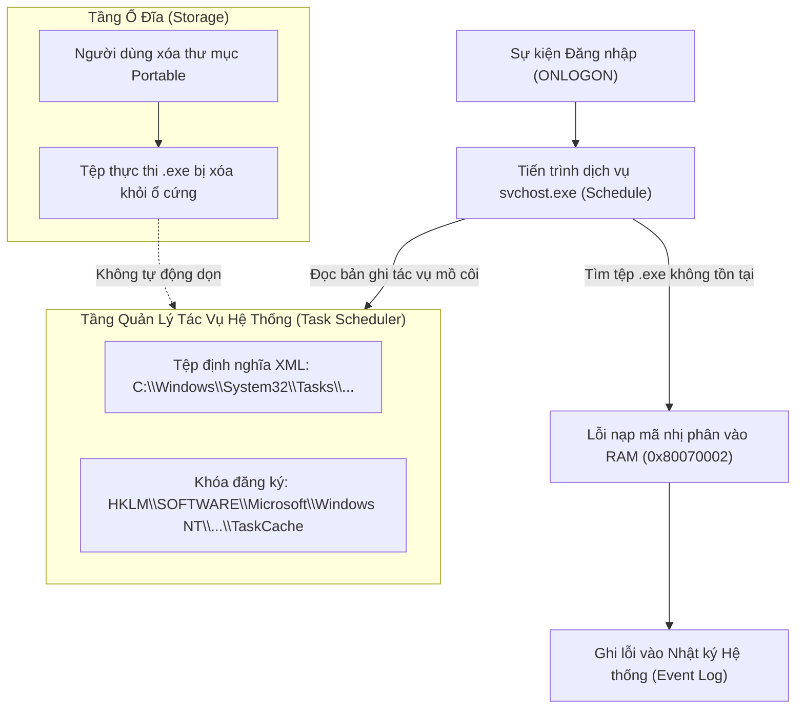

#### 1. Các thành phần còn sót lại trong hệ điều hành (Orphaned Artifacts)
1. **Tệp siêu dữ liệu XML định nghĩa tác vụ (Task Definition XML)**:
   - Vị trí vật lý: `C:\Windows\System32\Tasks\WindowsHandheldTool_AutoStart`.
2. **Khóa chỉ mục trong cây cơ sở dữ liệu cấu hình hệ thống (Registry Hive)**:
   - Nhánh phân cấp: `HKLM\SOFTWARE\Microsoft\Windows NT\CurrentVersion\Schedule\TaskCache\Tree\WindowsHandheldTool_AutoStart`.
   - Bản ghi định danh duy nhất: `HKLM\SOFTWARE\Microsoft\Windows NT\CurrentVersion\Schedule\TaskCache\Tasks\{GUID}`.

#### 2. Hiện tượng kỹ thuật khi chỉ xóa thư mục mà không hủy tác vụ
- Tác vụ trở thành một **tác vụ mồ côi (Orphaned Task)**.
- Mỗi chu kỳ khởi động và đăng nhập tài khoản người dùng (`ONLOGON`), tiến trình dịch vụ lập lịch của Windows (`svchost.exe` đảm nhiệm dịch vụ `Schedule`) kích hoạt ngắt, nạp tệp XML và tra cứu đường dẫn nhị phân được lưu sẵn.
- Do tệp `.exe` không còn tồn tại trên ổ cứng, hệ điều hành không thể phân bổ không gian địa chỉ ảo (Virtual Address Space) để nạp mã máy vào bộ nhớ RAM, dẫn đến việc tiến trình lập lịch trả về mã lỗi `0x80070002` (`ERROR_FILE_NOT_FOUND`) và ghi nhận vào nhật ký sự kiện hệ thống (Windows Event Viewer - Event ID 101/200).

#### 3. Quy trình dọn dẹp triệt để (Complete Decommissioning Workflow)
- **Phương án chủ động (Khuyến nghị)**: Trước khi xóa thư mục Portable, mở ứng dụng và chuyển công tắc "Khởi động cùng Windows" sang trạng thái Tắt trong [[SettingsTab]]. Hàm `AutostartService.setEnabled(false)` sẽ phát lệnh xóa trực tiếp qua tiến trình hệ thống: `schtasks /delete /tn "WindowsHandheldTool_AutoStart" /f`, triệt tiêu hoàn toàn tệp XML và các khóa Registry liên quan.
- **Phương án khắc phục sau khi đã xóa thư mục**:
  - Giao diện quản lý tác vụ: Nhấn tổ hợp phím `Win + R`, mở tiện ích `taskschd.msc`, truy cập vào danh mục `Task Scheduler Library`, tìm tác vụ `WindowsHandheldTool_AutoStart` và chọn Delete.
  - Giao diện dòng lệnh đặc quyền cao: Mở PowerShell hoặc Command Prompt dưới quyền Quản trị viên (Run as Administrator) và chạy lệnh: `schtasks /delete /tn "WindowsHandheldTool_AutoStart" /f`.

---

## Cơ Chế Nhận Diện Mã Độc Của Windows Defender Và Hiện Tượng Báo Động Giả (Antivirus Heuristic & False Positive Architecture)

### Bản Chất Vật Lý Của Luồng Quét Tĩnh Và Đánh Giá Rủi Ro Bằng Học Máy

Khi một tệp tin nén (`.zip`) hoặc tệp thực thi được tải về từ mạng Internet, hệ điều hành gắn thẻ đánh dấu vùng mạng không tin cậy (Zone Identifier / `ZoneId=3`) vào luồng dữ liệu phụ của tệp trên hệ thống tệp NTFS (Alternate Data Stream - ADS). Trình bảo vệ Windows Defender (tiến trình nhân dịch vụ `MsMpEng.exe`) ngay lập tức kích hoạt luồng kiểm tra tĩnh:

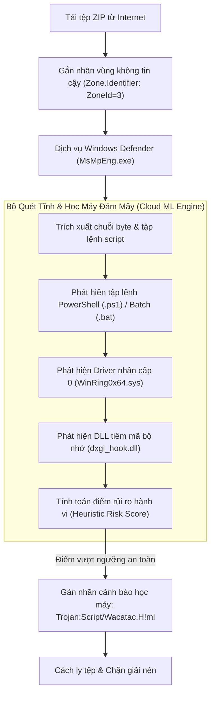

#### 1. Giải mã tên định danh mối đe dọa `Trojan:Script/Wacatac.H!ml`
- **`Trojan:`**: Phân loại danh mục phần mềm gây hại chung (phần mềm mạo danh hoặc mang hành vi ngầm).
- **`Script/`**: Đối tượng trực tiếp kích hoạt chữ ký nhận diện là một **tập lệnh mã nguồn** (tệp kịch bản dòng lệnh PowerShell `.ps1`, Batch `.bat`, hoặc Python `.py`), **hoàn toàn không phải** tệp nhị phân thực thi chính (`windows_handheld_tool.exe`).
- **`Wacatac`**: Tên họ định danh quy tắc phân tích mẫu tĩnh của Microsoft dành cho các đoạn mã có hành vi tự động can thiệp sâu vào hệ thống.
- **`!ml` (Machine Learning)**: Khẳng định đây là kết quả phán đoán xác suất từ **mô hình học máy trên đám mây (Cloud AI Heuristic Engine)** của Microsoft, không phải phát hiện dựa trên chữ ký tĩnh truyền thống (Static Hash/Byte Signature) của một mã độc đã biết.

#### 2. Nguyên nhân bế tắc kỹ thuật gây ra Báo động giả (False Positive) trong gói phát hành
Gói phân phối Portable phát sinh cảnh báo là do sự hội tụ đồng thời của 4 yếu tố nhạy cảm trong cùng một gói lưu trữ:

1. **Sự tồn tại của các tập lệnh kịch bản thô trong thư mục phụ tá**:
   - Thư mục phụ trợ ban đầu chứa tệp kịch bản `readjustService.ps1` (chứa các đoạn mã lặp vô tận, can thiệp tham số điện áp phần cứng và nạp động con trỏ hàm Windows API qua bộ đệm `Marshal`) và các tệp `.bat` tự động can thiệp Task Scheduler. Mô hình học máy của Defender quét nội dung văn bản này và gán trọng số rủi ro cực đại cho nhánh `Script/`.
2. **Trình điều khiển nhân cấp 0 không ký số mở rộng (`WinRing0x64.sys`)**:
   - Trình điều khiển này trực tiếp mở cổng đọc/ghi thanh ghi chuyên dụng của CPU (Model-Specific Registers - MSR) và cổng vào/ra (I/O Ports). Vì khả năng này thường bị các phần mềm khai thác lỗ hổng lạm dụng, Defender luôn đặt trạng thái giám sát nghiêm ngặt khi phát hiện driver này đi kèm các kịch bản script không xác định.
3. **Thư viện móc nối đồ họa bộ nhớ (`dxgi_hook.dll`)**:
   - Thư viện chứa mã nhị phân can thiệp cấu trúc con trỏ hàm ảo (Virtual Method Table Hooking) và phân đoạn bộ nhớ chia sẻ (`.shared` segment), có hành vi tương đồng với kỹ thuật tiêm mã bộ nhớ (DLL Injection).
4. **Thiếu chứng chỉ ký số tin cậy (Unsigned Binaries)**:
   - Các tệp thực thi chưa được đóng dấu chứng chỉ số công cộng (Code Signing Certificate) để tích lũy điểm danh tiếng hệ thống (SmartScreen Reputation).

#### 3. Giải pháp kỹ thuật triệt tiêu cảnh báo
- **Tối ưu hóa cây thư mục phát hành (Release Sanitization)**:
  - Ứng dụng điều khiển chính giao tiếp trực tiếp với `ryzenadj.dll` qua liên kết hàm FFI trong mã máy Dart. Toàn bộ các tệp kịch bản thô (`.ps1`, `.bat`, `.py`, `.xml.template`) và các tệp gỡ lỗi trung gian (`.pdb`, `.exp`, `.old`) là dư thừa và bắt buộc phải bị loại bỏ khỏi gói phát hành.
  - Khi gói phát hành chỉ còn lại các tệp nhị phân runtime thực sự cần thiết, thành phần kích hoạt `Script/` bị xóa sổ hoàn toàn khỏi chuỗi nhận diện của Defender.
- **Ký số chứng chỉ ứng dụng (Code Signing Pipeline)**:
  - Ký số toàn bộ tệp `.exe` và `.dll` bằng khóa chứng chỉ số để vượt qua lớp quét tĩnh SmartScreen.

---

### Bản Chất Lỗ Hổng Nhân Cấp 0 Của WinRing0 Vàng Hiện Tượng Bị Chặn (Vulnerable Driver Architecture & BYOVD)

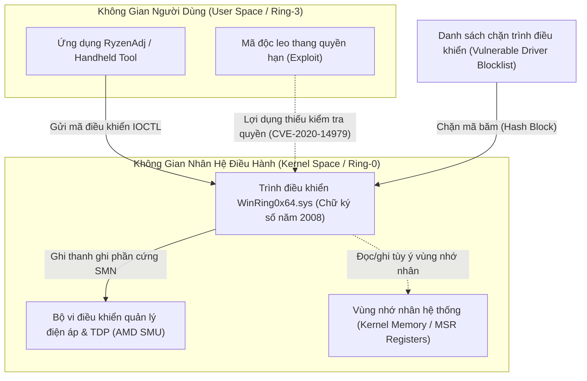

#### 1. Nguyên nhân kỹ thuật ra đời của cảnh báo `VulnerableDriver:WinNT/Winring0`
- **Driver hợp pháp nhưng có lỗ hổng kiến trúc (CVE-2020-14979)**:
  - Tệp `WinRing0x64.sys` do OpenLibSys phát hành năm 2008 mang chữ ký số hợp lệ của nhà phát triển, cho phép phần mềm tầng người dùng (Ring-3) đọc/ghi trực tiếp vào thanh ghi chuyên dụng của CPU (Model-Specific Registers - MSR), cổng I/O và bộ nhớ vật lý.
  - Tuy nhiên, driver này **hoàn toàn không thiết lập danh sách kiểm soát quyền truy cập (Access Control List - ACL)** cho các cổng giao tiếp vào/ra (`IOCTL`). Bất kỳ tiến trình nào chạy trong hệ điều hành, kể cả tiến trình không có đặc quyền quản trị viên, đều có thể gửi lệnh trực tiếp vào driver để thao túng không gian nhân.
- **Kỹ thuật tấn công "Mượn driver hợp pháp để đục thủng nhân" (Bring Your Own Vulnerable Driver - BYOVD)**:
  - Các nhóm tấn công an ninh mạng thường mang theo các driver đã được ký số hợp pháp như `WinRing0x64.sys` để qua mặt cơ chế cưỡng chế chữ ký số nhân của Windows (Driver Signature Enforcement - DSE). Sau khi nạp driver vào bộ nhớ, kẻ tấn công khai thác lỗ hổng IOCTL mở này để vô hiệu hóa phần mềm diệt virus và chiếm đoạt toàn quyền hệ thống.
  - Do đó, Microsoft đã đưa mã băm của `WinRing0x64.sys` vào **Danh sách chặn trình điều khiển dễ bị tổn thương của Microsoft (Microsoft Vulnerable Driver Blocklist)** và cơ chế bảo vệ tính toàn vẹn bộ nhớ (Memory Integrity / HVCI).

#### 2. Lý do các phần mềm Handheld bắt buộc sử dụng `WinRing0x64.sys`
- Bộ vi xử lý AMD Ryzen quản lý điện áp và công suất tiêu thụ (TDP) thông qua vi điều khiển SMU nằm sâu trong phần cứng. Giao tiếp với SMU bắt buộc phải ghi dữ liệu trực tiếp vào các thanh ghi phần cứng SMN tại tầng Ring-0.
- AMD không phát hành bất kỳ API hoặc Driver chính thức nào trong không gian người dùng Windows cho mục đích chỉnh sửa TDP tự do.
- Do đó, toàn bộ hệ sinh thái phần mềm Handheld mã nguồn mở (RyzenAdj, Universal x86 Tuning Utility, Handheld Companion) đều bắt buộc phải phụ thuộc vào `WinRing0x64.sys` để truyền lệnh điều khiển xung/áp tới chip AMD.

#### 3. Cơ chế ứng phó trong kiến trúc phần mềm Handheld
1. **Chế độ mô phỏng an toàn (Safe Simulation Fallback)**:
   - Module [[TdpService]] được xây dựng với cơ chế bọc lỗi: Khi Windows Defender hoặc cơ chế HVCI chặn nạp `WinRing0x64.sys`, hàm nạp thư viện `ryzenadj.dll` trả về mã lỗi 126. Dịch vụ lập tức kích hoạt chế độ mô phỏng an toàn, bảo toàn 100% vòng đời ứng dụng và giao diện người dùng mà không gây sự cố sập ứng dụng.
2. **Quy trình gỡ chặn trên thiết bị người dùng (Whitelisting Workflow)**:
   - Trong ứng dụng Bảo mật Windows (`Windows Security` $\rightarrow$ `Virus & threat protection` $\rightarrow$ `Protection history`), người dùng có thể nhấp vào thông báo `VulnerableDriver:WinNT/Winring0`, chọn `Actions` và kích hoạt `Allow on device` (Cho phép trên thiết bị).
   - Nếu hệ thống kích hoạt tính năng Cách ly lõi (Core Isolation / Memory Integrity) chặn cứng driver, người dùng có thể tạm thời tắt tính năng `Microsoft Vulnerable Driver Blocklist` trong phần `Device Security` để cho phép nạp driver điều khiển phần cứng.

### Kỹ Thuật Xử Lý Driver Nhạy Cảm Trong Bộ Cài Handheld Companion (Installer Whitelisting Pipeline)

Nhiều người dùng đặt câu hỏi tại sao công cụ **Handheld Companion** sử dụng cùng trình điều khiển phần cứng `WinRing0x64.sys` nhưng lại không làm xuất hiện cảnh báo đỏ trên Windows Defender. Sự khác biệt nằm ở kiến trúc đóng gói và quy trình cài đặt hệ thống:

```mermaid
flowchart TD
    subgraph Portable_Model["Mô Hình Bản Nén Di Động (Portable ZIP Pipeline)"]
        ZipDownload["Tải tệp ZIP từ Trình duyệt"] --> Zone3["Gắn thẻ ZoneId=3 (Untrusted Web Stream)"]
        Zone3 --> ExtractScan["Giải nén: Các tệp .sys và .dll lộ thiên"]
        ExtractScan --> BlocklistTrigger["Defender phát hiện tệp nhị phân trong danh sách chặn"]
        BlocklistTrigger --> Alert["Báo động đỏ: VulnerableDriver / Wacatac"]
    end

    subgraph Installer_Model["Mô Hình Bộ Cài Đặt Handheld Companion (Inno Setup Pipeline)"]
        InstDownload["Tải tệp Setup.exe"] --> RunAdmin["Chạy với đặc quyền Quản trị viên (Elevated)"]
        RunAdmin --> AddExclusion["Chạy ngầm: Add-MpPreference -ExclusionPath"]
        AddExclusion --> DefConfig["Windows Defender thêm thư mục cài đặt vào vùng loại trừ"]
        DefConfig --> ExtractClean["Bung tệp WinRing0x64.sys vào thư mục đã loại trừ"]
        ExtractClean --> SilentReady["Nạp Driver thành công không phát tín hiệu báo động"]
    end
```

#### 1. Cơ chế tự động thêm vùng loại trừ Windows Defender (Automated Defender Exclusion Injection)
- Handheld Companion **không phân phối bằng tệp nén di động (.zip) để người dùng tự bung tệp**. Dự án sử dụng bộ cài đặt đóng gói hệ thống (Inno Setup).
- Khi người dùng khởi chạy bộ cài đặt với đặc quyền Quản trị viên tối cao (Run as Administrator), mã kịch bản cài đặt (`setup.iss`) của Handheld Companion thực thi ngầm lệnh quản trị PowerShell can thiệp vào chính sách bảo vệ của hệ thống:
  - Lệnh can thiệp: `Add-MpPreference -ExclusionPath "{app}\WinRing0x64.sys"`
- Nhờ cơ chế này, hệ điều hành đã đưa đường dẫn tuyệt đối của tệp driver vào **Danh sách ngoại lệ của Windows Defender (Exclusion List)** *trước khi* tệp nhị phân được bung ra ổ đĩa. Dịch vụ bảo vệ `MsMpEng.exe` lập tức bỏ qua quá trình quét tĩnh trên tệp này.

#### 2. Đóng gói dữ liệu nhị phân bên trong vỏ bọc bộ cài (Installer Containerization)
- Khi phân phối qua tệp `.zip`, người dùng tải về sẽ bị hệ điều hành gắn nhãn không tin cậy (`Zone.Identifier: ZoneId=3`) lên từng tệp nhị phân riêng lẻ sau khi giải nén.
- Ngược lại, bộ cài đặt Inno Setup mã hóa và nén toàn bộ tệp nhị phân nhân (`.sys`) vào trong một tệp thực thi duy nhất (`Setup.exe`). Windows Defender khi quét tĩnh từ xa chỉ nhận diện cấu trúc tệp của trình cài đặt Inno Setup mà không quét thấy chữ ký băm của driver bên trong dòng dữ liệu nén.

#### 3. Tích lũy điểm danh tiếng bảo mật đám mây (Cloud SmartScreen Reputation)
- Handheld Companion có cộng đồng người dùng lớn với hàng trăm nghìn lượt tải và cài đặt qua GitHub.
- Cơ chế bảo vệ đám mây của Microsoft (Cloud Protection) liên tục ghi nhận mã băm SHA-256 của các bản phát hành Handheld Companion được nạp trên hàng chục nghìn máy tính mà không gây ra hành vi mã độc phá hoại.
- Điểm uy tín bảo mật (SmartScreen Reputation Score) của tệp cài đặt tăng dần theo thời gian, giúp phiên bản đó vượt qua bộ lọc Heuristic của Windows Defender một cách tự động.
