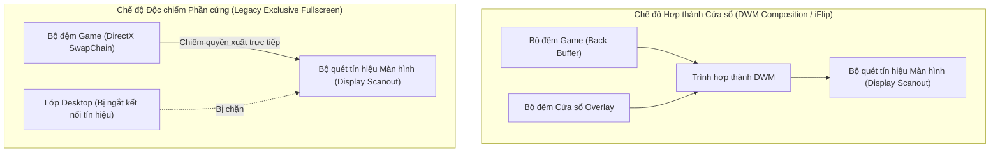
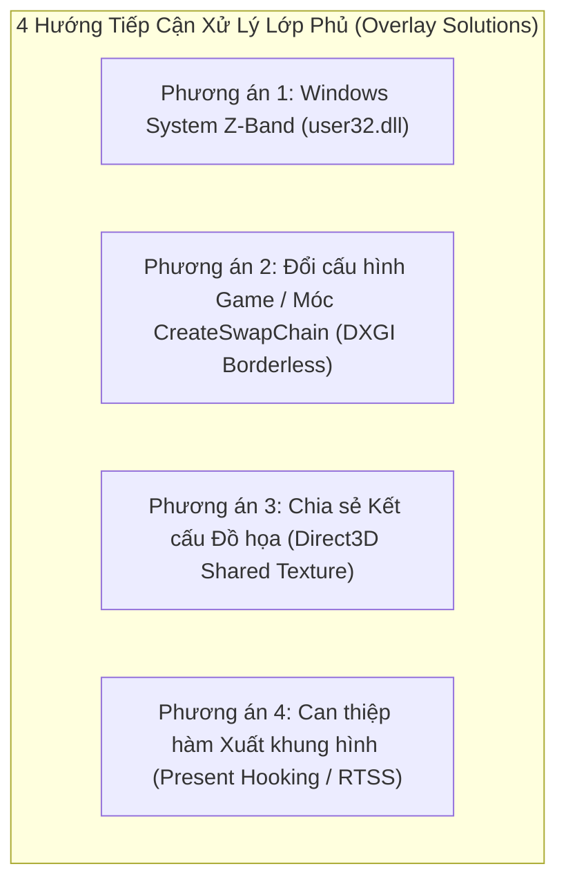
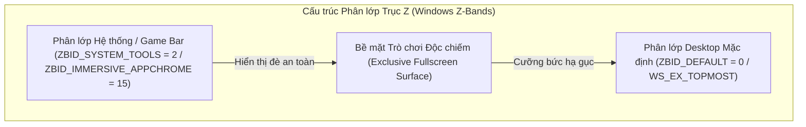
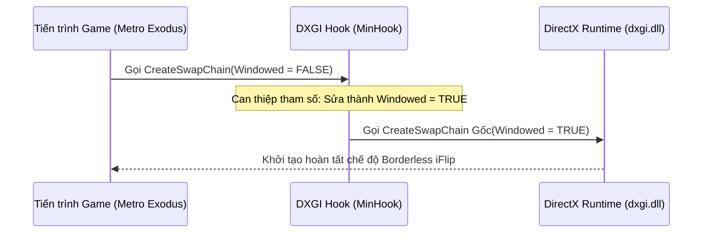
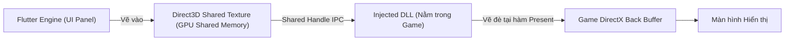
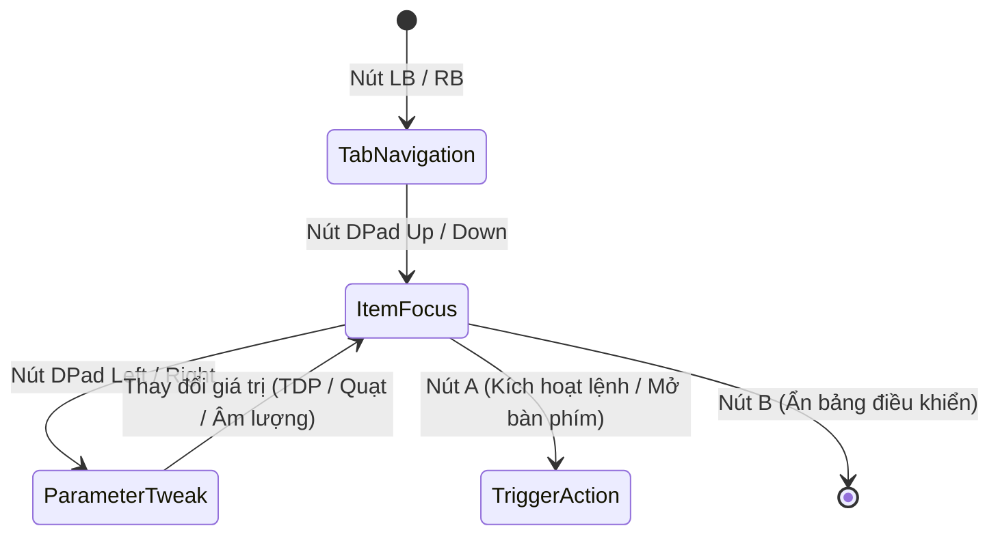

# Cơ Chế Hiển Thị Lớp Phủ (Overlay) Trên Trò Chơi Toàn Màn Hình Độc Quyền (Exclusive Fullscreen)

## Bản Chất Vật Lý Của Cơ Chế Xuất Hình Trên Windows

Trong hệ điều hành Windows, việc hiển thị hình ảnh từ card đồ họa (GPU) lên màn hình vật lý diễn ra qua hai cơ chế xử lý bộ đệm khung hình (Frame Buffer SwapChain):

1. **Chế độ Hợp thành Cửa sổ Mặc định (DWM Desktop Composition)**:
   - Các ứng dụng thông thường vẽ giao diện vào bộ đệm riêng của từng cửa sổ.
   - Trình quản lý cửa sổ của Windows (Desktop Window Manager - DWM) gom toàn bộ các bộ đệm này lại, ghép thành một khung hình tổng thể (Composite Frame) và gửi ra cổng xuất hình của card màn hình (Display Scanout).
2. **Chế độ Độc chiếm Phần cứng Toàn màn hình (DirectX Hardware Exclusive Mode - FSE)**:
   - Khi trò chơi kích hoạt chế độ toàn màn hình độc quyền (Exclusive Fullscreen), bộ điều khiển đồ họa (DirectX / DXGI) ngắt kết nối của DWM đối với màn hình hiển thị.
   - Chuỗi bộ đệm của game (SwapChain) được ánh xạ trực tiếp 1:1 tới bộ điều khiển quét tín hiệu phần cứng (Display Controller Scanout) nhằm triệt tiêu độ trễ xử lý (Latency) và loại bỏ chi phí hợp thành khung hình của DWM.



---

## Bế Tắc Kỹ Thuật Khi Hiển Thị Cửa Sổ Win32 Truyền Thống

### 1. Hiện trạng xử lý cũ
- Ứng dụng tạo một cửa sổ Win32 với các thuộc tính cửa sổ mở rộng: nổi trên cùng (`WS_EX_TOPMOST`), không nhận tiêu điểm chuột (`WS_EX_NOACTIVATE`), trong suốt nhiều lớp (`WS_EX_LAYERED`).

### 2. Sự cố và thảm họa kỹ thuật
- Windows phân chia không gian hiển thị của các cửa sổ thành nhiều phân lớp theo trục Z (Z-Order Bands). Cửa sổ `WS_EX_TOPMOST` thông thường được xếp vào **Phân lớp Mặc định của Môi trường Desktop** (`ZBID_DEFAULT`).
- Khi một trò chơi (như *Metro Exodus*) chạy ở chế độ Độc chiếm Phần cứng, toàn bộ phân lớp `ZBID_DEFAULT` bị tách khỏi chuỗi tín hiệu quét ra màn hình.
- Khi cửa sổ lớp phủ cố gắng xuất hiện hoặc yêu cầu làm mới khung hình (Render Invalidation), DWM nhận diện sự xuất hiện của một bề mặt thuộc phân lớp Desktop đang cố gắng đè lên vùng quét độc quyền. Để đảm bảo an toàn giao diện và khôi phục đường truyền DWM, Windows **cưỡng bức ngắt quyền độc chiếm phần cứng của trò chơi và thu nhỏ cửa sổ game xuống thanh tác vụ (Minimize to Taskbar)**.

---

## Phân Tích Kiến Trúc Các Phần Mềm Handheld Thương Mại (GPD Tool, AYASpace, Handheld Companion)

Các phần mềm chuyên dụng trên thiết bị chơi game cầm tay (GPD Win, AYANEO, ROG Ally) giải quyết triệt để bài toán này bằng cách kết hợp 4 phương án kỹ thuật từ tầng hệ điều hành đến tầng nhân đồ họa DirectX:



---

## Phương Án 1: Đưa Cửa Sổ Vào Phân Lớp Hệ Thống (Windows System Z-Band)

### 1. Cơ chế kỹ thuật
- Windows quản lý các lớp phủ hệ thống (như Bàn phím ảo cảm ứng `TabTip.exe`, Thanh trò chơi `Xbox Game Bar`, Thông báo hệ thống) trong một phân lớp đặc quyền cao hơn Desktop: **Phân lớp Công cụ Hệ thống (`ZBID_SYSTEM_TOOLS = 2`)** hoặc **Phân lớp Giao diện Nhúng (`ZBID_IMMERSIVE_APPCHROME = 15`)**.
- Các cửa sổ nằm trong phân lớp này được DWM cấp quyền vẽ đè trực tiếp lên trên các bề mặt đang độc chiếm màn hình mà không làm kích hoạt cơ chế thu nhỏ game.



### 2. Cách thức giải quyết triệt để
- Nạp hàm nội bộ không công khai từ thư viện `user32.dll`:
  * Hàm API: `CreateWindowInBand` và `SetWindowBand`.
  * Chỉ số phân lớp (Band ID): `ZBID_SYSTEM_TOOLS` (giá trị nguyên `2`).
- **Điều kiện cốt lõi**: Yêu cầu quyền **UIAccess (`uiAccess="true"`)** trong Token tiến trình. Nếu chưa được ký số tin cậy (Digital Certificate), nhân Windows sẽ âm thầm hạ cấp cửa sổ về `ZBID_DEFAULT = 0`.

---

## Phương Án 2: Móc Hàm Khởi Tạo Chuỗi Khung Hình Cưỡng Bức Không Viền (DXGI `CreateSwapChain` Hooking)

### 1. Cơ chế kỹ thuật (Kiến trúc AYASpace / Handheld Companion)
- Khi trò chơi khởi động, game gọi hàm của DirectX Graphics Infrastructure (DXGI): `IDXGIFactory::CreateSwapChain` (hoặc `CreateSwapChainForHwnd`).
- Trong cấu trúc tham số `DXGI_SWAP_CHAIN_DESC`, game truyền cờ `Windowed = FALSE` để yêu cầu chạy Toàn màn hình độc quyền.
- Một thư viện C++ hook (`dxgi_hook.dll`) được chèn vào không gian bộ nhớ của game (qua `SetWindowsHookEx` hoặc DLL Injection), chặn hàm này và **sửa tham số thành `Windowed = TRUE`** trước khi gửi xuống Driver GPU.



### 2. Cách thức giải quyết triệt để
- Game hoàn toàn tin rằng mình đang chạy Toàn màn hình độc quyền, nhưng thực chất Windows DWM đang quản lý game dưới dạng **Cửa sổ Không viền (Borderless Windowed / Independent Flip)**.
- Khi đó, cửa sổ Flutter Quick Settings Panel của bạn sẽ hiển thị đè lên game 100% mượt mà và không bao giờ bị văng.

---

## Phương Án 3: Chia Sẻ Kết Cấu Đồ Họa Độc Lập (Direct3D Shared Texture Injection)

### 1. Cơ chế kỹ thuật (Kiến trúc OBS Game Capture / Discord Overlay / Steam Overlay)
- Ứng dụng Flutter render toàn bộ giao diện bảng điều khiển vào một kết cấu đồ họa ngoài màn hình (Off-Screen Surface) với cờ chia sẻ vùng nhớ: **`D3D11_RESOURCE_MISC_SHARED`** (hoặc `D3D11_RESOURCE_MISC_SHARED_NTHANDLE`).
- Lấy con trỏ chia sẻ tài nguyên (`HANDLE sharedHandle`) từ DirectX Device của Flutter.
- Thư viện hook bên trong game gọi `ID3D11Device::OpenSharedResource(sharedHandle)` để nạp trực tiếp tấm ảnh kết cấu của Flutter vào bộ nhớ game.
- Tại hàm xuất hình ảnh **`IDXGISwapChain::Present`**, thư viện hook vẽ một tấm ảnh phẳng (2D Quad) chứa giao diện Flutter đè lên bộ đệm khung hình của game.



### 2. Cách thức giải quyết triệt để
- Triệt tiêu 100% sự phụ thuộc vào cửa sổ Win32 Desktop.
- Giao diện Flutter được nhúng trực tiếp vào chính luồng dữ liệu 60fps/120fps của game, không làm thay đổi trạng thái cửa sổ của trò chơi.

---

## Phương Án 4: Can Thiệp Trực Tiếp Vào Hàm Xuất Khung Hình (Present Hooking / RTSS OSD)

### 1. Cơ chế kỹ thuật
- Chèn mã thực thi nhị phân vào hàm `IDXGISwapChain::Present` (DirectX 11/12) để vẽ trực tiếp thông số HUD (TDP, Quạt, FPS, Pin) lên bộ đệm game.
- Dự án đã có sẵn module [rtss_service.dart](file:///c:/Users/h/dev-projects/windows-handheld-tools/lib/hardware/rtss_service.dart) giao tiếp qua bộ nhớ chia sẻ `RTSSSharedMemoryV2` của RivaTuner Statistics Server.

---

## Ma Trận So Sánh Kỹ Thuật Toàn Diện

| Tiêu chí | Phương án 1: Windows System Z-Band | Phương án 2: DXGI Borderless Hook | Phương án 3: Direct3D Shared Texture | Phương án 4: RTSS OSD Injection |
| :--- | :--- | :--- | :--- | :--- |
| **Bản chất kỹ thuật** | Tầng hệ điều hành (OS Window Management) | Móc hàm tạo chuỗi khung hình (`CreateSwapChain`) | Móc hàm xuất hình + Chia sẻ GPU Memory | Chèn chuỗi text/vector vào hàm `Present` |
| **Bảo tồn giao diện Flutter** | Giữ nguyên 100% | Giữ nguyên 100% | Giữ nguyên 100% (Texture Stream) | Chỉ hiển thị Text HUD / Không có Widget |
| **Khắc phục game Exclusive** | Phụ thuộc quyền UIAccess ký số | Khắc phục 100% (Ép game sang Borderless) | Khắc phục 100% (Vẽ trực tiếp vào game) | Khắc phục 100% (Chỉ áp dụng đo đạc OSD) |
| **Độ ổn định & Tương thích** | Cao | Rất cao (Chuẩn Handheld Companion) | Rất cao (Chuẩn Discord / OBS) | Tối đa |
| **Độ phức tạp triển khai** | Thấp (Đã tích hợp trong `win32_window.cpp`) | Trung bình (Tạo DLL `dxgi_hook.dll` với MinHook) | Nâng cao (Tạo DLL Hook + IPC Texture Handle) | Thấp (Đã tích hợp trong `rtss_service.dart`) |

---

## Kiến Trúc Thu Nhận Tín Hiệu Tay Cầm Và Điều Hướng Không Tiêu Điểm (Focusless Gamepad Input Pipeline)

### Bản Chất Vật Lý Của Luồng Tín Hiệu Tay Cầm Trên Windows

Trên các thiết bị chơi game, tín hiệu điều khiển từ tay cầm vật lý truyền về hệ điều hành theo chuỗi liên kết phần cứng - phần mềm:

1. **Ngắt tín hiệu phần cứng (Hardware Interrupt)**:
   - Khi người dùng nhấn nút hoặc gạt cần analog, vi điều khiển tích hợp trên tay cầm biến đổi mức điện áp analog thành giá trị số nguyên (Analog-to-Digital Converter - ADC).
   - Gói dữ liệu nhị phân (HID Data Packet) được gửi qua bus giao tiếp USB hoặc sóng vô tuyến Bluetooth tới bộ điều khiển ngắt (Interrupt Controller) của bo mạch chủ.
2. **Giải mã tại nhân hệ điều hành (Kernel-mode Driver)**:
   - Trình điều khiển thiết bị của Windows (`xusb22.sys` hoặc `hidclass.sys`) tiếp nhận ngắt, phân giải gói tin nhị phân thành cấu trúc dữ liệu chuẩn gồm:
     * Mặt nạ bit 16-bit thể hiện trạng thái đóng/ngắt của các nút bấm (`wButtons`).
     * Độ nén lò xo của hai nút cò Left/Right Trigger (giá trị 8-bit không dấu từ 0 đến 255: `bLeftTrigger`, `bRightTrigger`).
     * Tọa độ điện áp của hai cần gạt Analog Left/Right Thumbstick (giá trị 16-bit có dấu từ -32768 đến 32767: `sThumbLX`, `sThumbLY`, `sThumbRX`, `sThumbRY`).
   - Cấu trúc này được lưu cố định trong vùng nhớ nhân hệ thống và sẵn sàng để ứng dụng tầng người dùng truy xuất.

```mermaid
flowchart TD
    subgraph Hardware_Layer["Tầng Phần Cứng (Hardware Layer)"]
        Buttons["Nút bấm & Cần gạt Analog"] -->|Điện áp ADC| MCU["Vi điều khiển Tay cầm (MCU)"]
        MCU -->|Gói tin nhị phân USB/BT| Bus["Bus Giao Tiếp (USB / Bluetooth)"]
    end

    subgraph Kernel_Layer["Tầng Nhân Hệ Điều Hành (Windows Kernel)"]
        Bus -->|Ngắt phần cứng (IRQ)| Driver["Driver XInput (xusb22.sys)"]
        Driver -->|Ghi dữ liệu nhị phân| KernelBuffer["Bộ đệm trạng thái (XINPUT_STATE)"]
    end

    subgraph User_Layer["Tầng Ứng Dụng (User Space)"]
        KernelBuffer -->|Gọi hàm FFI liên ngôn ngữ| PollTimer["Bộ đếm thời gian quét định kỳ 50ms"]
        PollTimer --> NativeMem["Bộ nhớ con trỏ RAM tĩnh (calloc)"]
        NativeMem --> Filter["Bộ lọc Sườn xung (Edge Trigger) & Vùng chết (Deadzone)"]
        Filter --> Stream["Luồng sự kiện (Gamepad Event Stream)"]
        Stream --> UIState["Chỉ số điều hướng ảo (_focusedIndex / _selectedTabIndex)"]
    end
```

---

### Bế Tắc Kỹ Thuật Của Vòng Lặp Thông Điệp Cửa Sổ Truyền Thống

#### 1. Hiện trạng xử lý cũ
- Ứng dụng Desktop tiêu chuẩn thu nhận lệnh điều khiển thông qua hàng đợi thông điệp của cửa sổ Win32 (Message Loop / `GetMessage` / `PeekMessage`) với các thông điệp bàn phím (`WM_KEYDOWN`, `WM_KEYUP`) hoặc thông điệp thô (`WM_INPUT`).

#### 2. Thảm họa kỹ thuật trong môi trường trò chơi
- Windows áp dụng nguyên tắc: **Chỉ cửa sổ đang nắm giữ tiêu điểm nhập liệu chủ động (Active Keyboard Focus / `HWND Focus`) mới được nhân hệ thống phân phối thông điệp `WM_KEYDOWN`**.
- Khi một trò chơi đang chạy toàn màn hình, trò chơi chiếm giữ 100% tiêu điểm cửa sổ. Bảng điều khiển Quick Settings nằm ở trạng thái nền hoặc lớp phủ không chiếm tiêu điểm (`WS_EX_NOACTIVATE`) để tránh làm đứt đoạn trận đấu của người chơi.
- Hậu quả: Mọi thông điệp phím thông thường đều bị chuyển toàn bộ vào game, bảng điều khiển hoàn toàn "mù" dữ liệu nhập và không thể phản hồi bất kỳ thao tác nào từ tay cầm.

#### 3. Giải pháp triệt tiêu rào cản: Quét trạng thái trực tiếp không cần tiêu điểm (Zero-Focus Polling)
- Ứng dụng nạp trực tiếp thư viện liên kết động tầng hệ thống (`xinput1_4.dll` / `xinput1_3.dll`) thông qua cơ chế gọi hàm liên ngôn ngữ (Foreign Function Interface - FFI).
- Hàm hệ thống `XInputGetState(dwUserIndex, pState)` cho phép đọc trực tiếp bộ đệm trạng thái phần cứng của tối đa 4 tay cầm kết nối mà **hoàn toàn không quan tâm cửa sổ nào đang giữ tiêu điểm Windows**.
- Một bộ đếm thời gian (Periodic Timer) chạy vòng lặp ngắt đều đặn mỗi 50ms (tần số 20Hz), trích xuất trạng thái nhị phân trực tiếp từ RAM máy tính vào cấu trúc con trỏ tĩnh được cấp phát trước (`Pointer<_XInputState>`).

---

### Xử Lý Xung Tín Hiệu Và Trạng Thái Điều Hướng Tại Tầng Ứng Dụng

Vì cơ chế đọc trạng thái là quét định kỳ (Polling), việc giữ một nút vật lý trong 1 giây sẽ sinh ra 20 lần đọc trạng thái dương tính liên tiếp. Để chuyển đổi thành thao tác điều hướng chuẩn xác trên giao diện, luồng dữ liệu bắt buộc đi qua 3 bộ lọc vật lý:

1. **Bộ lọc sườn xung kích hoạt đơn (Rising-Edge Triggering)**:
   - Dành cho các nút bấm tác vụ (A, B, X, Y, Start, Back).
   - Thuật toán so khớp trạng thái: Chỉ phát ra sự kiện khi giá trị chuyển từ sai sang đúng (tín hiệu đi từ mức 0 lên mức 1). Nếu người dùng tiếp tục đè nút, các chu kỳ quét tiếp theo bị chặn đứng hoàn toàn.
2. **Bộ lọc vùng chết cần gạt (Stick Deadzone Filtering)**:
   - Cần analog vật lý luôn có sai số cơ học và hiện tượng trôi cần (Stick Drift), khiến giá trị điện áp luôn dao động nhẹ quanh điểm gốc tọa độ 0.
   - Thuật toán thiết lập biên độ ngưỡng: Bỏ qua toàn bộ giá trị có độ lớn tuyệt đối nhỏ hơn 15000 (trên thang đo toàn phần từ 0 đến 32767). Chỉ khi người chơi đẩy cần vượt qua ngưỡng này, tín hiệu mới được công nhận là một thao tác gạt hướng (Stick Up/Down/Left/Right).
3. **Bộ mô phỏng nhịp lặp điều hướng (Hold-to-Repeat State Machine)**:
   - Dành cho các phím di chuyển danh mục (D-Pad Lên/Xuống/Trái/Phải và Cần Analog).
   - Lần nhấn đầu tiên: Phát sự kiện điều hướng ngay lập tức (độ trễ 0ms).
   - Nếu tiếp tục giữ nút: Khóa sự kiện trong 6 chu kỳ quét liên tiếp (~300ms) để chống nhảy mục ngoài ý muốn. Sau ngưỡng trễ này, phát nhịp lặp đều đặn mỗi 2 chu kỳ quét (~100ms/lần) giúp người chơi lướt nhanh danh sách tùy chọn mượt mà.

---

### Ánh Xạ Sự Kiện Vào Cây Trạng Thái Giao Diện (Virtual Focus Navigation)

Sau khi được chuẩn hóa, sự kiện nút bấm được đẩy vào luồng bất đồng bộ (Broadcast Stream). Giao diện Quick Settings tiếp nhận sự kiện và điều hướng hoàn toàn bằng **Chỉ số tiêu điểm ảo (Virtual Focus Index)** mà không cần chuột hay chạm:



1. **Chuyển đổi phân vùng cấp cao (Tab Level Navigation)**:
   - Sự kiện nút vai trái/phải (`GamepadButton.lb`, `GamepadButton.rb`) làm thay đổi biến chỉ số tab `_selectedTabIndex` theo phép chia lấy dư vòng tròn (Modulo 4), đồng thời đặt lại chỉ số mục về 0 và đưa thanh cuộn về đỉnh trang.
2. **Di chuyển tiêu điểm theo trục dọc (Vertical Item Focus)**:
   - Sự kiện `GamepadButton.dpadUp` và `GamepadButton.dpadDown` làm tăng/giảm chỉ số `_focusedIndex` trong phạm vi giới hạn của tab hiện hành.
   - Hệ thống tự động tính toán khoảng cách cuộn ảo dựa trên tỉ lệ giao diện (`targetOffset = _focusedIndex * 135.0 * uiScale`) và kích hoạt bộ điều khiển cuộn hoạt họa mượt mà (`_scrollController.animateTo`) để luôn giữ mục đang chọn nằm chính giữa màn hình.
3. **Tương tác thông số theo trục ngang (Horizontal Value Adjustment)**:
   - Sự kiện `GamepadButton.dpadLeft` và `GamepadButton.dpadRight` tác động trực tiếp vào giá trị thông số của mục đang nắm giữ `_focusedIndex` (tăng/giảm công suất TDP, tốc độ quạt, hoặc chuyển đổi giữa các nấc cài đặt sẵn Preset).
4. **Đóng mở giao diện lớp phủ (Overlay Lifecycle)**:
   - Tổ hợp phím cứng vật lý (BACK + RB) được bộ quét nhận diện đồng thời sẽ kích hoạt hàm đảo trạng thái hiển thị (`OverlayController.toggleOverlay`), trong khi nút B đóng vai trò phím thoát an toàn (`hideOverlay`) trả lại toàn bộ quyền điều khiển cho trò chơi.
