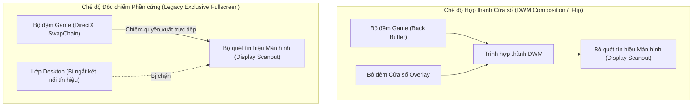
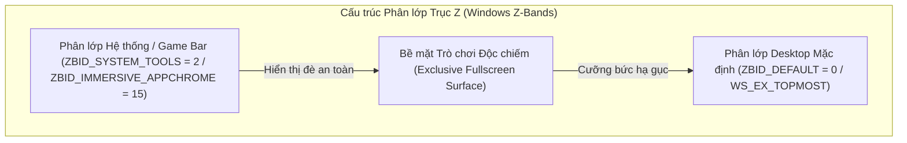
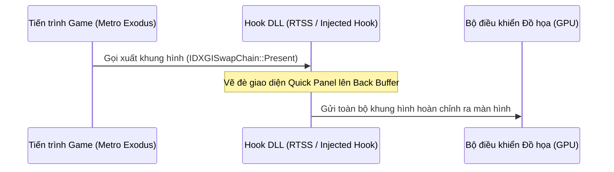

# Cơ Chế Hiển Thị Lớp Phủ (Overlay) Trên Trò Chơi Toàn Màn Hình Độc Quyền (Exclusive Fullscreen)

## Bản Chất Vật Lý Của Cơ Chế Xuất Hình Trên Windows

Trong hệ điều hành Windows, việc hiển thị hình ảnh từ card đồ họa (GPU) lên màn hình vật lý diễn ra qua hai cơ chế xử lý bộ đệm khung hình (Frame Buffer SwapChain):

1. **Chế độ Hợp thành Cửa sổ Mặc định (DWM Desktop Composition)**:
   - Các ứng dụng thông thường vẽ giao diện vào bộ đệm riêng của từng cửa sổ.
   - Trình quản lý cửa sổ của Windows (Desktop Window Manager - DWM) gom toàn bộ các bộ đệm này lại, ghép thành một khung hình tổng thể (Composite Frame) và gửi ra cổng xuất hình của card màn hình (Display Scanout).
2. **Chế độ Độc chiếm Phần cứng Toàn màn hình (DirectX Hardware Exclusive Mode - FSE)**:
   - Khi trò chơi kích hoạt chế độ toàn màn hình độc quyền (Exclusive Fullscreen), bộ điều khiển đồ họa (DirectX / DXGI) ngắt kết nối của DWM đối với màn hình hiển thị.
   - Chuỗi bộ đệm của game (SwapChain) được ánh xạ trực tiếp 1:1 tới bộ điều khiển quét tín hiệu phần cứng (Display Controller Scanout) nhằm triệt tiêu độ trễ xử lý (Latency) và loại bỏ chi phí hợp thành khung hình của DWM.

---

## Bế Tắc Kỹ Thuật Khi Hiển Thị Cửa Sổ Win32 Truyền Thống

### 1. Hiện trạng xử lý cũ
- Ứng dụng tạo một cửa sổ Win32 với các thuộc tính cửa sổ mở rộng: nổi trên cùng (`WS_EX_TOPMOST`), không nhận tiêu điểm chuột (`WS_EX_NOACTIVATE`), trong suốt nhiều lớp (`WS_EX_LAYERED`).

### 2. Sự cố và thảm họa kỹ thuật
- Windows phân chia không gian hiển thị của các cửa sổ thành nhiều phân lớp theo trục Z (Z-Order Bands). Cửa sổ `WS_EX_TOPMOST` thông thường được xếp vào **Phân lớp Mặc định của Môi trường Desktop** (`ZBID_DEFAULT`).
- Khi một trò chơi (như *Metro Exodus*) chạy ở chế độ Độc chiếm Phần cứng, toàn bộ phân lớp `ZBID_DEFAULT` bị tách khỏi chuỗi tín hiệu quét ra màn hình.
- Khi cửa sổ lớp phủ cố gắng xuất hiện hoặc yêu cầu làm mới khung hình (Render Invalidation), DWM nhận diện sự xuất hiện của một bề mặt thuộc phân lớp Desktop đang cố gắng đè lên vùng quét độc quyền. Để đảm bảo an toàn giao diện và khôi phục đường truyền DWM, Windows **cưỡng bức ngắt quyền độc chiếm phần cứng của trò chơi và thu nhỏ cửa sổ game xuống thanh tác vụ (Minimize to Taskbar)**.

---

## Phương Án 1: Đưa Cửa Sổ Vào Phân Lớp Hệ Thống (Windows System Z-Band)

### 1. Cơ chế kỹ thuật
- Windows quản lý các lớp phủ hệ thống (như Bàn phím ảo cảm ứng `TabTip.exe`, Thanh trò chơi `Xbox Game Bar`, Thông báo hệ thống) trong một phân lớp đặc quyền cao hơn Desktop: **Phân lớp Công cụ Hệ thống (`ZBID_SYSTEM_TOOLS = 2`)** hoặc **Phân lớp Giao diện Nhúng (`ZBID_IMMERSIVE_APPCHROME = 15`)**.
- Các cửa sổ nằm trong phân lớp này được DWM cấp quyền vẽ đè trực tiếp lên trên các bề mặt đang độc chiếm màn hình mà không làm kích hoạt cơ chế thu nhỏ game.

### 2. Cách thức giải quyết triệt để
- Thay vì gọi hàm tạo cửa sổ thông thường (`CreateWindowExW`), ứng dụng nạp hàm nội bộ không công khai từ thư viện `user32.dll`:
  * Hàm API: `CreateWindowInBand` (hoặc `SetWindowBand`).
  * Chỉ số phân lớp (Band ID): `ZBID_SYSTEM_TOOLS` (giá trị nguyên `2`) hoặc `ZBID_IMMERSIVE_APPCHROME` (giá trị nguyên `15`).
- Yêu cầu môi trường: Tiến trình cần có đặc quyền trợ năng giao diện (`uiAccess="true"` trong Manifest kết hợp chữ ký số chứng chỉ hoặc chạy dưới quyền Quản trị viên `Administrator`).

### 3. Các bước triển khai trong mã nguồn
- **Bước 1 (C++ Runner)**: Khai báo con trỏ hàm `CreateWindowInBand` từ `user32.dll` trong file [win32_window.cpp](file:///c:/Users/h/dev-projects/windows-handheld-tools/windows/runner/win32_window.cpp).
  * Chữ ký hàm Win32:
    `HWND WINAPI CreateWindowInBand(DWORD dwExStyle, LPCWSTR lpClassName, LPCWSTR lpWindowName, DWORD dwStyle, int X, int Y, int nWidth, int nHeight, HWND hWndParent, HMENU hMenu, HINSTANCE hInstance, LPVOID lpParam, DWORD dwBand);`
- **Bước 2 (Gán Band ID)**: Thay thế lời gọi `CreateWindowEx` bằng `CreateWindowInBand`, truyền tham số `dwBand = 2` (`ZBID_SYSTEM_TOOLS`).
- **Bước 3 (Thử nghiệm)**: Biên dịch lại ứng dụng và kiểm tra khả năng nổi trên *Metro Exodus*.

---

## Phương Án 2: Can Thiệp Trực Tiếp Vào Luồng Khung Hình DirectX (DirectX Hooking / RTSS OSD Injection)

### 1. Cơ chế kỹ thuật
- Thay vì tạo một cửa sổ Win32 riêng biệt bên ngoài hệ điều hành, phương pháp này chèn mã thực thi nhị phân (DLL Injection) trực tiếp vào không gian địa chỉ bộ nhớ (Process Memory Space) của tiến trình trò chơi.
- Mã nhị phân chèn vào sẽ thay thế địa chỉ hàm xuất hình ảnh của giao diện DirectX/DXGI: **`IDXGISwapChain::Present`** (DirectX 11/12) hoặc **`ID3D11DeviceContext::DrawIndexed`**.

### 2. Cách thức giải quyết triệt để
- Khi game chuẩn bị đẩy khung hình từ bộ đệm phụ (Back Buffer) ra bộ đệm chính để hiển thị, hàm Hook chặn luồng thực thi, tự vẽ thêm các điểm ảnh của bảng điều khiển (Quick Settings UI) lên trên cùng của bộ đệm game, sau đó mới cho phép hàm `Present` gốc chạy tiếp.
- Do giao diện được hợp nhất vào chính dòng khung hình của game, trò chơi vẫn giữ nguyên quyền độc chiếm phần cứng 100% mà không bị gián đoạn hay thu nhỏ.

### 3. Các bước triển khai trong mã nguồn
- **Cách tiếp cận A (Tận dụng RivaTuner Statistics Server - RTSS có sẵn)**:
  * Dự án đã tích hợp module [rtss_service.dart](file:///c:/Users/h/dev-projects/windows-handheld-tools/lib/hardware/rtss_service.dart) giao tiếp qua bộ nhớ chia sẻ (`RTSSSharedMemory`).
  * Sử dụng RTSS API để đẩy text và bảng điều khiển thông số OSD trực tiếp vào game khi nhấn hotkey.
- **Cách tiếp cận B (Chèn Native Direct3D Hook DLL)**:
  * Viết một thư viện C++ (`overlay_hook.dll`) sử dụng thư viện móc hàm (Microsoft Detours hoặc MinHook) can thiệp vào `dxgi.dll`.
  * Nhúng giao diện đồ họa siêu nhẹ (ImGui hoặc chuyển texture từ Flutter Engine qua Shared Texture Handle `D3D11_RESOURCE_MISC_SHARED`) vào hàm `Present`.

---

## Ma Trận So Sánh Kỹ Thuật

| Tiêu chí | Phương án 1: Windows System Z-Band | Phương án 2: DirectX Hooking (RTSS) |
| :--- | :--- | :--- |
| **Bản chất** | Tầng hệ điều hành (OS Window Management) | Tầng đồ họa trong bộ nhớ (Process Memory Injection) |
| **Bảo tồn giao diện Flutter** | Giữ nguyên 100% giao diện Flutter (Hiệu ứng động, trượt mượt mà) | Cần ánh xạ Texture từ Flutter sang DirectX hoặc dùng ImGui/RTSS Text |
| **Tính tương thích Game** | Tương thích toàn bộ Game chạy iFlip / Fullscreen Optimizations / UWP | Tương thích 100% cả những Game Exclusive Fullscreen cổ điển cứng đầu nhất |
| **Nguy cơ Anti-Cheat** | 0% (Không can thiệp bộ nhớ game) | Có thể bị chặn bởi một số game có Easy Anti-Cheat / BattleEye nếu tự viết Hook |
| **Độ phức tạp triển khai** | Trung bình (Sửa `win32_window.cpp` gọi `CreateWindowInBand`) | Cao (Cần Native C++ Hook DLL hoặc mở rộng RTSS OSD) |
